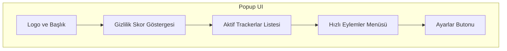
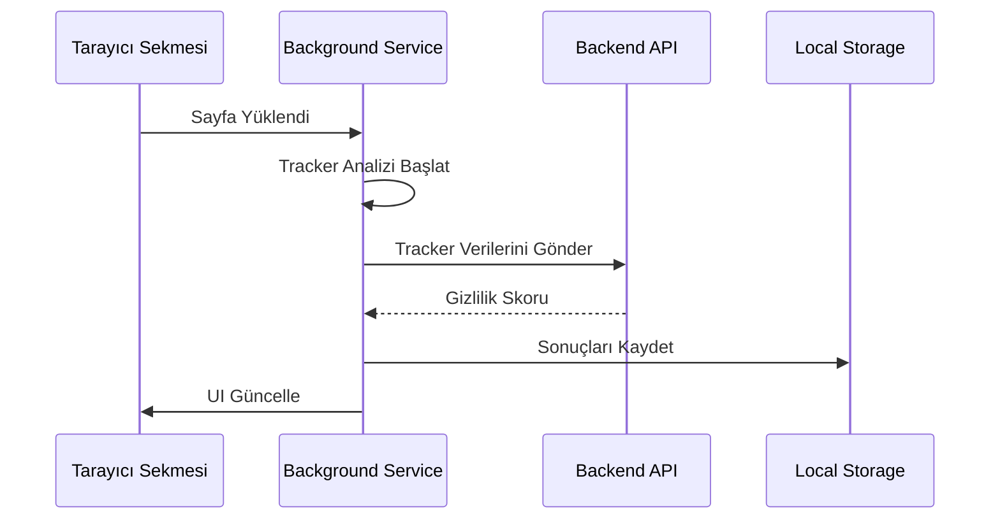
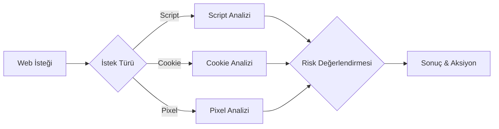
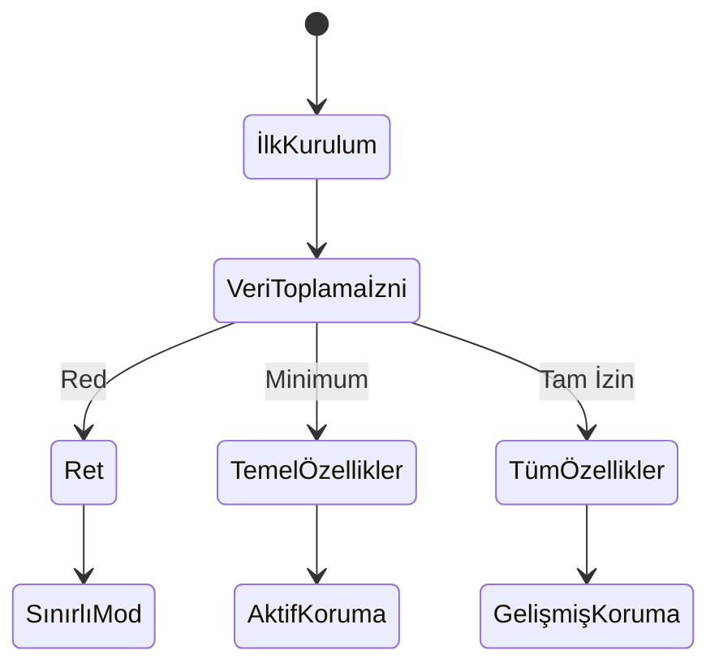

# Dijital Ayak İzi İzleyici - Tarayıcı Uzantısı Tasarım Dokümanı (BEDD)

## 1. Kullanıcı Arayüzü Tasarımı

### 1.1 Popup Arayüzü



### 1.2 UI Bileşenleri

#### 1.2.1 Ana Ekran

- **Üst Bar**

  - Logo (16x16 px)
  - Site Adı
  - Gizlilik Skoru (0-100)
  - Ayarlar İkonu

- **Orta Panel**

  - Tracker Sayacı
  - Risk Seviyesi Göstergesi (Düşük/Orta/Yüksek)
  - Aktif Tracker'ların Listesi

- **Alt Panel**
  - Hızlı Eylemler
    - Tüm Tracker'ları Engelle
    - Çerezleri Temizle
    - Rapor Görüntüle

#### 1.2.2 Ayarlar Paneli

- Genel Ayarlar

  - Otomatik Engelleme
  - Bildirim Tercihleri
  - Veri Toplama İzinleri

- Gelişmiş Ayarlar
  - Whitelist/Blacklist
  - Özel Kurallar
  - Performans Ayarları

### 1.3 Renk Paleti ve Tipografi

```yaml
Renkler:
  primary: '#2196F3' # Mavi - Ana Tema
  success: '#4CAF50' # Yeşil - Güvenli
  warning: '#FFC107' # Sarı - Orta Risk
  danger: '#F44336' # Kırmızı - Yüksek Risk
  background: '#FFFFFF' # Beyaz - Arka Plan
  text: '#212121' # Koyu Gri - Metin

Tipografi:
  başlık: 'Roboto, 16px, bold'
  altBaşlık: 'Roboto, 14px, medium'
  normal: 'Roboto, 12px, regular'
  küçük: 'Roboto, 10px, regular'
```

## 2. Manifest Dosyası ve İzinler

### 2.1 manifest.json

```json
{
  "manifest_version": 3,
  "name": "Dijital Ayak İzi İzleyici",
  "version": "1.0.0",
  "description": "Kişisel veri gizliliği ve dijital ayak izi yönetimi",
  "permissions": [
    "storage",
    "cookies",
    "webRequest",
    "webRequestBlocking",
    "tabs",
    "notifications",
    "privacy"
  ],
  "host_permissions": ["<all_urls>"],
  "background": {
    "service_worker": "background.js"
  },
  "action": {
    "default_popup": "popup.html",
    "default_icon": {
      "16": "icons/icon16.png",
      "48": "icons/icon48.png",
      "128": "icons/icon128.png"
    }
  },
  "icons": {
    "16": "icons/icon16.png",
    "48": "icons/icon48.png",
    "128": "icons/icon128.png"
  }
}
```

### 2.2 İzin Detayları

| İzin          | Kullanım Amacı                | Güvenlik Etkisi |
| ------------- | ----------------------------- | --------------- |
| storage       | Kullanıcı tercihleri ve cache | Düşük           |
| cookies       | Çerez analizi ve yönetimi     | Orta            |
| webRequest    | Ağ trafiği analizi            | Yüksek          |
| tabs          | Aktif sekme bilgisi           | Düşük           |
| notifications | Kullanıcı bildirimleri        | Düşük           |
| privacy       | Gizlilik ayarları             | Yüksek          |

## 3. Arka Plan Servisleri

### 3.1 Background Service Worker Yapısı

```typescript
// background.js ana yapısı
class BackgroundService {
  private trackerDetector: TrackerDetector;
  private privacyScorer: PrivacyScorer;
  private networkAnalyzer: NetworkAnalyzer;

  constructor() {
    this.initializeServices();
    this.setupEventListeners();
  }

  private initializeServices(): void {
    // Servis başlatma
  }

  private setupEventListeners(): void {
    // Event listener'lar
  }
}
```

### 3.2 Veri Akış Diyagramı



## 4. Çerez ve Web İstekleri Analizi

### 4.1 Çerez Analiz Süreci

```typescript
interface CookieAnalysis {
  type: 'essential' | 'functional' | 'analytics' | 'advertising';
  risk_level: 'low' | 'medium' | 'high';
  domain: string;
  expires: Date;
}

interface TrackerAnalysis {
  type: string;
  source: string;
  blocked: boolean;
  timestamp: Date;
}
```

### 4.2 Tracker Tespit Algoritması



## 5. Hata Yönetimi ve Loglama

### 5.1 Hata Kategorileri

```typescript
enum ErrorCategory {
  NETWORK = 'network_error',
  PERMISSION = 'permission_error',
  STORAGE = 'storage_error',
  API = 'api_error',
  INTERNAL = 'internal_error',
}

interface ErrorLog {
  category: ErrorCategory;
  message: string;
  timestamp: Date;
  context: object;
}
```

### 5.2 Log Seviyeleri

```yaml
Log Levels:
  ERROR:
    - Kritik hatalar
    - API bağlantı hataları
    - İzin hataları

  WARNING:
    - Tracker engelleme başarısızlıkları
    - Performans sorunları
    - Veri senkronizasyon hataları

  INFO:
    - Tracker tespitleri
    - Kullanıcı aksiyonları
    - Ayar değişiklikleri

  DEBUG:
    - Detaylı tracker bilgileri
    - Performance metrics
    - API istekleri
```

## 6. Kullanıcı Rızası ve Veri Koruma

### 6.1 Kullanıcı Rıza Akışı



### 6.2 Veri Anonimleştirme

```yaml
Anonimleştirme Teknikleri:
  - Hash fonksiyonları (SHA-256)
  - Veri maskeleme
  - Agregasyon
  - K-anonymity

Korunan Veri Tipleri:
  - Kullanıcı kimliği
  - IP adresleri
  - Tarama geçmişi
  - Form verileri
```

### 6.3 GDPR Uyumluluk Kontrol Listesi

- [ ] Açık rıza mekanizması
- [ ] Veri toplama bildirimi
- [ ] Veri erişim ve silme hakları
- [ ] Veri taşınabilirliği
- [ ] Veri işleme kaydı
- [ ] Veri minimizasyonu
- [ ] Güvenli veri depolama

## 7. Performans Optimizasyonu

### 7.1 Bellek Yönetimi

```yaml
Bellek Optimizasyonları:
  - Event listener temizleme
  - Cache boyutu limitleri
  - Gereksiz DOM manipülasyonlarından kaçınma
  - Web worker kullanımı

Performans Metrikleri:
  - CPU kullanımı: < %1
  - Bellek kullanımı: < 50MB
  - Yanıt süresi: < 100ms
```

### 7.2 Network Optimizasyonu

```yaml
İstek Optimizasyonları:
  - Batch processing
  - Rate limiting
  - Caching
  - Compression

Önbellek Stratejisi:
  - IndexedDB için max 50MB
  - LocalStorage için max 5MB
  - Cache temizleme: 7 günde bir
```

## 8. Test Planı

### 8.1 Test Kategorileri

```yaml
Birim Testler:
  - Tracker tespit algoritmaları
  - Veri anonimleştirme
  - Storage işlemleri

Entegrasyon Testleri:
  - API haberleşmesi
  - Event handling
  - Background service worker

UI Testleri:
  - Popup responsive tasarım
  - Kullanıcı etkileşimleri
  - Hata mesajları
```

### 8.2 Test Ortamları

```yaml
Development:
  - Chrome Canary
  - Firefox Developer Edition
  - Local API mock

Staging:
  - Chrome Stable
  - Firefox Stable
  - Edge
  - Test API endpoint

Production:
  - Tüm major tarayıcılar
  - Production API
```

---

## Versiyon Geçmişi

| Versiyon | Tarih | Değişiklikler |
| -------- | ----- | ------------- |
| 0.1.0    | -     | İlk taslak    |

## Onay

| Rol                  | İsim | Tarih | İmza |
| -------------------- | ---- | ----- | ---- |
| UX Tasarımcı         |      |       |      |
| Frontend Geliştirici |      |       |      |
| Güvenlik Uzmanı      |      |       |      |
