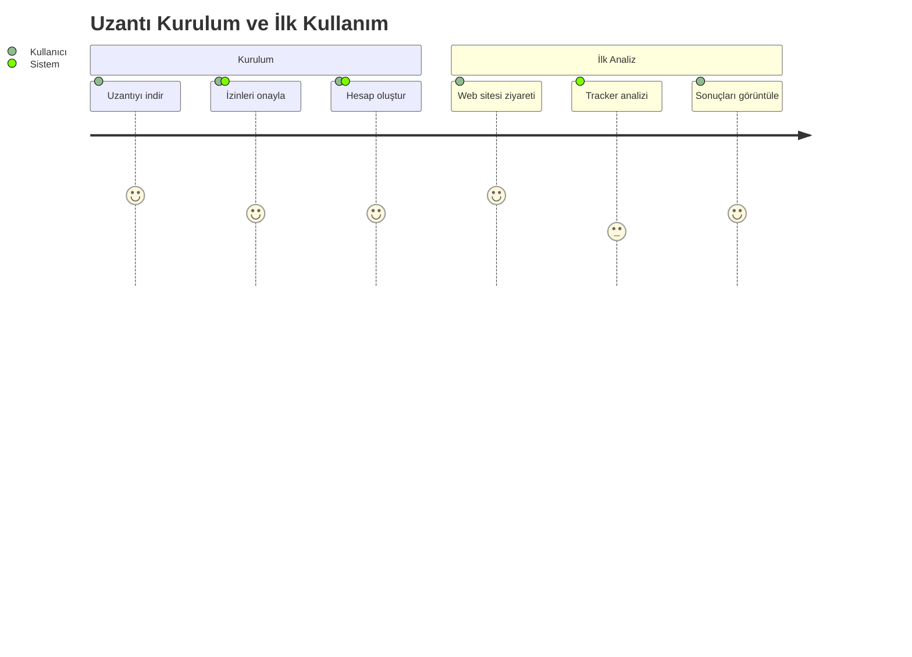
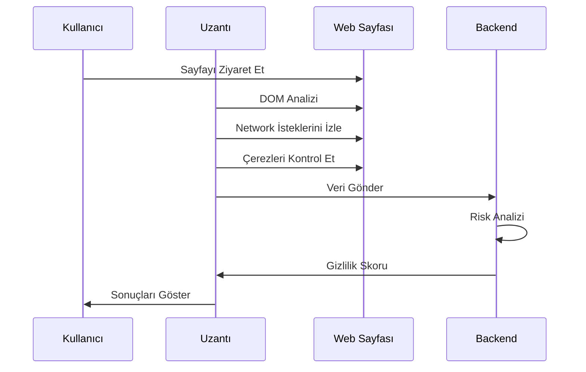

# Dijital Ayak İzi İzleyici - Feature Specification Document (FSD)

## Doküman Bilgileri

| Başlık         | Detay                                    |
| -------------- | ---------------------------------------- |
| Proje          | Dijital Ayak İzi İzleyici                |
| Özellik Grubu  | Web Tracker Analizi ve Gizlilik Yönetimi |
| Versiyon       | 1.0.0                                    |
| Son Güncelleme | 2024-01-15                               |
| Durum          | Tasarım Aşaması                          |
| Geliştirici    | Solo Developer                           |

## İçindekiler

1. [Özellik Tanımları](#1-özellik-tanımları)
2. [Kullanıcı Hikayeleri](#2-kullanıcı-hikayeleri)
3. [İş Akışları ve UI](#3-iş-akışları-ve-ui)
4. [Teknik Gereksinimler](#4-teknik-gereksinimler)
5. [Hata Senaryoları](#5-hata-senaryoları)
6. [Test Kriterleri](#6-test-kriterleri)

## 1. Özellik Tanımları

### 1.1 Web Tracker Analizi

#### 1.1.1 Temel Özellikler

```yaml
Özellik: Gerçek Zamanlı Tracker Tespiti
Amaç: Web sitelerindeki takip mekanizmalarını tespit etme
Kullanıcı Faydası: Gizlilik tehditlerinin anlık tespiti

Alt Özellikler:
  - JavaScript tracker analizi
  - Çerez kategorizasyonu
  - Fingerprinting tespiti
  - Network request analizi
```

#### 1.1.2 Gizlilik Puanlama Sistemi

```yaml
Özellik: Site Bazlı Gizlilik Değerlendirmesi
Amaç: Web sitelerinin gizlilik riskini ölçme
Kullanıcı Faydası: Bilinçli gezinme kararları

Puanlama Kriterleri:
  - Tracker sayısı ve türleri (40%)
  - Veri toplama yoğunluğu (30%)
  - SSL/TLS kullanımı (15%)
  - Çerez politikaları (15%)
```

### 1.2 Koruma Mekanizmaları

#### 1.2.1 Otomatik Engelleme

```yaml
Özellik: Zararlı Tracker Engelleme
Amaç: İstenmeyen takip mekanizmalarını önleme
Kullanıcı Faydası: Proaktif gizlilik koruması

Engelleme Seviyeleri:
  - Temel: Reklam ve analitik trackerlar
  - Orta: Tüm üçüncü taraf trackerlar
  - Sıkı: Tüm potansiyel takip mekanizmaları
```

## 2. Kullanıcı Hikayeleri

### 2.1 Temel Kullanım Senaryoları

#### 2.1.1 İlk Kullanım



#### 2.1.2 Günlük Kullanım

```yaml
Kullanıcı Hikayesi: Site Analizi
Aktör: Web kullanıcısı
Hedef: Ziyaret edilen sitenin gizlilik riskini öğrenme

Ana Akış: 1. Kullanıcı web sitesini ziyaret eder
  2. Uzantı otomatik analizi başlatır
  3. Tracker'lar tespit edilir
  4. Gizlilik skoru hesaplanır
  5. Sonuçlar popup'ta gösterilir

Alternatif Akışlar:
  A1. Site analiz edilemezse:
    - Kullanıcıya hata bildirimi gösterilir
    - Manuel analiz seçeneği sunulur

  A2. Yüksek risk tespit edilirse:
    - Anlık uyarı gösterilir
    - Koruma önerileri sunulur
```

## 3. İş Akışları ve UI

### 3.1 Tracker Analiz Akışı



### 3.2 UI Tasarımı

#### 3.2.1 Popup Arayüzü

```yaml
Ana Bileşenler:
  Header:
    - Site ismi ve ikonu
    - Genel gizlilik skoru
    - Ayarlar butonu

  Content:
    - Tracker sayacı
    - Kategori bazlı dağılım
    - Risk göstergesi

  Actions:
    - Koruma seviyesi ayarı
    - Detaylı rapor linki
    - Engelleme kontrolleri
```

#### 3.2.2 Dashboard Arayüzü

```yaml
Metrikler Paneli:
  - Toplam analiz edilen site
  - Ortalama gizlilik skoru
  - Engellenen tracker sayısı
  - Zaman bazlı trendler

Site Detay Görünümü:
  - Tracker listesi ve detayları
  - Engelleme geçmişi
  - Özelleştirilmiş kurallar
  - Performans metrikleri
```

## 4. Teknik Gereksinimler

### 4.1 API Entegrasyonu

#### 4.1.1 Endpoint Tanımları

```yaml
/api/v1/analyze:
  method: POST
  request:
    url: string
    pageContent: string
    trackers: TrackerInfo[]
  response:
    privacyScore: number
    risks: Risk[]
    recommendations: Action[]

/api/v1/trackers:
  method: GET
  parameters:
    siteId: string
    timeRange: string
  response:
    trackers: TrackerHistory[]
    trends: TrendAnalysis
```

#### 4.1.2 Veri Modelleri

```typescript
interface TrackerInfo {
  type: 'script' | 'pixel' | 'cookie';
  source: string;
  category: 'analytics' | 'ads' | 'essential';
  risk: number;
}

interface PrivacyScore {
  overall: number;
  categories: {
    tracking: number;
    encryption: number;
    cookies: number;
  };
  timestamp: Date;
}
```

### 4.2 Depolama Gereksinimleri

```yaml
Local Storage:
  - Kullanıcı tercihleri
  - Cache verisi (24 saat)
  - Whitelist/blacklist

Backend Storage:
  Collection: sites
    - Site URL
    - Analiz geçmişi
    - Tracker verileri
    - Gizlilik skorları

  Collection: users
    - Kullanıcı tercihleri
    - Özelleştirilmiş kurallar
    - Analiz geçmişi
```

## 5. Hata Senaryoları

### 5.1 Hata Türleri ve Çözümleri

```yaml
Analiz Hataları:
  DOM Erişim Hatası:
    Sebep: Content Security Policy
    Çözüm: CSP bypass teknikleri
    Fallback: Basit DOM analizi

  Network Hatası:
    Sebep: Bağlantı problemi
    Çözüm: Retry mekanizması
    Fallback: Cache verisi

  API Hatası:
    Sebep: Backend erişim sorunu
    Çözüm: Queue sistemi
    Fallback: Lokal analiz
```

### 5.2 Hata Mesajları

```yaml
Kullanıcı Mesajları:
  Analiz Başarısız:
    Türkçe: 'Site analizi tamamlanamadı'
    İngilizce: 'Site analysis failed'
    Action: Retry butonu

  Bağlantı Hatası:
    Türkçe: 'İnternet bağlantınızı kontrol edin'
    İngilizce: 'Check your internet connection'
    Action: Refresh butonu

  Veri Hatası:
    Türkçe: 'Veriler güncellenemedi'
    İngilizce: 'Data update failed'
    Action: Manual sync butonu
```

## 6. Test Kriterleri

### 6.1 Fonksiyonel Testler

```yaml
Tracker Analizi:
  - Tüm tracker türleri doğru tespit edilmeli
  - Kategorizasyon %95 doğrulukta olmalı
  - Analiz 2 saniyeden kısa sürmeli

Gizlilik Skoru:
  - Skor hesaplaması tutarlı olmalı
  - Risk faktörleri doğru ağırlıklandırılmalı
  - Geçmiş verilerle karşılaştırılabilmeli

Engelleme:
  - Seçilen trackerlar başarıyla engellenmeli
  - Whitelist/blacklist doğru çalışmalı
  - Site fonksiyonları bozulmamalı
```

### 6.2 Performans Testleri

```yaml
Metrikler:
  CPU Kullanımı:
    Normal: <%1
    Peak: <%5
    Duration: <500ms

  Bellek Kullanımı:
    Normal: <50MB
    Peak: <100MB
    Leak: None

  Yanıt Süreleri:
    Analiz: <2s
    UI Update: <100ms
    API Call: <500ms
```

### 6.3 Güvenlik Testleri

```yaml
Test Kapsamı:
  - XSS koruması
  - CSRF önleme
  - API güvenliği
  - Veri şifreleme
  - İzin kontrolleri

Kabul Kriterleri:
  - OWASP Top 10 uyumluluğu
  - Güvenlik açığı: 0 (Kritik/Yüksek)
  - Penetrasyon testi başarısı
```

---

## Versiyon Geçmişi

| Versiyon | Tarih | Değişiklikler |
| -------- | ----- | ------------- |
| 1.0.0    | -     | İlk sürüm     |

## Onay

| Rol            | İsim   | Tarih      | İmza |
| -------------- | ------ | ---------- | ---- |
| Solo Developer | [İsim] | 2024-01-15 |      |

_Not: Bu proje tek geliştirici tarafından yürütülmektedir. Tüm roller ve sorumluluklar aynı kişi tarafından üstlenilmiştir._
