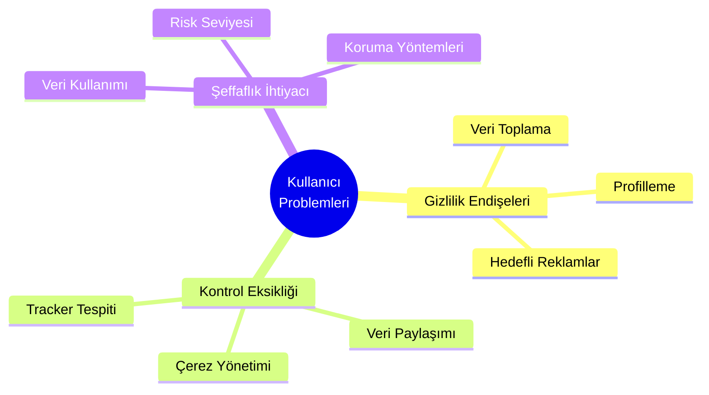
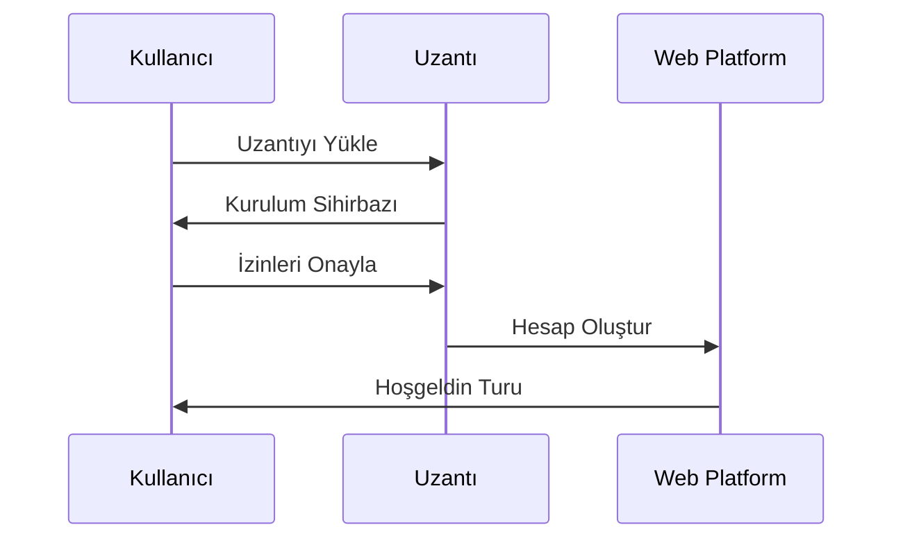
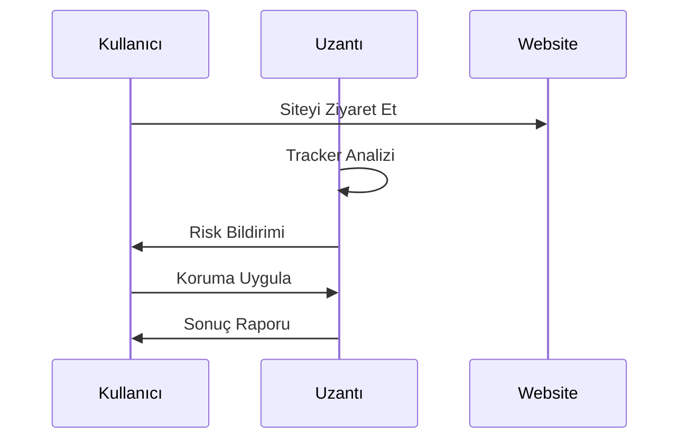
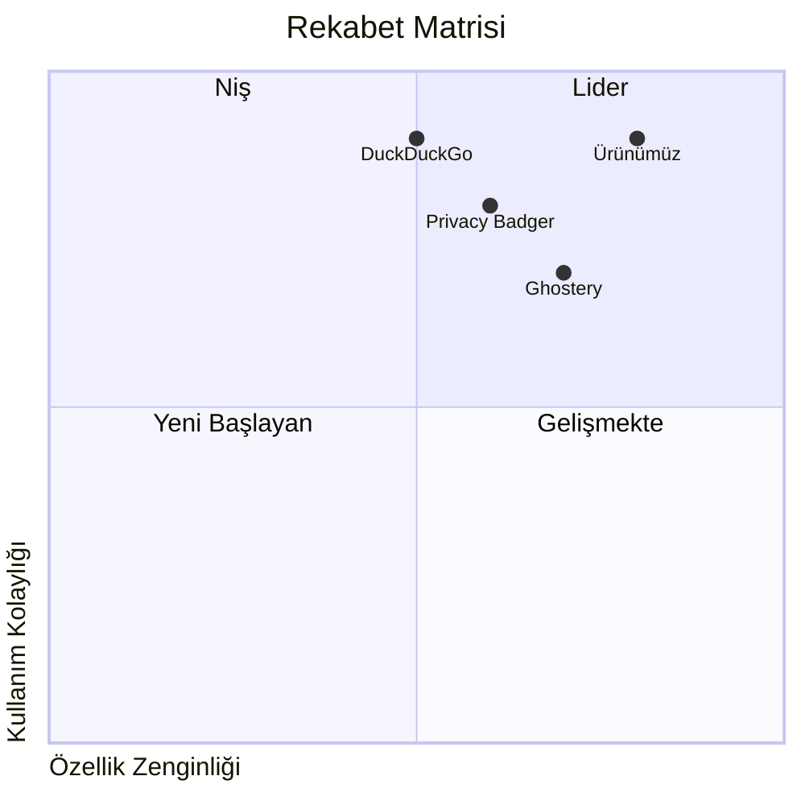

# Dijital Ayak İzi İzleyici - Product Requirements Document (PRD)

## Doküman Bilgileri

| Başlık         | Detay                     |
| -------------- | ------------------------- |
| Ürün Adı       | Dijital Ayak İzi İzleyici |
| Versiyon       | 1.0.0                     |
| Son Güncelleme | 2024-01-15                |
| Geliştirici    | Solo Developer            |
| Durum          | MVP Geliştirme            |

## İçindekiler

1. [Ürünün Amacı ve Hedefleri](#1-ürünün-amacı-ve-hedefleri)
2. [Kullanıcı İhtiyaçları ve Beklentileri](#2-kullanıcı-ihtiyaçları-ve-beklentileri)
3. [Temel İşlevler ve Özellikler](#3-temel-i̇şlevler-ve-özellikler)
4. [Kullanım Senaryoları](#4-kullanım-senaryoları)
5. [Başarı ve Kabul Kriterleri](#5-başarı-ve-kabul-kriterleri)
6. [Rekabet Analizi](#6-rekabet-analizi)

## 1. Ürünün Amacı ve Hedefleri

### 1.1 Ürün Vizyonu

Dijital Ayak İzi İzleyici, kullanıcıların çevrimiçi gizliliklerini korumalarına ve dijital ayak izlerini yönetmelerine yardımcı olan kapsamlı bir platformdur. Kullanıcıların internet üzerindeki aktivitelerinin nasıl izlendiğini şeffaf bir şekilde göstererek, kişisel verilerinin kontrolünü ellerinde tutmalarını sağlar.

### 1.2 Temel Hedefler

```yaml
İş Hedefleri:
  Solo MVP:
    - İlk 3 ayda temel özelliklerin tamamlanması
    - Bireysel test ve kullanıcı geri bildirimi
    - MVP sonrası iteratif geliştirme

Kullanıcı Hedefleri:
  - Çevrimiçi gizliliği artırmak
  - Kişisel verilerin kontrolünü sağlamak
  - Basit ve kullanışlı arayüz

Teknik Hedefler:
  - %90 doğruluk oranıyla tracker tespiti
  - <200ms yanıt süresi
  - Temel güvenlik önlemleri
```

### 1.3 Değer Önerisi

#### Kullanıcılar İçin

- Şeffaf ve anlaşılır gizlilik analizi
- Kişiselleştirilmiş gizlilik önerileri
- Otomatik koruma mekanizmaları
- Detaylı raporlama ve izleme

#### İşletmeler İçin

- Çalışan gizlilik yönetimi
- Uyumluluk raporlaması
- Toplu kullanıcı analizi
- Özelleştirilebilir politikalar

## 2. Kullanıcı İhtiyaçları ve Beklentileri

### 2.1 Hedef Kitle Analizi

#### 2.1.1 Birincil Hedef Kitle

```yaml
Bireysel Kullanıcılar:
  Profil:
    - Yaş: 20-40
    - Teknoloji ilgisi: Orta
    - Gizlilik farkındalığı: Orta-Yüksek

  İhtiyaçlar:
    - Kişisel verilerin korunması
    - Kolay kullanım
    - Temel raporlama
```

#### 2.1.2 İkincil Hedef Kitle

```yaml
Kurumsal Kullanıcılar:
  Profil:
    - Siber güvenlik uzmanları
    - IT yöneticileri
    - Veri koruma görevlileri

  İhtiyaçlar:
    - Toplu kullanıcı yönetimi
    - Uyumluluk raporlaması
    - Özelleştirilebilir politikalar
    - Gelişmiş analitik
```

### 2.2 Kullanıcı Problemleri



### 2.3 Çözüm Beklentileri

| Problem        | Beklenti             | Çözüm                  |
| -------------- | -------------------- | ---------------------- |
| Veri Takibi    | Takipçilerin tespiti | Gerçek zamanlı analiz  |
| Gizlilik Riski | Risk değerlendirmesi | Gizlilik skor sistemi  |
| Veri Kontrolü  | Yönetim araçları     | Merkezi kontrol paneli |
| Şeffaflık      | Detaylı raporlama    | İnteraktif dashboard   |

## 3. Temel İşlevler ve Özellikler

### 3.1 Tarayıcı Uzantısı Özellikleri

#### 3.1.1 Tracker Analizi

```yaml
Temel Özellikler:
  - Gerçek zamanlı tracker tespiti
  - Çerez kategorilendirme
  - Risk seviyesi hesaplama
  - Otomatik engelleme

Gelişmiş Özellikler:
  - Davranışsal analiz
  - Fingerprinting koruması
  - Custom engelleme kuralları
  - Whitelist/Blacklist
```

#### 3.1.2 Gizlilik Puanlama

```yaml
Puanlama Kriterleri:
  - Tracker sayısı ve türleri
  - Veri toplama yoğunluğu
  - Çerez politikaları
  - SSL/TLS kullanımı

Puan Aralıkları:
  0-39: Yüksek Risk
  40-69: Orta Risk
  70-100: Düşük Risk
```

### 3.2 Web Platform Özellikleri

#### 3.2.1 Dashboard

```yaml
Genel Görünüm:
  - Gizlilik skoru trendi
  - Aktif korumalar
  - Son aktiviteler
  - Öneriler

Detaylı Analizler:
  - Site bazlı raporlar
  - Zaman bazlı trendler
  - Karşılaştırmalı analizler
  - Özelleştirilebilir grafikler
```

#### 3.2.2 Veri Yönetimi

```yaml
Yönetim Araçları:
  - Veri görüntüleme
  - Toplu temizleme
  - Yedekleme
  - Dışa aktarma

Gizlilik Ayarları:
  - Koruma seviyesi
  - Bildirim tercihleri
  - Otomatizasyon kuralları
  - Özel politikalar
```

## 4. Kullanım Senaryoları

### 4.1 Temel Kullanım Senaryoları

#### Senaryo 1: İlk Kullanım



#### Senaryo 2: Günlük Kullanım



### 4.2 İleri Düzey Senaryolar

#### Senaryo 3: Kurumsal Kullanım

```yaml
Adımlar: 1. Toplu lisans aktivasyonu
  2. Politika yapılandırması
  3. Kullanıcı grupları oluşturma
  4. Merkezi yönetim
  5. Uyumluluk raporlama
```

## 5. Başarı ve Kabul Kriterleri

### 5.1 Teknik Performans Kriterleri

```yaml
Doğruluk:
  Tracker Tespiti: >90
  Risk Skorlama: >85
  Yanlış Pozitif: <5%

Performans:
  Sayfa Yükleme Etkisi: <300ms
  CPU Kullanımı: <%2
  Bellek Kullanımı: <100MB

Güvenilirlik:
  Uptime: >98
  Hata Oranı: <1%
```

### 5.2 Kullanıcı Deneyimi Kriterleri

| Metrik                | Hedef     | Ölçüm Yöntemi    |
| --------------------- | --------- | ---------------- |
| Kullanıcı Memnuniyeti | >4.5/5    | App Store puanı  |
| Aktif Kullanım        | >3x/hafta | Analytics        |
| Özellik Kullanımı     | >70%      | Feature tracking |
| Kullanıcı Kaybı       | <5%/ay    | Cohort analizi   |

### 5.3 İş Hedefleri

```yaml
Kullanıcı Büyümesi:
  Organik: +20%/ay
  Viral: K-faktör >1.2
  Elde Tutma: >60% (3 ay)

Gelir Hedefleri:
  Premium Dönüşüm: >5%
  ARPU: $5/ay
  CAC Geri Dönüşü: <6 ay
```

## 6. Rekabet Analizi

### 6.1 Pazar Konumlandırması



### 6.2 Rekabet Avantajları

```yaml
Teknik Üstünlükler:
  - Gelişmiş ML tabanlı analiz
  - Gerçek zamanlı koruma
  - Düşük sistem yükü
  - Kapsamlı API desteği

Kullanıcı Deneyimi:
  - Sezgisel arayüz
  - Kişiselleştirilmiş öneriler
  - Detaylı raporlama
  - Kolay kurulum

İş Modeli:
  - Freemium yapı
  - Kurumsal çözümler
  - API marketplace
  - Partner ekosistemi
```

### 6.3 Pazar Trendleri

```yaml
Büyüme Faktörleri:
  - Gizlilik düzenlemeleri (GDPR, CCPA)
  - Artan siber güvenlik tehditleri
  - Veri gizliliği farkındalığı
  - Remote çalışma artışı

Teknoloji Trendleri:
  - AI/ML kullanımı
  - Zero-trust security
  - Edge computing
  - Blockchain gizlilik çözümleri
```

## Ek Gereksinimler

### Lokalizasyon

- Çoklu dil desteği
- Bölgesel yasal uyumluluk
- Yerel destek ve dokümantasyon

### Ölçeklenebilirlik

- Mikroservis mimarisi
- Cloud-native deployment
- Otomatik ölçeklendirme
- Global CDN

### Güvenlik

- End-to-end encryption
- Zero-knowledge proof
- Düzenli güvenlik auditi
- Bug bounty programı

---

## Versiyon Geçmişi

| Versiyon | Tarih      | Değişiklikler              |
| -------- | ---------- | -------------------------- |
| 1.0.0    | 2024-01-15 | İlk sürüm - Solo Developer |

## Onay

| Rol            | Tarih      | İmza |
| -------------- | ---------- | ---- |
| Solo Developer | 2024-01-15 |      |
