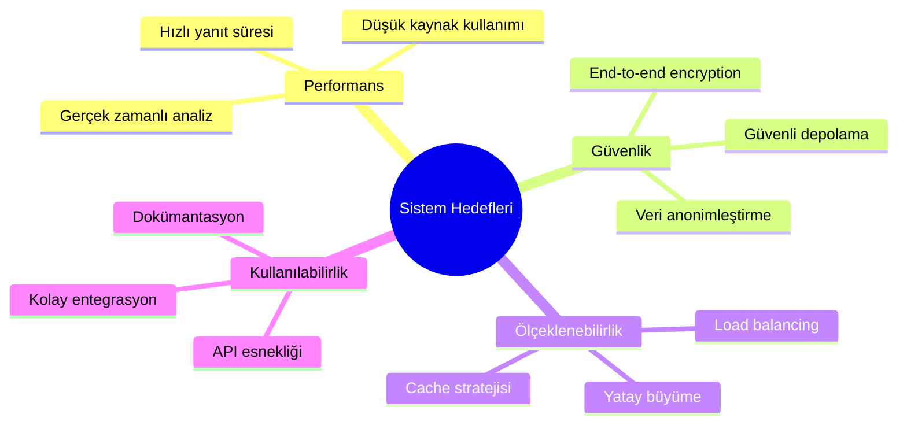
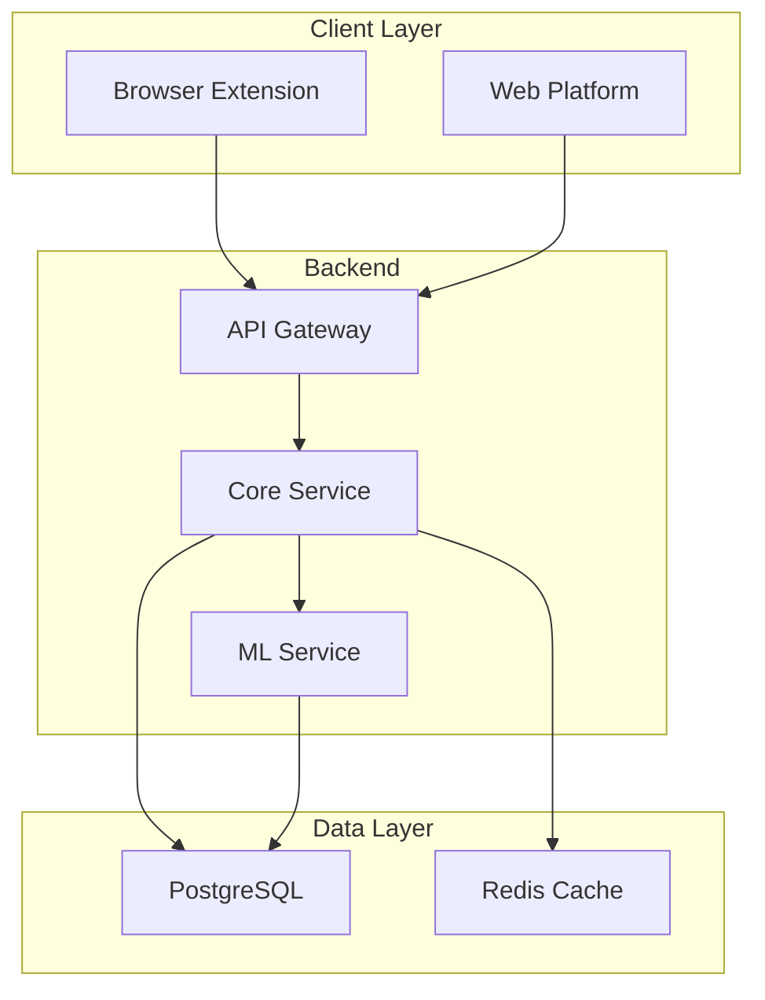
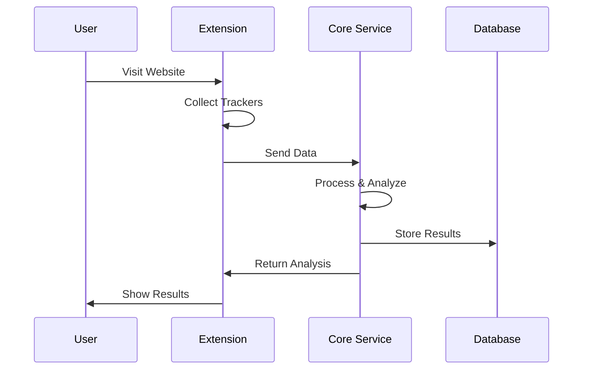
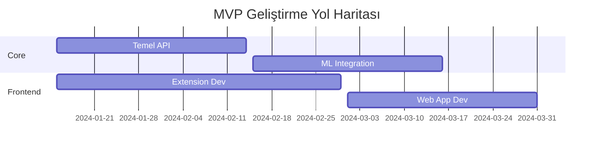

# Dijital Ayak İzi İzleyici - RFC (Request for Comments)

## RFC Bilgileri

| Başlık         | Detay                                     |
| -------------- | ----------------------------------------- |
| RFC No         | RFC-001                                   |
| Başlık         | Dijital Ayak İzi İzleyici Sistem Mimarisi |
| Durum          | Taslak                                    |
| Yazar          | [İsim]                                    |
| Son Güncelleme | [Tarih]                                   |
| Hedef Versiyon | 1.0.0                                     |

## İçindekiler

1. [Giriş ve Amaç](#1-giriş-ve-amaç)
2. [Sistem Bileşenleri ve Mimarisi](#2-sistem-bileşenleri-ve-mimarisi)
3. [Teknik Spesifikasyonlar](#3-teknik-spesifikasyonlar)
4. [Tasarım Kararları](#4-tasarım-kararları)
5. [Uygulama Protokolleri](#5-uygulama-protokolleri)
6. [Gelecek Geliştirmeler](#6-gelecek-geliştirmeler)

## 1. Giriş ve Amaç

### 1.1 RFC'nin Amacı

Bu RFC, Dijital Ayak İzi İzleyici projesinin teknik altyapısını, mimari kararlarını ve uygulama protokollerini detaylandırmayı amaçlamaktadır. Doküman, sistem geliştirme sürecinde alınan teknik kararların gerekçelerini açıklar ve gelecekteki geliştirmeler için bir yol haritası sunar.

### 1.2 Problem Tanımı

```yaml
Teknik Zorluklar:
  1. Gerçek Zamanlı Analiz:
    - Web sayfalarının dinamik yapısı
    - JavaScript tabanlı trackerlar
    - Performance optimizasyonu

  2. Veri Güvenliği:
    - Kullanıcı verilerinin korunması
    - GDPR/KVKK uyumluluğu
    - Güvenli veri iletimi

  3. Ölçeklenebilirlik:
    - Yüksek eşzamanlı kullanıcı
    - Dağıtık sistem yönetimi
    - Veri tutarlılığı
```

### 1.3 Kapsam ve Hedefler



## 2. Sistem Bileşenleri ve Mimarisi

### 2.1 Basitleştirilmiş Mimari



### 2.2 Basitleştirilmiş Veri Akışı



### 2.3 Bileşen Detayları

#### 2.3.1 Monolitik Core Service

```yaml
Core Service Components:
  - User Management
  - Tracker Analysis
  - Privacy Scoring
  - Data Storage
  - API Layer

Integration Points:
  - Browser Extension API
  - Frontend Web App
  - Database
  - Cache Layer
```

## 3. Teknik Spesifikasyonlar

### 3.1 Teknoloji Stack'i

```yaml
Backend:
  Framework: NestJS
  Language: TypeScript
  API: REST + GraphQL
  Real-time: WebSocket

Frontend:
  Framework: React
  State Management: Redux Toolkit
  Build Tool: Vite
  Testing: Jest + RTL

Extension:
  Core: TypeScript
  Build: Webpack
  API: Chrome Extensions V3

ML Pipeline:
  Core: Python 3.9+
  Frameworks:
    - TensorFlow 2.x
    - scikit-learn
    - PyTorch
```

### 3.2 Veri Modelleri

```typescript
interface TrackerData {
  id: string;
  type: TrackerType;
  source: string;
  timestamp: Date;
  metadata: {
    category: string;
    risk_level: number;
    permissions: string[];
  };
}

interface PrivacyScore {
  overall: number;
  components: {
    tracking: number;
    fingerprinting: number;
    cookies: number;
  };
  recommendations: Recommendation[];
}

interface UserProfile {
  id: string;
  settings: UserSettings;
  preferences: UserPreferences;
  analytics: AnalyticsData;
}
```

### 3.3 API Spesifikasyonları

#### 3.3.1 REST Endpoints

```yaml
/api/v1/analysis:
  post:
    description: Submit page for analysis
    request:
      content-type: application/json
      body:
        url: string
        html: string
        trackers: TrackerData[]
    response:
      200:
        content-type: application/json
        body:
          score: PrivacyScore
          recommendations: Recommendation[]

/api/v1/reports:
  get:
    description: Retrieve analysis reports
    parameters:
      - timeRange: string
      - domain: string
    response:
      200:
        content-type: application/json
        body:
          reports: Report[]
```

#### 3.3.2 WebSocket Events

```yaml
Events:
  tracker.detected:
    payload:
      tracker: TrackerData
      timestamp: number

  score.updated:
    payload:
      newScore: PrivacyScore
      delta: number

  alert.triggered:
    payload:
      type: AlertType
      message: string
      severity: number
```

## 4. Tasarım Kararları

### 4.1 Mimari Kararlar

#### 4.1.1 Microservice Mimarisi

```yaml
Seçim: Event-driven microservices
Gerekçe:
  - Bağımsız ölçeklendirme
  - Teknoloji özgürlüğü
  - İzole hata alanları

Trade-offs:
  Avantajlar:
    - Yüksek esneklik
    - Kolay bakım
    - Bağımsız deployment

  Dezavantajlar:
    - Kompleks orchestration
    - Network overhead
    - Monitoring zorluğu
```

#### 4.1.2 Veri Depolama Stratejisi

```yaml
Çoklu Veritabanı Yaklaşımı:
  PostgreSQL:
    Kullanım: Ana veritabanı
    Veri Tipleri:
      - Kullanıcı profilleri
      - Analiz sonuçları
      - Yapılandırma verileri

  Redis:
    Kullanım: Cache ve geçici veri
    Veri Tipleri:
      - Session verileri
      - Gerçek zamanlı metrikler
      - Rate limiting

  TimescaleDB:
    Kullanım: Zaman serisi verileri
    Veri Tipleri:
      - Tracker tespitleri
      - Performance metrikleri
      - Trend analizleri
```

### 4.2 Güvenlik Kararları

```yaml
Veri Şifreleme:
  At Rest:
    - AES-256-GCM
    - Key rotation (30 gün)
    - HSM entegrasyonu

  In Transit:
    - TLS 1.3
    - Certificate pinning
    - Forward secrecy

Kimlik Doğrulama:
  - OAuth 2.0 + PKCE
  - JWT with short expiry
  - 2FA support

Yetkilendirme:
  - RBAC (Role-based)
  - Resource-level policies
  - IP whitelisting
```

## 5. Uygulama Protokolleri

### 5.1 İletişim Protokolleri

#### 5.1.1 HTTP/REST

```yaml
Endpoint Yapısı:
  Base URL: api.digitalfootprint.com
  Versiyonlama: URI-based (/v1, /v2)
  Format: JSON

Status Codes:
  2xx: Başarılı işlemler
  4xx: Client hataları
  5xx: Server hataları

Rate Limiting:
  - IP-based: 1000/saat
  - Token-based: 100/dakika
  - Retry-After header
```

#### 5.1.2 WebSocket

```yaml
Connection:
  URL: ws://realtime.digitalfootprint.com
  Protocol: WSS (WebSocket Secure)
  Heartbeat: 30 saniye

Message Format: { 'type': 'event_type', 'payload': {}, 'timestamp': number }

Error Handling:
  - Automatic reconnection
  - Event queueing
  - Failed message replay
```

### 5.2 Veri Formatları

```yaml
API Payloads:
  Request:
    - Content-Type: application/json
    - Compression: gzip
    - Max Size: 5MB

  Response:
    - JSON structure
    - HAL format
    - Pagination headers

Event Messages:
  - Protocol Buffers
  - Binary format
  - Schema versioning
```

## 6. Gelecek Geliştirmeler

### 6.1 MVP Geliştirme Planı



### 6.2 Teknik Borç ve İyileştirmeler

```yaml
MVP Sonrası (3-6 ay):
  - Servis ayrıştırma
  - Test coverage artırma
  - Performance optimizasyonu
  - Monitoring geliştirme

Orta Vadeli (6-12 ay):
  - Microservice migrasyonu
  - ML pipeline geliştirme
  - Multi-region deployment
```

### 6.3 Araştırma Alanları

```yaml
Emerging Technologies:
  - Federated Learning
  - Privacy-preserving ML
  - Homomorphic encryption
  - Zero-knowledge proofs

Performance Optimization:
  - WebAssembly modules
  - Edge computing
  - Predictive caching
  - Resource optimization

Security Enhancements:
  - Post-quantum cryptography
  - Secure enclaves
  - Blockchain verification
  - Biometric authentication
```

---

## Versiyon Geçmişi

| Versiyon | Tarih | Değişiklikler | Yazar          |
| -------- | ----- | ------------- | -------------- |
| 0.1.0    | -     | İlk taslak    | Solo Developer |

## RFC Durumu

- [x] Taslak
- [ ] İnceleme
- [ ] Son Revizyon
- [ ] Onaylandı
- [ ] Uygulanıyor

## Katkıda Bulunanlar

| İsim           | Rol            | Organizasyon |
| -------------- | -------------- | ------------ |
| Solo Developer | Lead Developer | -            |
