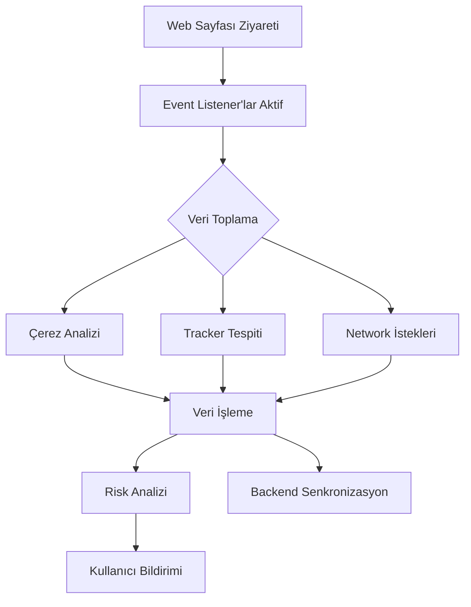
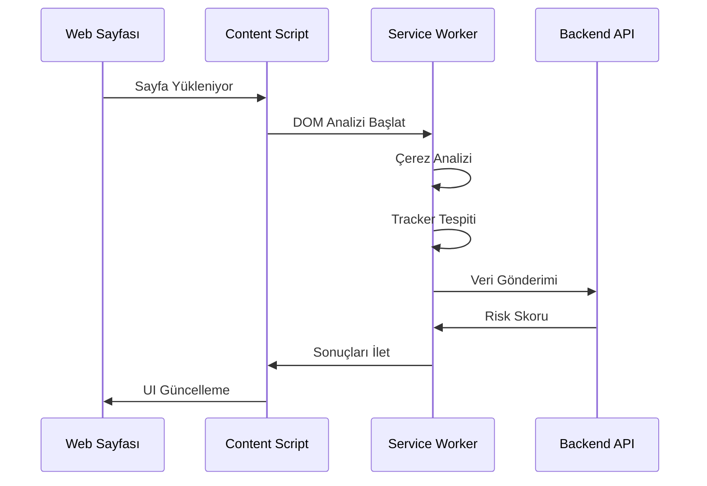

# Dijital Ayak İzi İzleyici - RFC (Request for Comments)

## RFC Bilgileri

| Başlık         | Detay                                                       |
| -------------- | ----------------------------------------------------------- |
| RFC No         | RFC-002                                                     |
| Başlık         | Tarayıcı Uzantısı (Browser Extension) Teknik Spesifikasyonu |
| Durum          | Taslak                                                      |
| Yazar          | Solo Developer                                              |
| Son Güncelleme | 2024-03-09                                                  |
| Hedef Versiyon | 1.0.0                                                       |

## İçindekiler

1. [Giriş ve Amaç](#1-giriş-ve-amaç)
2. [Manifest.json Yapılandırması ve İzinleri](#2-manifestjson-yapılandırması-ve-izinleri)
3. [Arka Plan Servisleri ve Event Listener Mekanizmaları](#3-arka-plan-servisleri-ve-event-listener-mekanizmaları)
4. [Çerez ve Tracker Verisinin Toplanması ve İşlenmesi](#4-çerez-ve-tracker-verisinin-toplanması-ve-işlenmesi)
5. [Veri Depolama ve Geçici Cache Stratejileri](#5-veri-depolama-ve-geçici-cache-stratejileri)
6. [Backend API İletişim Protokolü](#6-backend-api-iletişim-protokolü)
7. [Kullanıcı Gizliliği Politikaları](#7-kullanıcı-gizliliği-politikaları)

## 1. Giriş ve Amaç

### 1.1 Tarayıcı Uzantısının Rolü ve İşlevi

Tarayıcı uzantısı, Dijital Ayak İzi İzleyici projesinin kullanıcı tarafındaki temel bileşenidir. Bu uzantı:

- Kullanıcının web gezintisi sırasında karşılaştığı trackerları gerçek zamanlı olarak tespit eder
- Çerez ve diğer izleme mekanizmalarını analiz eder
- Kullanıcıya gizlilik risk skorunu anlık olarak gösterir
- Gerektiğinde koruyucu önlemler alır

### 1.2 Çalışma Prensibi



## 2. Manifest.json Yapılandırması ve İzinleri

### 2.1 Temel Manifest Yapısı

```json
{
  "manifest_version": 3,
  "name": "Dijital Ayak İzi İzleyici",
  "version": "1.0.0",
  "description": "Web gezintiniz sırasında dijital ayak izinizi takip eden ve koruyan uzantı",
  "permissions": ["cookies", "webRequest", "storage", "tabs", "scripting"],
  "host_permissions": ["<all_urls>"],
  "background": {
    "service_worker": "background.js",
    "type": "module"
  },
  "action": {
    "default_popup": "popup.html",
    "default_icon": {
      "16": "icons/icon16.png",
      "48": "icons/icon48.png",
      "128": "icons/icon128.png"
    }
  },
  "content_scripts": [
    {
      "matches": ["<all_urls>"],
      "js": ["content.js"],
      "run_at": "document_start"
    }
  ]
}
```

### 2.2 Tarayıcı Uyumluluk Matrisi

```yaml
Chrome:
  Min Version: 88+
  Manifest: v3
  Özel Gereksinimler:
    - service_worker kullanımı
    - chrome.* API'leri

Firefox:
  Min Version: 109+
  Manifest: v2 (v3 geçiş aşamasında)
  Özel Gereksinimler:
    - browser.* API'leri
    - background.scripts kullanımı

Safari:
  Min Version: 15+
  Manifest: v2
  Özel Gereksinimler:
    - browser.* API'leri
    - content_security_policy uyumluluğu
```

## 3. Arka Plan Servisleri ve Event Listener Mekanizmaları

### 3.1 Service Worker Yaşam Döngüsü

```typescript
// background.js
class BackgroundService {
  private static instance: BackgroundService;
  private isInitialized: boolean = false;

  static getInstance(): BackgroundService {
    if (!BackgroundService.instance) {
      BackgroundService.instance = new BackgroundService();
    }
    return BackgroundService.instance;
  }

  async initialize() {
    if (this.isInitialized) return;

    this.setupEventListeners();
    this.initializeStorage();
    this.startAnalysisService();

    this.isInitialized = true;
  }

  private setupEventListeners() {
    chrome.webRequest.onBeforeRequest.addListener(this.handleWebRequest, { urls: ['<all_urls>'] }, [
      'requestBody',
    ]);

    chrome.runtime.onMessage.addListener(this.handleMessage.bind(this));
  }
}
```

### 3.2 Event Listener Yapılandırması

```yaml
Web Request Listeners:
  onBeforeRequest:
    Amaç: Network isteklerini yakalama
    Filtre: Tüm URL'ler
    Yetki: requestBody erişimi

  onHeadersReceived:
    Amaç: HTTP başlıklarını analiz etme
    Filtre: Tüm URL'ler
    Yetki: responseHeaders değiştirme

Cookie Listeners:
  onChanged:
    Amaç: Çerez değişikliklerini izleme
    Tetikleyici: Çerez ekleme/silme/güncelleme

Runtime Messages:
  onMessage:
    Amaç: Popup ve content script iletişimi
    Veri Tipleri: JSON serileştirilebilir veriler
```

## 4. Çerez ve Tracker Verisinin Toplanması ve İşlenmesi

### 4.1 Veri Toplama Stratejisi



### 4.2 Tracker Analiz Mekanizması

```typescript
interface TrackerData {
  type: 'cookie' | 'pixel' | 'script' | 'beacon';
  source: string;
  destination: string;
  category: TrackerCategory;
  riskLevel: number;
  metadata: {
    cookies?: CookieData[];
    fingerprinting?: boolean;
    permissions?: string[];
  };
}

interface CookieData {
  name: string;
  domain: string;
  expirationDate?: number;
  isThirdParty: boolean;
  isSecure: boolean;
  sameSite?: 'Strict' | 'Lax' | 'None';
}
```

## 5. Veri Depolama ve Geçici Cache Stratejileri

### 5.1 Depolama Mimarisi

```yaml
Local Storage:
  chrome.storage.local:
    - Kullanıcı tercihleri
    - Site bazlı whitelist/blacklist
    - Cache verisi (24 saat)

Session Storage:
  chrome.storage.session:
    - Aktif oturum analiz verileri
    - Geçici risk skorları
    - Runtime durumu

IndexedDB:
  Tracker Database:
    - Geçmiş tracker kayıtları
    - Site bazlı istatistikler
    - ML model cache
```

### 5.2 Cache Stratejisi

```typescript
interface CacheStrategy {
  type: 'memory' | 'storage' | 'indexedDB';
  ttl: number; // milliseconds
  maxSize: number; // bytes
  priority: 'high' | 'medium' | 'low';
}

const cacheConfigs: Record<string, CacheStrategy> = {
  trackerPatterns: {
    type: 'memory',
    ttl: 3600000, // 1 saat
    maxSize: 5242880, // 5MB
    priority: 'high',
  },
  siteScores: {
    type: 'storage',
    ttl: 86400000, // 24 saat
    maxSize: 10485760, // 10MB
    priority: 'medium',
  },
};
```

## 6. Backend API İletişim Protokolü

### 6.1 API Endpoint Yapılandırması

```yaml
REST Endpoints:
  /api/v1/analysis:
    method: POST
    payload: TrackerAnalysisData
    response: PrivacyScore
    rate_limit: 100/minute

  /api/v1/sync:
    method: POST
    payload: BatchSyncData
    response: SyncResponse
    rate_limit: 1000/hour

WebSocket:
  /ws/v1/realtime:
    events:
      - tracker.detected
      - score.updated
      - threat.detected
    heartbeat: 30s
```

### 6.2 Güvenlik ve Yetkilendirme

```typescript
interface AuthConfig {
  type: 'Bearer';
  token: string;
  refreshToken: string;
  expiresIn: number;
}

interface APIRequest {
  headers: {
    Authorization: `Bearer ${string}`;
    'X-Client-Version': string;
    'X-Request-ID': string;
  };
  body: unknown;
  timestamp: number;
  signature: string;
}
```

## 7. Kullanıcı Gizliliği Politikaları

### 7.1 Veri Anonimleştirme

```yaml
Anonimleştirme Stratejisi:
  Kullanıcı Verileri:
    - UUID kullanımı
    - IP maskeleme
    - Tarayıcı parmak izi gizleme

  Site Verileri:
    - URL hash'leme
    - Hassas parametre temizleme
    - Meta veri ayıklama

  Depolama:
    - Şifrelenmiş storage
    - Otomatik veri temizleme
    - Kullanıcı kontrollü silme
```

### 7.2 GDPR/KVKK Uyumluluğu

```typescript
interface PrivacyControls {
  dataRetention: {
    maxDuration: number; // days
    autoDelete: boolean;
    exportable: boolean;
  };
  userConsent: {
    necessary: boolean;
    functional: boolean;
    analytics: boolean;
    marketing: boolean;
  };
  dataSubjectRights: {
    access: boolean;
    rectification: boolean;
    erasure: boolean;
    portability: boolean;
    restriction: boolean;
  };
}
```

## Versiyon Geçmişi

| Versiyon | Tarih      | Değişiklikler | Yazar          |
| -------- | ---------- | ------------- | -------------- |
| 0.1.0    | 2024-03-09 | İlk taslak    | Solo Developer |

## RFC Durumu

- [x] Taslak
- [ ] İnceleme
- [ ] Son Revizyon
- [ ] Onaylandı
- [ ] Uygulanıyor

## Katkıda Bulunanlar

| İsim           | Rol            | Organizasyon |
| -------------- | -------------- | ------------ |
| Solo Developer | Lead Developer | -            |
