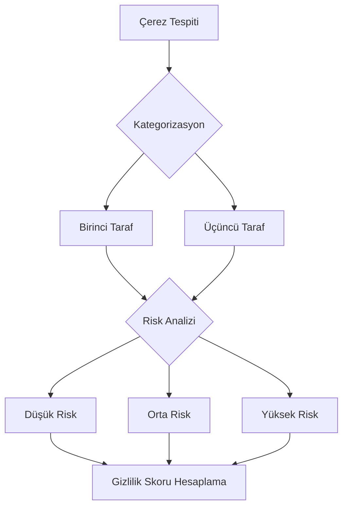
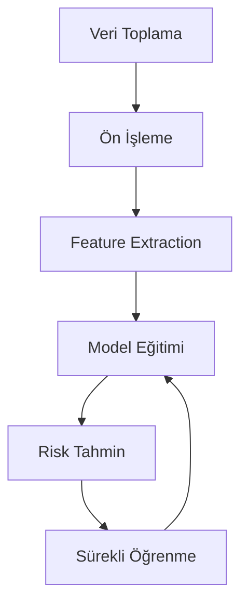
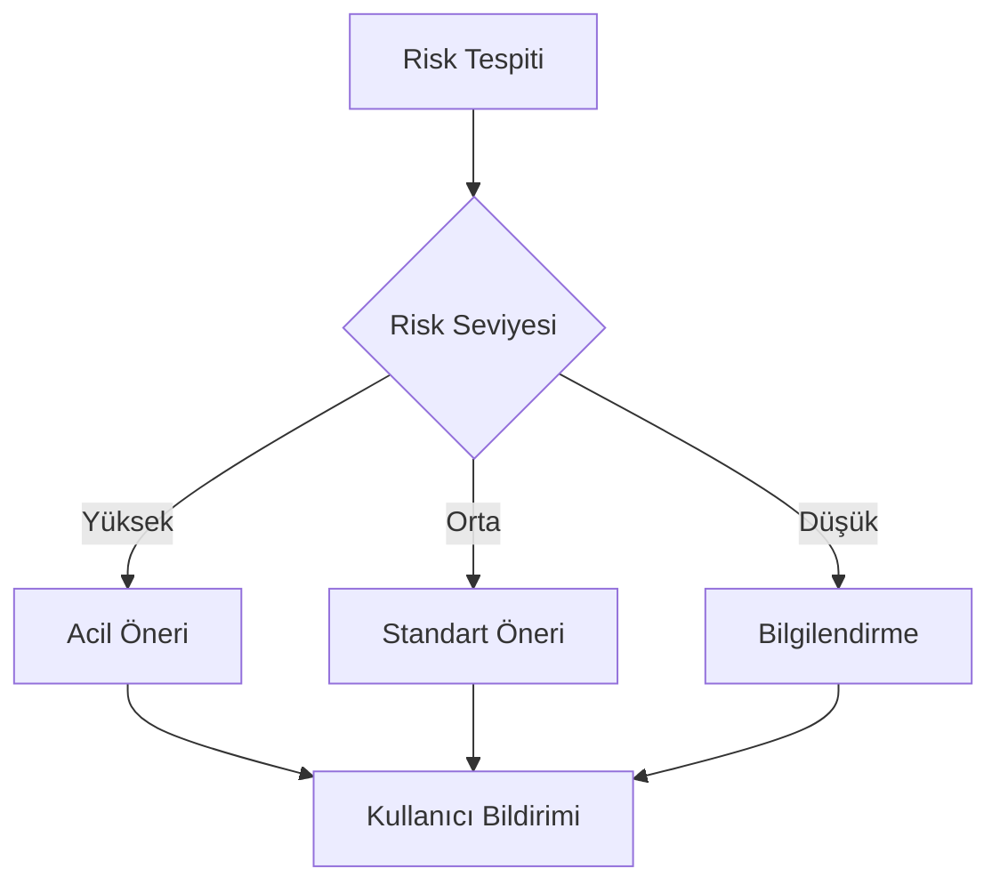
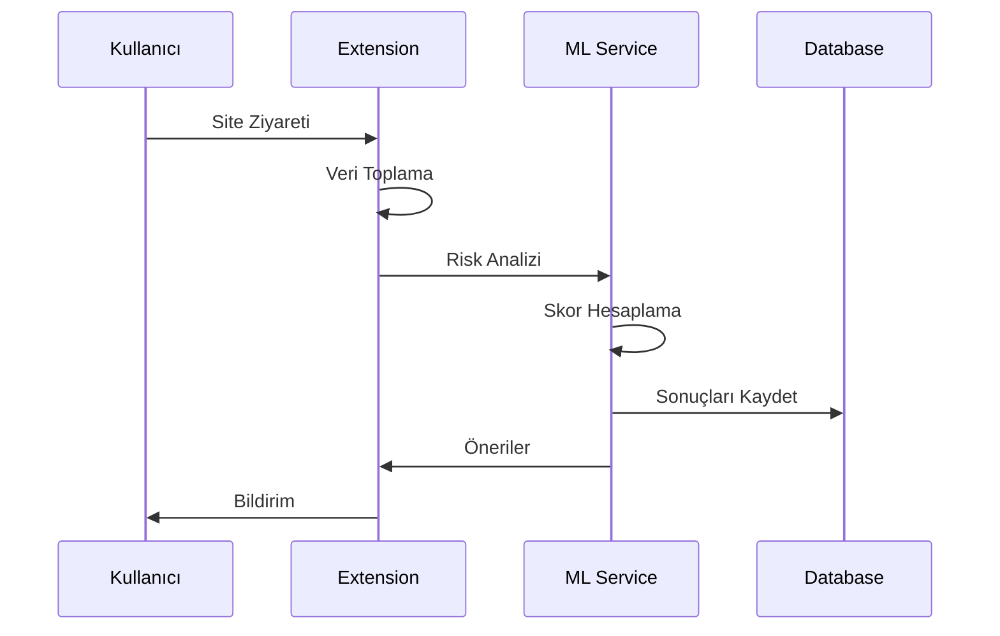

# Dijital Ayak İzi İzleyici - RFC (Request for Comments)

## RFC Bilgileri

| Başlık         | Detay                                     |
| -------------- | ----------------------------------------- |
| RFC No         | RFC-003                                   |
| Başlık         | Gizlilik Skoru ve Risk Analiz Algoritması |
| Durum          | Taslak                                    |
| Yazar          | Solo Developer                            |
| Son Güncelleme | 2024-03-10                                |
| Hedef Versiyon | 1.0.0                                     |

## İçindekiler

1. [Giriş ve Amaç](#1-giriş-ve-amaç)
2. [Risk Faktörleri ve Değerlendirme Kriterleri](#2-risk-faktörleri-ve-değerlendirme-kriterleri)
3. [Gizlilik Skoru Hesaplama Formülü](#3-gizlilik-skoru-hesaplama-formülü)
4. [Makine Öğrenmesi ve Veri Madenciliği](#4-makine-öğrenmesi-ve-veri-madenciliği)
5. [Öneri Sistemi](#5-öneri-sistemi)
6. [Performans ve Doğruluk Metrikleri](#6-performans-ve-doğruluk-metrikleri)
7. [Veri Akışı ve İşleme Pipeline'ı](#7-veri-akışı-ve-i̇şleme-pipelineı)

## 1. Giriş ve Amaç

### 1.1 Gizlilik Skorunun Amacı ve Faydaları

Gizlilik Skoru, kullanıcıların çevrimiçi gizlilik seviyelerini anlaşılır ve ölçülebilir bir formatta sunmayı amaçlar. Bu skor:

- Kullanıcıların gizlilik risklerini anlık olarak görmelerini sağlar
- Proaktif koruma önlemleri için rehberlik eder
- Zaman içindeki gizlilik trendlerini takip etmeyi mümkün kılar
- Farklı web siteleri arasında karşılaştırma yapmaya olanak tanır

### 1.2 Risk Analiz Algoritmasının Temel Prensipleri

```yaml
Temel Prensipler:
  1. Gerçek Zamanlı Analiz:
    - Anlık tracker tespiti
    - Dinamik risk değerlendirmesi
    - Hızlı feedback döngüsü

  2. Çok Faktörlü Değerlendirme:
    - Tracker analizi
    - Çerez değerlendirmesi
    - Network trafiği incelemesi
    - Kullanıcı davranışları

  3. Adaptif Öğrenme:
    - Pattern tanıma
    - Anomali tespiti
    - Tehdit istihbaratı
```

## 2. Risk Faktörleri ve Değerlendirme Kriterleri

### 2.1 Web Sitesi Tracker Analizi

#### 2.1.1 Tracker Kategorilendirmesi

```yaml
Tracker Tipleri:
  Analytics:
    Risk: Orta
    Örnekler:
      - Google Analytics
      - Mixpanel
      - Hotjar

  Advertising:
    Risk: Yüksek
    Örnekler:
      - DoubleClick
      - Facebook Pixel
      - AdRoll

  Essential:
    Risk: Düşük
    Örnekler:
      - Authentication
      - Shopping Cart
      - User Preferences
```

#### 2.1.2 Risk Seviye Matrisi

| Tracker Tipi | Sayı | Risk Puanı | Etki Faktörü |
| ------------ | ---- | ---------- | ------------ |
| Reklam       | 1-3  | 30         | 1.5          |
| Analytics    | 1-5  | 20         | 1.2          |
| Essential    | 1-10 | 5          | 1.0          |

### 2.2 Çerez ve Veri Sızıntısı Analizi



### 2.3 Tarayıcı Ayarları ve Güvenlik Politikaları

```yaml
Güvenlik Kontrolleri:
  Tarayıcı Ayarları:
    - Do Not Track (DNT): +10 puan
    - 3rd Party Cookies: -20 puan
    - JavaScript: Durum bazlı değerlendirme

  Koruma Mekanizmaları:
    - Ad Blocker: +15 puan
    - VPN Kullanımı: +20 puan
    - HTTPS Enforce: +10 puan

  Güvenlik Başlıkları:
    - Content-Security-Policy: +10 puan
    - X-Frame-Options: +5 puan
    - HSTS: +10 puan
```

## 3. Gizlilik Skoru Hesaplama Formülü

### 3.1 Ana Formül Bileşenleri

```typescript
interface PrivacyScore {
  baseScore: number; // 100 başlangıç puanı
  trackerImpact: number; // Tracker etkisi
  cookieRisk: number; // Çerez riski
  securityBonus: number; // Güvenlik bonus puanı
  finalScore: number; // Sonuç puanı
}

// Ana formül:
// FinalScore = (BaseScore - TrackerImpact - CookieRisk) * SecurityMultiplier

interface ScoreWeights {
  trackerWeight: number; // a = 0.4
  cookieWeight: number; // b = 0.3
  securityWeight: number; // c = 0.3
}
```

### 3.2 Alt Bileşen Hesaplamaları

```typescript
interface TrackerScore {
  calculate(trackers: Tracker[]): number {
    return trackers.reduce((score, tracker) => {
      return score - (tracker.risk * tracker.weight);
    }, 0);
  }
}

interface CookieScore {
  calculate(cookies: Cookie[]): number {
    return cookies.reduce((score, cookie) => {
      return score - (cookie.risk * cookie.persistence);
    }, 0);
  }
}

interface SecurityScore {
  calculate(settings: SecuritySettings): number {
    return Object.values(settings).reduce((score, setting) => {
      return score + (setting.enabled ? setting.bonus : 0);
    }, 0);
  }
}
```

## 4. Makine Öğrenmesi ve Veri Madenciliği

### 4.1 ML Model Mimarisi



### 4.2 Feature Engineering

```yaml
Feature Sets:
  Site Karakteristikleri:
    - Domain yaşı
    - SSL durumu
    - Hosting lokasyonu
    - Tech stack

  Tracker Özellikleri:
    - Sayı ve tipleri
    - Veri toplama yöntemleri
    - Gizlilik politikaları

  Kullanıcı Davranışları:
    - Ziyaret süresi
    - Etkileşim tipleri
    - Form doldurma
    - Gezinme paterni
```

## 5. Öneri Sistemi

### 5.1 Öneri Kategorileri

```yaml
Temel Öneriler:
  Tracker Kontrolü:
    - 'Üçüncü taraf çerezleri devre dışı bırakın'
    - "JavaScript'i seçici olarak etkinleştirin"
    - 'Reklam engelleyici kullanın'

  Gizlilik Ayarları:
    - 'Tarayıcı gizlilik ayarlarını optimize edin'
    - 'VPN kullanımını değerlendirin'
    - 'HTTPS Everywhere eklentisini kurun'

  Veri Koruması:
    - 'Düzenli çerez temizliği yapın'
    - 'Tarama geçmişini periyodik silin'
    - 'Güvenli tarayıcı profili oluşturun'
```

### 5.2 Öneri Tetikleme Mantığı



## 6. Performans ve Doğruluk Metrikleri

### 6.1 Performans Hedefleri

```yaml
Yanıt Süreleri:
  Anlık Analiz: <500ms
  Skor Hesaplama: <100ms
  Öneri Üretme: <200ms

Kaynak Kullanımı:
  CPU: Peak <%5
  Bellek: <50MB
  Disk: <100MB cache

Doğruluk Hedefleri:
  Tracker Tespiti: >95
  Risk Sınıflandırma: >90
  Öneri Uygunluğu: >85
```

### 6.2 Kalite Güvence Metrikleri

```typescript
interface QualityMetrics {
  accuracy: {
    trackerDetection: number; // >0.95
    riskClassification: number; // >0.90
    recommendationRelevance: number; // >0.85
  };

  performance: {
    analysisTime: number; // <500ms
    scoreCalculationTime: number; // <100ms
    recommendationGenerationTime: number; // <200ms
  };

  reliability: {
    falsePositiveRate: number; // <0.05
    falseNegativeRate: number; // <0.03
    systemUptime: number; // >0.99
  };
}
```

## 7. Veri Akışı ve İşleme Pipeline'ı

### 7.1 Veri İşleme Pipeline'ı



### 7.2 Veri Saklama ve Analiz

```yaml
Veri Saklama Stratejisi:
  Kısa Vadeli:
    - Raw tracker verileri (7 gün)
    - Anlık risk skorları (24 saat)
    - Session analitikleri (1 gün)

  Orta Vadeli:
    - Agregat risk skorları (30 gün)
    - Trend analizleri (90 gün)
    - Kullanıcı tercihleri (sürekli)

  Uzun Vadeli:
    - Anonimleştirilmiş istatistikler
    - ML model verileri
    - Güvenlik metrikleri
```

---

## Versiyon Geçmişi

| Versiyon | Tarih      | Değişiklikler | Yazar          |
| -------- | ---------- | ------------- | -------------- |
| 0.1.0    | 2024-03-10 | İlk taslak    | Solo Developer |

## RFC Durumu

- [x] Taslak
- [ ] İnceleme
- [ ] Son Revizyon
- [ ] Onaylandı
- [ ] Uygulanıyor

## Katkıda Bulunanlar

| İsim           | Rol            | Organizasyon |
| -------------- | -------------- | ------------ |
| Solo Developer | Lead Developer | -            |
