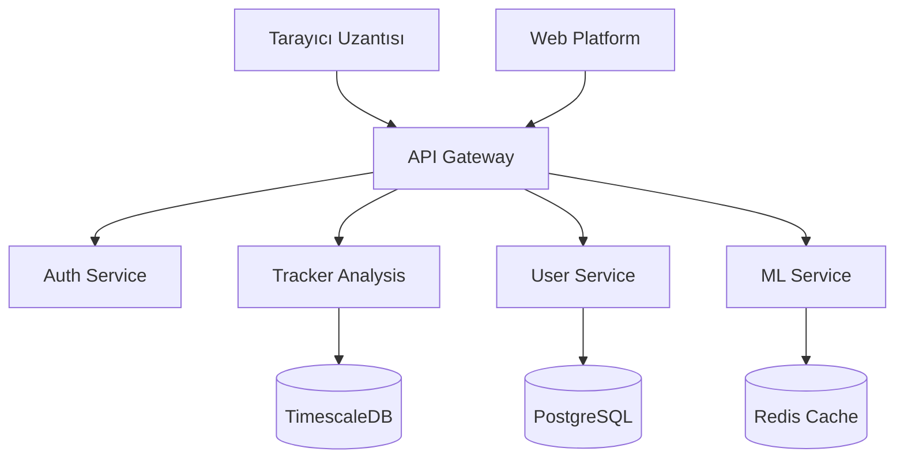
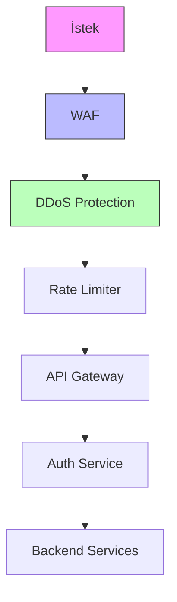
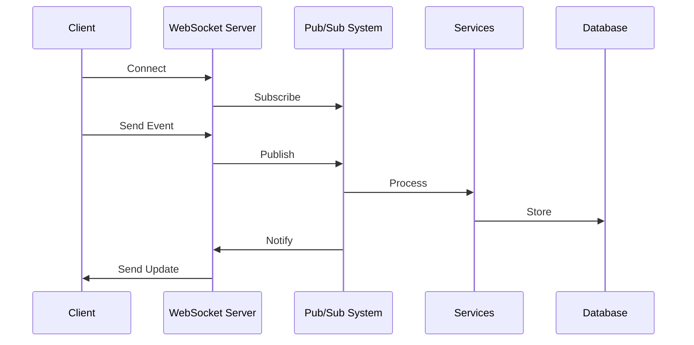

# Dijital Ayak İzi İzleyici - RFC (Request for Comments)

## RFC Bilgileri

| Başlık         | Detay                                    |
| -------------- | ---------------------------------------- |
| RFC No         | RFC-004                                  |
| Başlık         | API ve Backend Servisleri Spesifikasyonu |
| Durum          | Taslak                                   |
| Yazar          | Solo Developer                           |
| Son Güncelleme | 2024-03-11                               |
| Hedef Versiyon | 1.0.0                                    |

## İçindekiler

1. [Giriş ve Amaç](#1-giriş-ve-amaç)
2. [API Endpoint Listesi ve İstek/Yanıt Formatları](#2-api-endpoint-listesi-ve-i̇stekyant-formatları)
3. [Kimlik Doğrulama ve Yetkilendirme](#3-kimlik-doğrulama-ve-yetkilendirme)
4. [Rate Limiting ve Güvenlik Önlemleri](#4-rate-limiting-ve-güvenlik-önlemleri)
5. [Gerçek Zamanlı Veri İşleme](#5-gerçek-zamanlı-veri-i̇şleme)
6. [Ölçeklenebilir Backend Stratejileri](#6-ölçeklenebilir-backend-stratejileri)
7. [Hata Yönetimi ve Loglama](#7-hata-yönetimi-ve-loglama)

## 1. Giriş ve Amaç

### 1.1 Backend Servislerinin Sistem İçindeki Rolü



### 1.2 API ve Backend İletişim Stratejisi

```yaml
İletişim Katmanları:
  1. REST API:
    - CRUD operasyonları
    - Resource-based endpoints
    - HTTP/2 protokolü

  2. WebSocket:
    - Gerçek zamanlı tracker tespiti
    - Anlık risk bildirimleri
    - Skor güncellemeleri

  3. gRPC:
    - Mikroservisler arası iletişim
    - Yüksek performanslı veri transferi
    - Binary protokol
```

### 1.3 Güvenlik ve Gizlilik Prensipleri

```yaml
Temel Prensipler:
  Veri Minimizasyonu:
    - Sadece gerekli verilerin toplanması
    - Otomatik veri yaşlandırma
    - Anonimleştirme stratejileri

  Güvenli İletişim:
    - End-to-end encryption
    - Perfect forward secrecy
    - Certificate pinning

  Veri İzolasyonu:
    - Tenant isolation
    - Veri partitioning
    - Encryption at rest
```

## 2. API Endpoint Listesi ve İstek/Yanıt Formatları

### 2.1 REST API Endpoints

#### 2.1.1 Tracker Analiz API'leri

```yaml
/api/v1/trackers/analyze:
  post:
    description: Web sitesi tracker analizi
    request:
      content-type: application/json
      body:
        {
          'url': 'string',
          'pageContent': 'string',
          'trackers': [{ 'type': 'string', 'source': 'string', 'category': 'string' }],
        }
    response:
      200:
        body: { 'riskScore': number, 'detectedTrackers': array, 'recommendations': array }
      403:
        body: { 'error': 'Unauthorized access' }
    rate_limit: 100/minute

/api/v1/trackers/report:
  get:
    description: Tracker analiz raporu
    parameters:
      - timeRange: string
      - domain: string
    response:
      200:
        body: { 'totalTrackers': number, 'blockedTrackers': number, 'riskTrend': array }
```

#### 2.1.2 Kullanıcı Gizlilik API'leri

```yaml
/api/v1/privacy/score:
  get:
    description: Kullanıcı gizlilik skoru
    response:
      200:
        body:
          {
            'overallScore': number,
            'categoryScores': { 'tracking': number, 'cookies': number, 'fingerprinting': number },
            'recommendations': array,
          }

/api/v1/privacy/settings:
  put:
    description: Gizlilik ayarları güncelleme
    request:
      body:
        {
          'trackingPrevention': string,
          'cookiePolicy': string,
          'fingerprintingProtection': boolean,
        }
    response:
      200:
        body: { 'updated': boolean, 'newSettings': object }
```

### 2.2 WebSocket API

```typescript
interface WebSocketMessage {
  type: 'tracker.detected' | 'risk.alert' | 'score.update';
  payload: {
    timestamp: number;
    data: unknown;
  };
  metadata: {
    userId: string;
    source: string;
  };
}

// Örnek mesajlar
const trackerDetected = {
  type: 'tracker.detected',
  payload: {
    timestamp: Date.now(),
    data: {
      tracker: {
        name: 'Google Analytics',
        type: 'analytics',
        risk: 'medium',
      },
      url: 'example.com',
    },
  },
  metadata: {
    userId: 'user123',
    source: 'extension',
  },
};
```

## 3. Kimlik Doğrulama ve Yetkilendirme

### 3.1 OAuth 2.0 + JWT Implementasyonu

```yaml
OAuth Flow:
  Authorization Code with PKCE:
    1. Code Challenge Oluşturma:
      - Random verifier üretimi
      - SHA-256 hash
      - Base64URL encoding

    2. Authorization İsteği:
      - client_id
      - redirect_uri
      - code_challenge
      - state

    3. Token Exchange:
      - code
      - code_verifier
      - client_id
      - client_secret

JWT Structure:
  Header:
    alg: RS256
    typ: JWT
    kid: key-id

  Payload:
    sub: user_id
    iss: digital-footprint
    iat: timestamp
    exp: timestamp + 1h
    scope: ['read:privacy', 'write:settings']

  Signature:
    - RSA-4096 key pair
    - Key rotation her 30 günde
```

### 3.2 Rol Tabanlı Erişim Kontrolü (RBAC)

```typescript
interface Role {
  name: 'user' | 'premium' | 'admin';
  permissions: Permission[];
}

interface Permission {
  resource: string;
  action: 'read' | 'write' | 'delete';
  constraints?: {
    timeLimit?: number;
    rateLimit?: number;
    dataScope?: string[];
  };
}

const rolePermissions: Record<string, Permission[]> = {
  user: [
    { resource: 'privacy-score', action: 'read' },
    { resource: 'settings', action: 'write' },
  ],
  premium: [
    { resource: 'advanced-analytics', action: 'read' },
    { resource: 'custom-rules', action: 'write' },
  ],
  admin: [{ resource: '*', action: '*' }],
};
```

## 4. Rate Limiting ve Güvenlik Önlemleri

### 4.1 Rate Limiting Stratejisi

```yaml
Rate Limiter Konfigürasyonu:
  Global Limitler:
    - 1000 istek/IP/saat
    - 100 istek/endpoint/dakika
    - 50 concurrent bağlantı/IP

  Endpoint-Specific Limitler:
    /analyze:
      - 100 istek/dakika
      - Burst: 20 istek/saniye

    /report:
      - 50 istek/dakika
      - Burst: 10 istek/saniye

  WebSocket Limitler:
    - 5 concurrent bağlantı/kullanıcı
    - 100 mesaj/dakika
```

### 4.2 Güvenlik Katmanları



### 4.3 Veri Şifreleme Stratejisi

```yaml
Transport Layer Security:
  - TLS 1.3
  - Perfect Forward Secrecy
  - Strong cipher suites
  - Certificate pinning

Data at Rest:
  - AES-256-GCM
  - Key rotation
  - HSM integration

Field-Level Encryption:
  - Sensitive user data
  - Payment information
  - Personal identifiers
```

## 5. Gerçek Zamanlı Veri İşleme

### 5.1 Event-Driven Architecture



### 5.2 Real-time Processing Pipeline

```typescript
interface EventProcessor {
  topic: string;
  handler: (event: Event) => Promise<void>;
  options: {
    retries: number;
    timeout: number;
    priority: number;
  };
}

interface Event {
  id: string;
  type: EventType;
  timestamp: number;
  data: unknown;
  metadata: {
    userId: string;
    source: string;
    version: string;
  };
}

// Örnek Event Handler
const trackerEventHandler: EventProcessor = {
  topic: 'tracker.detected',
  handler: async (event) => {
    // Process tracker data
    // Update risk score
    // Send notifications
  },
  options: {
    retries: 3,
    timeout: 5000,
    priority: 1,
  },
};
```

## 6. Ölçeklenebilir Backend Stratejileri

### 6.1 Mikroservis Mimarisi

```yaml
Servis Decomposition:
  Auth Service:
    - Kimlik doğrulama
    - Yetkilendirme
    - Token yönetimi

  Tracker Service:
    - Pattern analizi
    - Risk değerlendirme
    - Blocking rules

  Privacy Service:
    - Skor hesaplama
    - Öneri üretme
    - Trend analizi

  User Service:
    - Profil yönetimi
    - Tercih saklama
    - Veri import/export

Inter-Service Communication:
  - gRPC protokolü
  - Circuit breaker pattern
  - Retry mekanizmaları
```

### 6.2 Caching Stratejisi

```typescript
interface CacheConfig {
  strategy: 'write-through' | 'write-behind' | 'cache-aside';
  ttl: number;
  maxSize: number;
  invalidation: {
    strategy: 'time-based' | 'event-based';
    triggers: string[];
  };
}

const cacheConfigs: Record<string, CacheConfig> = {
  'privacy-score': {
    strategy: 'write-through',
    ttl: 3600, // 1 saat
    maxSize: 10000,
    invalidation: {
      strategy: 'event-based',
      triggers: ['tracker.detected', 'settings.updated'],
    },
  },
  'tracker-patterns': {
    strategy: 'cache-aside',
    ttl: 86400, // 24 saat
    maxSize: 50000,
    invalidation: {
      strategy: 'time-based',
      triggers: ['daily'],
    },
  },
};
```

## 7. Hata Yönetimi ve Loglama

### 7.1 Error Handling

```yaml
Error Categories:
  4xx Errors:
    400: Invalid request format
    401: Authentication required
    403: Permission denied
    429: Rate limit exceeded

  5xx Errors:
    500: Internal server error
    502: Bad gateway
    503: Service unavailable
    504: Gateway timeout

Error Response Format:
  {
    'error':
      {
        'code': 'ERROR_CODE',
        'message': 'User friendly message',
        'details': { ... },
        'requestId': 'uuid',
      },
  }
```

### 7.2 Monitoring ve Alerting

```yaml
Metrics Collection:
  System Metrics:
    - CPU kullanımı
    - Memory kullanımı
    - Disk I/O
    - Network traffic

  Application Metrics:
    - Request latency
    - Error rates
    - Cache hit rates
    - Queue lengths

  Business Metrics:
    - Active users
    - Tracker detection rate
    - Privacy score averages
    - API usage patterns

Alert Conditions:
  High Severity:
    - Error rate > 5%
    - Latency > 1s
    - CPU > 80%

  Medium Severity:
    - Cache hit rate < 70%
    - Queue length > 1000
    - Memory > 70%
```

---

## Versiyon Geçmişi

| Versiyon | Tarih      | Değişiklikler | Yazar          |
| -------- | ---------- | ------------- | -------------- |
| 0.1.0    | 2024-03-11 | İlk taslak    | Solo Developer |

## RFC Durumu

- [x] Taslak
- [ ] İnceleme
- [ ] Son Revizyon
- [ ] Onaylandı
- [ ] Uygulanıyor

## Katkıda Bulunanlar

| İsim           | Rol            | Organizasyon |
| -------------- | -------------- | ------------ |
| Solo Developer | Lead Developer | -            |
