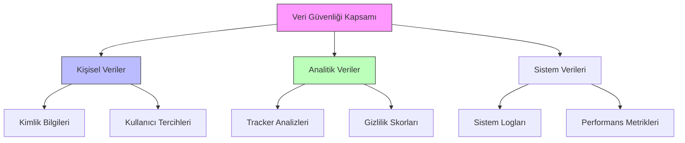
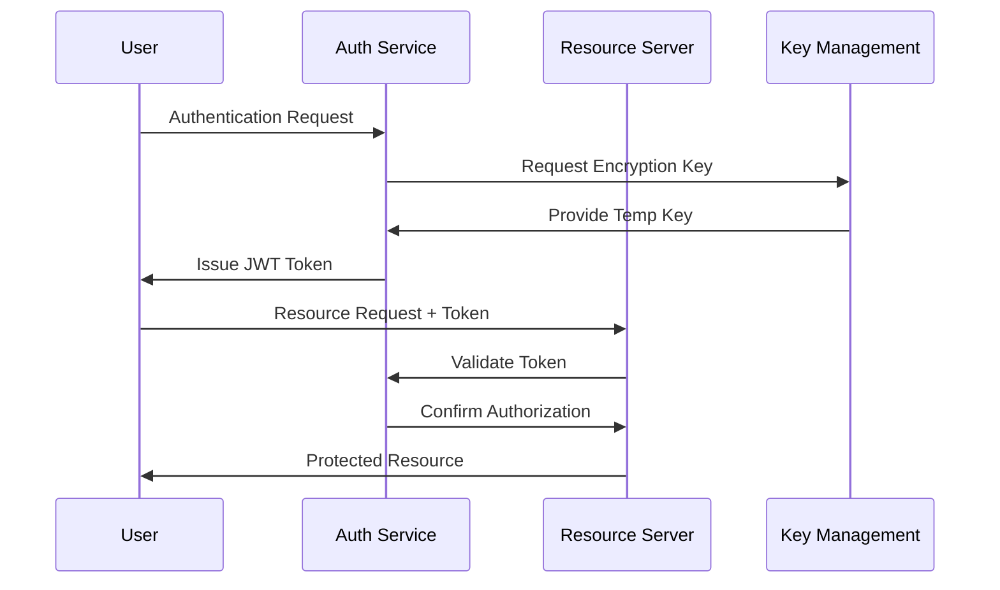
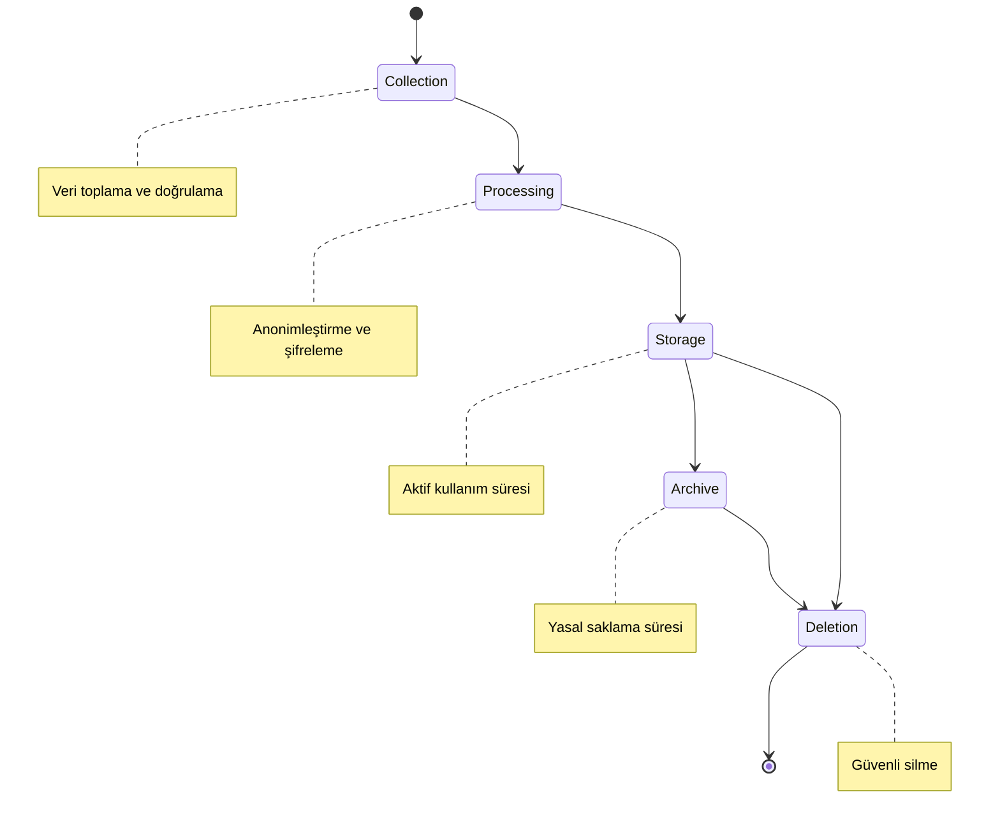
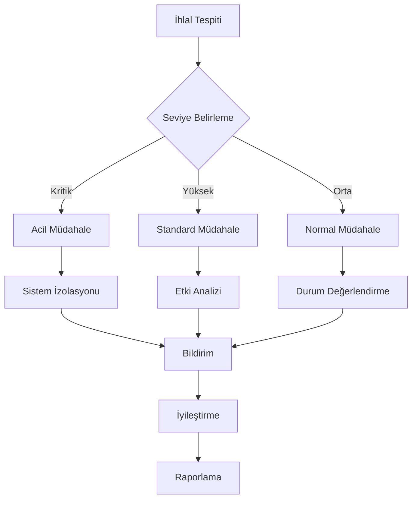

# Dijital Ayak İzi İzleyici - RFC (Request for Comments)

## RFC Bilgileri

| Başlık         | Detay                                    |
| -------------- | ---------------------------------------- |
| RFC No         | RFC-005                                  |
| Başlık         | Veri Güvenliği ve Uyumluluk Stratejileri |
| Durum          | Taslak                                   |
| Yazar          | Solo Developer                           |
| Son Güncelleme | 2024-03-12                               |
| Hedef Versiyon | 1.0.0                                    |

## İçindekiler

1. [Giriş ve Amaç](#1-giriş-ve-amaç)
2. [Toplanan Veriler ve Anonimleştirme Yöntemleri](#2-toplanan-veriler-ve-anonimleştirme-yöntemleri)
3. [Şifreleme ve Veri Koruma Önlemleri](#3-şifreleme-ve-veri-koruma-önlemleri)
4. [Veri Saklama Süresi](#4-veri-saklama-süresi)
5. [Verinin Silinmesi ve Unutulma Hakkı](#5-verinin-silinmesi-ve-unutulma-hakkı)
6. [Veri İhlali Müdahale Planı](#6-veri-i̇hlali-müdahale-planı)
7. [Uyumluluk ve Denetim](#7-uyumluluk-ve-denetim)

## 1. Giriş ve Amaç

### 1.1 Veri Güvenliği Stratejisinin Amacı

Dijital Ayak İzi İzleyici platformu, kullanıcıların çevrimiçi gizliliklerini korurken kendi verilerinin de maksimum güvenlikle işlenmesini hedefler. Bu RFC, platformun veri güvenliği ve gizlilik uyumluluğu stratejilerini detaylandırır.

### 1.2 Temel Prensipler ve Hedefler

```yaml
Veri Güvenliği Prensipleri:
  1. Privacy by Design:
    - Varsayılan gizlilik ayarları
    - Minimum veri toplama
    - Şeffaf veri işleme

  2. Yasal Uyumluluk:
    - GDPR (Avrupa Birliği)
    - CCPA (Kaliforniya)
    - KVKK (Türkiye)
    - LGPD (Brezilya)

  3. Kullanıcı Hakları:
    - Veri erişimi
    - Veri taşınabilirliği
    - Silme hakkı
    - İşleme kısıtlama
```

### 1.3 Kapsam ve Sınırlar



## 2. Toplanan Veriler ve Anonimleştirme Yöntemleri

### 2.1 Veri Kategorileri ve Toplama Amacı

```typescript
interface CollectedData {
  personalData: {
    identifiers: {
      userId: string; // Pseudonymized
      deviceId: string; // Hashed
      emailHash: string; // One-way hash
    };
    preferences: {
      privacySettings: PrivacySettings;
      browserConfig: BrowserConfig;
    };
  };

  analyticsData: {
    visitedSites: Array<{
      domainHash: string; // One-way hash
      timestamp: number;
      trackers: TrackerInfo[];
    }>;
    privacyScores: Array<{
      score: number;
      timestamp: number;
      factors: ScoringFactors;
    }>;
  };
}
```

### 2.2 Anonimleştirme Stratejileri

#### 2.2.1 Pseudonymization

```yaml
Teknikler:
  UUID Kullanımı:
    - Kullanıcı ID'leri için UUID v4
    - Her oturum için yeni session ID
    - Cihaz tanımlayıcıları için rotasyon

  Hash Zincirleme:
    - Email: Argon2id + salt
    - Domain: SHA-256 + timestamp
    - IP: Truncation + masking

  Veri Ayırma:
    - Kimlik bilgileri ayrı depolama
    - Linkage sadece gerektiğinde
    - Temporary mapping tables
```

#### 2.2.2 Differential Privacy

```typescript
interface DifferentialPrivacyConfig {
  epsilon: number; // Gizlilik bütçesi
  delta: number; // Hata toleransı
  sensitivity: number; // Veri hassasiyeti

  noiseDistribution: {
    type: 'laplace' | 'gaussian';
    parameters: {
      mean: number;
      scale: number;
    };
  };

  aggregationRules: {
    minGroupSize: number; // Minimum k-anonymity
    suppressionThreshold: number;
    generalizationLevels: number[];
  };
}

const privacyConfig: DifferentialPrivacyConfig = {
  epsilon: 0.1, // Sıkı gizlilik
  delta: 0.00001, // Düşük hata toleransı
  sensitivity: 1,
  noiseDistribution: {
    type: 'laplace',
    parameters: {
      mean: 0,
      scale: 1.0,
    },
  },
  aggregationRules: {
    minGroupSize: 5,
    suppressionThreshold: 0.01,
    generalizationLevels: [1, 2, 3],
  },
};
```

## 3. Şifreleme ve Veri Koruma Önlemleri

### 3.1 Şifreleme Stratejisi

```yaml
Encryption Layers:
  Transport Layer:
    Protocol: TLS 1.3
    Cipher Suites:
      - TLS_AES_256_GCM_SHA384
      - TLS_CHACHA20_POLY1305_SHA256
    Certificate: EV SSL

  Data at Rest:
    Algorithm: AES-256-GCM
    Key Management:
      - Hardware Security Module (HSM)
      - Key rotation (30 days)
      - Secure key distribution

  Field Level:
    Sensitive Fields:
      - PII: ChaCha20-Poly1305
      - Credentials: Argon2id
      - Session data: AES-256-CBC
```

### 3.2 Erişim Kontrolü



### 3.3 Oturum Güvenliği

```typescript
interface SessionSecurity {
  jwt: {
    algorithm: 'RS256';
    expiresIn: '1h';
    refreshToken: {
      rotationPolicy: 'every-use' | 'time-based';
      maxLifetime: '7d';
    };
  };

  csrf: {
    tokenType: 'double-submit-cookie';
    headerName: 'X-CSRF-Token';
    cookieOptions: {
      httpOnly: true;
      secure: true;
      sameSite: 'strict';
    };
  };

  rateLimit: {
    window: 60000; // 1 minute
    max: 100; // requests
    trustProxy: true;
  };
}
```

## 4. Veri Saklama Süresi

### 4.1 Veri Yaşam Döngüsü



### 4.2 Veri Saklama Politikaları

```yaml
Retention Periods:
  User Data:
    Active Account:
      - Basic profile: Account active + 30 days
      - Security logs: 12 months
      - Settings: Account duration

    Deleted Account:
      - Basic profile: Immediate deletion
      - Analytics: Anonymized after 90 days
      - Logs: 6 months (regulatory)

  Analytics Data:
    Raw Data:
      - Tracker logs: 30 days
      - Performance metrics: 90 days
      - Usage statistics: 12 months

    Aggregated Data:
      - Monthly reports: 24 months
      - Trend analysis: 36 months
      - Research data: Unlimited (anonymized)
```

## 5. Verinin Silinmesi ve Unutulma Hakkı

### 5.1 Veri Silme Mekanizmaları

```typescript
interface DataDeletionRequest {
  userId: string;
  requestType: 'full' | 'partial';
  scope: {
    personalData: boolean;
    analyticsData: boolean;
    deviceData: boolean;
  };
  verification: {
    method: 'email' | '2fa' | 'password';
    proof: string;
  };
  legal: {
    gdprRequest: boolean;
    retentionOverride: boolean;
    regulatoryHold: boolean;
  };
}

interface DeletionResponse {
  requestId: string;
  status: 'pending' | 'completed' | 'failed';
  completionEstimate: Date;
  affectedSystems: string[];
  verificationToken: string;
}
```

### 5.2 Silme Prosedürü

```yaml
Deletion Process:
  1. Kullanıcı Doğrulama:
    - İki faktörlü doğrulama
    - Bekleme süresi (24 saat)
    - Geri alınamaz uyarısı

  2. Veri Tespiti:
    - Kullanıcıya ait tüm verilerin tespiti
    - İlişkili verilerin belirlenmesi
    - Yasal gerekliliklerin kontrolü

  3. Silme İşlemi:
    - Soft delete işaretlemesi
    - Yedeklerden temizleme
    - Üçüncü taraf servislerden silme

  4. Doğrulama:
    - Silme işleminin teyidi
    - Kullanıcıya bilgilendirme
    - Silme kaydının tutulması
```

## 6. Veri İhlali Müdahale Planı

### 6.1 İhlal Tespit ve Sınıflandırma

```yaml
İhlal Kategorileri:
  Kritik (Seviye 1):
    - Kimlik bilgileri sızıntısı
    - Şifre veritabanı ihlali
    - Sistem seviyesi yetkisiz erişim
    Yanıt Süresi: <1 saat

  Yüksek (Seviye 2):
    - Kısıtlı veri sızıntısı
    - API güvenlik ihlali
    - DoS saldırıları
    Yanıt Süresi: <4 saat

  Orta (Seviye 3):
    - Yetkilendirme hataları
    - Sınırlı veri ifşası
    - Sistem anomalileri
    Yanıt Süresi: <12 saat
```

### 6.2 Müdahale Prosedürü



### 6.3 İletişim Planı

```typescript
interface BreachNotification {
  severity: 'critical' | 'high' | 'medium';
  affectedUsers: {
    count: number;
    regions: string[];
    dataTypes: string[];
  };
  timeline: {
    detectionTime: Date;
    containmentTime: Date;
    notificationTime: Date;
  };
  actions: {
    required: string[];
    recommended: string[];
    completed: string[];
  };
  communication: {
    channels: string[];
    languages: string[];
    templates: Record<string, string>;
  };
}
```

## 7. Uyumluluk ve Denetim

### 7.1 Düzenli Denetimler

```yaml
Denetim Programı:
  İç Denetim:
    Sıklık: 3 ayda bir
    Kapsam:
      - Güvenlik kontrolleri
      - Erişim logları
      - Veri işleme uyumluluğu

  Dış Denetim:
    Sıklık: Yılda bir
    Kapsam:
      - Penetrasyon testleri
      - Uyumluluk denetimi
      - Sertifikasyon yenileme

  Sürekli İzleme:
    - Otomatik güvenlik taramaları
    - Log analizi
    - Anomali tespiti
```

### 7.2 Uyumluluk Metrikleri

```typescript
interface ComplianceMetrics {
  gdpr: {
    dataSubjectRequests: {
      received: number;
      completed: number;
      completionTime: number;
    };
    breachNotifications: {
      reported: number;
      timeToNotify: number;
    };
    consentTracking: {
      validConsents: number;
      renewalRate: number;
    };
  };
  securityMetrics: {
    incidentResponse: {
      meanTimeToDetect: number;
      meanTimeToResolve: number;
    };
    accessControl: {
      unauthorizedAttempts: number;
      privilegeViolations: number;
    };
  };
  dataProtection: {
    encryptionCoverage: number;
    keyRotationCompliance: number;
    backupSuccess: number;
  };
}
```

---

## Versiyon Geçmişi

| Versiyon | Tarih      | Değişiklikler | Yazar          |
| -------- | ---------- | ------------- | -------------- |
| 0.1.0    | 2024-03-12 | İlk taslak    | Solo Developer |

## RFC Durumu

- [x] Taslak
- [ ] İnceleme
- [ ] Son Revizyon
- [ ] Onaylandı
- [ ] Uygulanıyor

## Katkıda Bulunanlar

| İsim           | Rol            | Organizasyon |
| -------------- | -------------- | ------------ |
| Solo Developer | Lead Developer | -            |
