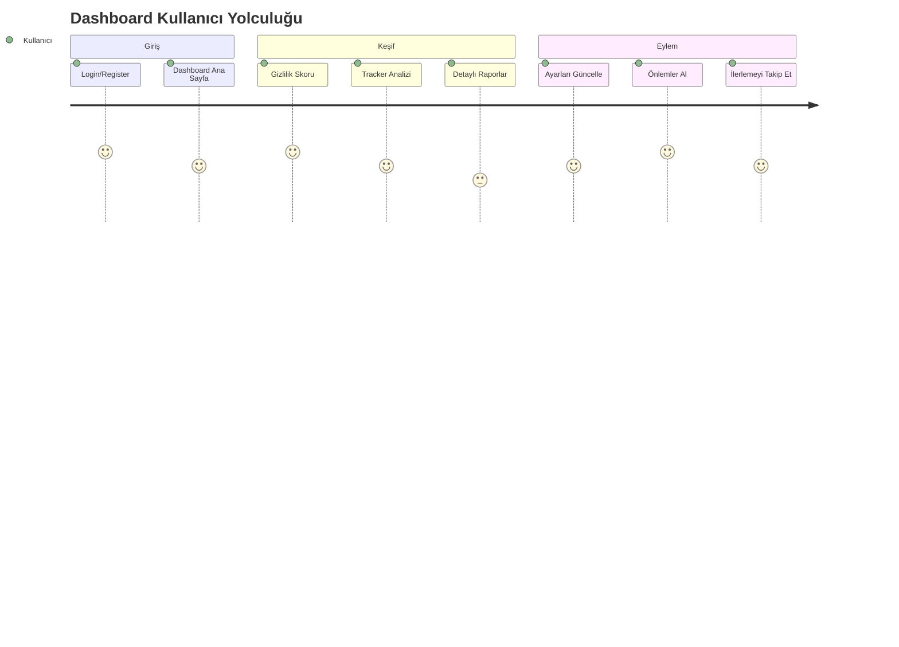
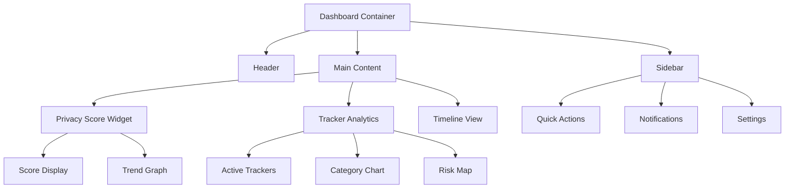

# Dijital Ayak İzi İzleyici - RFC (Request for Comments)

## RFC Bilgileri

| Başlık         | Detay                                           |
| -------------- | ----------------------------------------------- |
| RFC No         | RFC-006                                         |
| Başlık         | Dashboard ve Kullanıcı Arayüzü Tasarım İlkeleri |
| Durum          | Taslak                                          |
| Yazar          | Solo Developer                                  |
| Son Güncelleme | 2024-03-13                                      |
| Hedef Versiyon | 1.0.0                                           |

## İçindekiler

1. [Giriş ve Amaç](#1-giriş-ve-amaç)
2. [UI/UX Tasarım Prensipleri](#2-uiux-tasarım-prensipleri)
3. [Dashboard Veri Görselleştirme](#3-dashboard-veri-görselleştirme)
4. [Teknoloji Stack ve Bileşenler](#4-teknoloji-stack-ve-bileşenler)
5. [Responsive Tasarım Stratejisi](#5-responsive-tasarım-stratejisi)
6. [Erişilebilirlik ve Performans](#6-erişilebilirlik-ve-performans)
7. [Tema ve Özelleştirme](#7-tema-ve-özelleştirme)

## 1. Giriş ve Amaç

### 1.1 Kullanıcı Arayüzü Vizyonu

Dashboard ve kullanıcı arayüzü, kullanıcıların dijital ayak izlerini ve gizlilik durumlarını kolay anlaşılır ve etkileşimli bir şekilde görüntülemelerini sağlamayı amaçlar. Arayüz tasarımı şu temel prensiplere dayanır:

- Sezgisel ve kullanıcı dostu tasarım
- Veri odaklı görselleştirme
- Gerçek zamanlı güncellemeler
- Kişiselleştirilebilir deneyim

### 1.2 Temel Tasarım Hedefleri

```yaml
Kullanıcı Deneyimi:
  1. Anlaşılabilirlik:
    - Açık ve net veri sunumu
    - Sezgisel navigasyon
    - Yardımcı ipuçları

  2. Etkileşim:
    - Anlık geri bildirim
    - Drag-and-drop özellikler
    - Filtreleme ve sıralama

  3. Kişiselleştirme:
    - Özelleştirilebilir widget'lar
    - Tema seçenekleri
    - Veri görünüm tercihleri
```

### 1.3 Kullanıcı Yolculuğu



## 2. UI/UX Tasarım Prensipleri

### 2.1 Görsel Hiyerarşi

```yaml
Tasarım Öğeleri:
  Ana Paneller:
    - Gizlilik Skoru Widget'ı
    - Aktif Tracker Listesi
    - Risk Analiz Grafiği
    - Hızlı Eylem Butonları

  Renk Paleti:
    Primary: '#2196F3' # Ana tema rengi
    Success: '#4CAF50' # Güvenli durum
    Warning: '#FFC107' # Dikkat gerektiren
    Danger: '#F44336' # Riskli durum
    Background: '#FFFFFF' # Arka plan
    Text: '#212121' # Metin rengi

  Tipografi:
    - Başlık: Inter, 24px, bold
    - Alt Başlık: Inter, 18px, semibold
    - Metin: Inter, 14px, regular
    - Veri Etiketleri: Inter, 12px, medium
```

### 2.2 İnteraktif Bileşenler

```typescript
interface InteractiveElement {
  type: 'button' | 'toggle' | 'slider' | 'card';
  state: {
    hover: CSSProperties;
    active: CSSProperties;
    disabled: CSSProperties;
  };
  animation: {
    duration: string;
    easing: string;
    properties: string[];
  };
  feedback: {
    visual: boolean;
    haptic?: boolean;
    audio?: boolean;
  };
}

const buttonStyles: InteractiveElement = {
  type: 'button',
  state: {
    hover: {
      transform: 'translateY(-2px)',
      boxShadow: '0 4px 6px rgba(0,0,0,0.1)',
    },
    active: {
      transform: 'translateY(1px)',
      boxShadow: 'none',
    },
    disabled: {
      opacity: 0.6,
      cursor: 'not-allowed',
    },
  },
  animation: {
    duration: '0.2s',
    easing: 'cubic-bezier(0.4, 0, 0.2, 1)',
    properties: ['transform', 'box-shadow', 'opacity'],
  },
  feedback: {
    visual: true,
    haptic: true,
  },
};
```

## 3. Dashboard Veri Görselleştirme

### 3.1 Ana Dashboard Düzeni



### 3.2 Veri Görselleştirme Bileşenleri

```typescript
interface ChartConfig {
  type: 'line' | 'bar' | 'pie' | 'radar' | 'heatmap';
  data: DataSet;
  options: {
    responsive: boolean;
    maintainAspectRatio: boolean;
    animation: {
      duration: number;
      easing: string;
    };
    interactions: {
      hover: boolean;
      click: boolean;
    };
    tooltip: {
      enabled: boolean;
      position: 'nearest' | 'average';
      callbacks: Record<string, Function>;
    };
  };
}

// Chart.js konfigürasyon örneği
const privacyScoreChart: ChartConfig = {
  type: 'line',
  data: {
    labels: ['Hafta 1', 'Hafta 2', 'Hafta 3', 'Hafta 4'],
    datasets: [
      {
        label: 'Gizlilik Skoru',
        data: [75, 82, 78, 85],
        borderColor: '#2196F3',
        fill: false,
      },
    ],
  },
  options: {
    responsive: true,
    maintainAspectRatio: false,
    animation: {
      duration: 750,
      easing: 'easeInOutQuart',
    },
    interactions: {
      hover: true,
      click: true,
    },
    tooltip: {
      enabled: true,
      position: 'nearest',
      callbacks: {
        label: (context) => `Skor: ${context.parsed.y}`,
      },
    },
  },
};
```

### 3.3 Gerçek Zamanlı Veri Güncelleme

```typescript
interface RealTimeUpdateConfig {
  websocket: {
    url: string;
    reconnectStrategy: {
      attempts: number;
      backoff: number;
    };
  };
  dataStreams: {
    [key: string]: {
      topic: string;
      updateInterval: number;
      bufferSize: number;
    };
  };
  visualization: {
    smoothTransition: boolean;
    transitionDuration: number;
    notifyOnUpdate: boolean;
  };
}

const realTimeConfig: RealTimeUpdateConfig = {
  websocket: {
    url: 'wss://api.digitalfootprint.com/realtime',
    reconnectStrategy: {
      attempts: 5,
      backoff: 1500,
    },
  },
  dataStreams: {
    privacyScore: {
      topic: 'privacy.score.update',
      updateInterval: 5000,
      bufferSize: 100,
    },
    activeTrackers: {
      topic: 'trackers.active',
      updateInterval: 1000,
      bufferSize: 50,
    },
  },
  visualization: {
    smoothTransition: true,
    transitionDuration: 300,
    notifyOnUpdate: true,
  },
};
```

## 4. Teknoloji Stack ve Bileşenler

### 4.1 Frontend Teknolojileri

```yaml
Core Technologies:
  Framework:
    - React 18+
    - TypeScript 5+
    - Vite

  Styling:
    - TailwindCSS
    - CSS Modules
    - CSS-in-JS (styled-components)

  State Management:
    - Redux Toolkit
    - React Query
    - Zustand

Vizualization Libraries:
  Charts:
    - Chart.js
    - D3.js
    - Nivo

  Maps:
    - Leaflet
    - MapboxGL

  Animations:
    - Framer Motion
    - GSAP
```

### 4.2 Bileşen Kütüphanesi

```typescript
interface ComponentLibrary {
  core: {
    Button: React.FC<ButtonProps>;
    Input: React.FC<InputProps>;
    Card: React.FC<CardProps>;
    Modal: React.FC<ModalProps>;
  };
  data: {
    Table: React.FC<TableProps>;
    Chart: React.FC<ChartProps>;
    Timeline: React.FC<TimelineProps>;
    Map: React.FC<MapProps>;
  };
  feedback: {
    Alert: React.FC<AlertProps>;
    Toast: React.FC<ToastProps>;
    Progress: React.FC<ProgressProps>;
    Skeleton: React.FC<SkeletonProps>;
  };
  layout: {
    Grid: React.FC<GridProps>;
    Flex: React.FC<FlexProps>;
    Container: React.FC<ContainerProps>;
    Sidebar: React.FC<SidebarProps>;
  };
}
```

## 5. Responsive Tasarım Stratejisi

### 5.1 Breakpoint Sistemi

```yaml
Breakpoints:
  xs: 0px # Mobile S
  sm: 640px # Mobile L
  md: 768px # Tablet
  lg: 1024px # Laptop
  xl: 1280px # Desktop
  2xl: 1536px # Large Desktop

Layout Grid:
  Columns:
    xs: 4
    sm: 8
    md: 12
    lg: 12
    xl: 16

  Gutters:
    xs: 16px
    sm: 24px
    md: 32px
    lg: 40px
    xl: 48px
```

### 5.2 Mobile-First Yaklaşımı

```typescript
interface ResponsiveConfig {
  layout: {
    sidebar: {
      xs: 'hidden';
      md: 'docked';
      lg: 'expanded';
    };
    content: {
      xs: 'stacked';
      md: 'grid';
      lg: 'dashboard';
    };
  };
  components: {
    charts: {
      xs: 'simplified';
      md: 'interactive';
      lg: 'detailed';
    };
    tables: {
      xs: 'cards';
      md: 'scrollable';
      lg: 'full';
    };
  };
  navigation: {
    xs: 'bottom-bar';
    md: 'side-nav';
    lg: 'expanded-nav';
  };
}
```

## 6. Erişilebilirlik ve Performans

### 6.1 WCAG 2.1 Uyumluluğu

```yaml
Accessibility Features:
  Semantic HTML:
    - Proper heading hierarchy
    - ARIA landmarks
    - Descriptive alt texts

  Keyboard Navigation:
    - Focus indicators
    - Keyboard shortcuts
    - Skip links

  Color Contrast:
    - AA standard minimum
    - High contrast mode
    - Color blindness support

  Screen Readers:
    - ARIA labels
    - Live regions
    - Descriptive buttons
```

### 6.2 Performans Optimizasyonu

```typescript
interface PerformanceConfig {
  loading: {
    strategy: 'lazy' | 'eager' | 'auto';
    threshold: number;
    placeholder: React.ReactNode;
  };
  caching: {
    strategy: 'stale-while-revalidate' | 'cache-first';
    ttl: number;
    maxEntries: number;
  };
  code: {
    splitting: boolean;
    preloading: string[];
    dynamicImports: string[];
  };
  metrics: {
    fcp: number; // First Contentful Paint
    lcp: number; // Largest Contentful Paint
    fid: number; // First Input Delay
    cls: number; // Cumulative Layout Shift
  };
}

const performanceTargets: PerformanceConfig = {
  loading: {
    strategy: 'auto',
    threshold: 0.1,
    placeholder: <Skeleton />
  },
  caching: {
    strategy: 'stale-while-revalidate',
    ttl: 3600,
    maxEntries: 100
  },
  code: {
    splitting: true,
    preloading: ['dashboard', 'charts'],
    dynamicImports: ['settings', 'reports']
  },
  metrics: {
    fcp: 1000,  // 1s
    lcp: 2500,  // 2.5s
    fid: 100,   // 100ms
    cls: 0.1    // 0.1
  }
};
```

## 7. Tema ve Özelleştirme

### 7.1 Tema Sistemi

```typescript
interface ThemeConfig {
  colors: {
    primary: Record<string, string>;
    secondary: Record<string, string>;
    accent: Record<string, string>;
    neutral: Record<string, string>;
    semantic: {
      success: string;
      warning: string;
      error: string;
      info: string;
    };
  };
  typography: {
    fontFamily: {
      sans: string[];
      serif: string[];
      mono: string[];
    };
    fontSize: Record<string, string>;
    fontWeight: Record<string, number>;
    lineHeight: Record<string, number>;
  };
  spacing: Record<string, string>;
  borderRadius: Record<string, string>;
  shadows: Record<string, string>;
  transitions: {
    duration: Record<string, string>;
    easing: Record<string, string>;
  };
}
```

### 7.2 Özelleştirme Seçenekleri

```yaml
User Preferences:
  Layout:
    - Dashboard düzeni
    - Widget yerleşimi
    - Sidebar pozisyonu

  Appearance:
    - Renk teması
    - Font boyutu
    - Kontrast seviyesi

  Data Display:
    - Grafik tipleri
    - Veri güncelleme sıklığı
    - Bildirim tercihleri

  Accessibility:
    - Metin boyutu
    - Animasyon azaltma
    - Klavye kısayolları
```

---

## Versiyon Geçmişi

| Versiyon | Tarih      | Değişiklikler | Yazar          |
| -------- | ---------- | ------------- | -------------- |
| 0.1.0    | 2024-03-13 | İlk taslak    | Solo Developer |

## RFC Durumu

- [x] Taslak
- [ ] İnceleme
- [ ] Son Revizyon
- [ ] Onaylandı
- [ ] Uygulanıyor

## Katkıda Bulunanlar

| İsim           | Rol            | Organizasyon |
| -------------- | -------------- | ------------ |
| Solo Developer | Lead Developer | -            |
