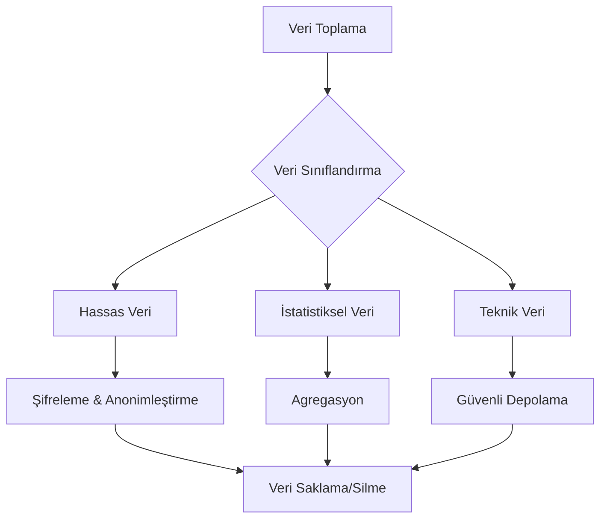
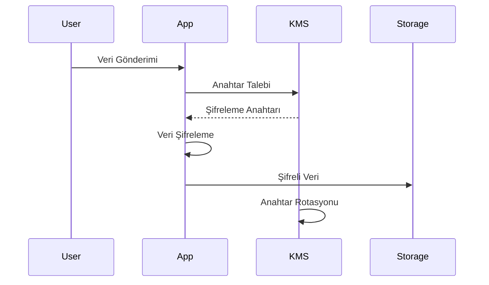
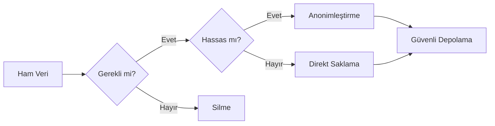
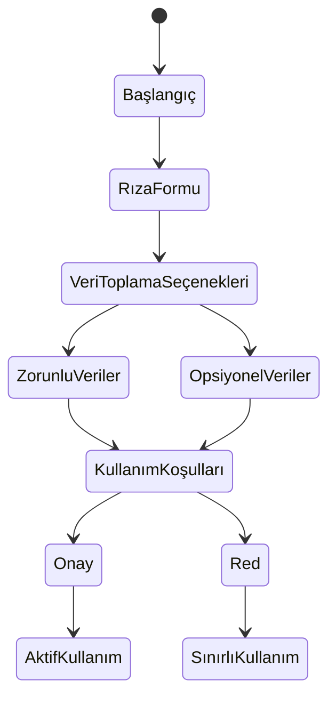
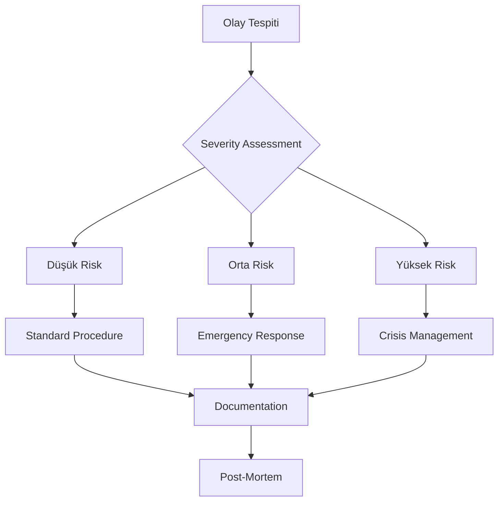

# Dijital Ayak İzi İzleyici - Güvenlik ve Gizlilik Dokümanı (SPD)

## 1. Veri Toplama ve İşleme Yöntemleri

### 1.1 Veri Toplama Kapsamı

#### 1.1.1 Tarayıcı Uzantısı Üzerinden Toplanan Veriler

```yaml
Temel Veriler:
  - Ziyaret edilen web siteleri domain bilgisi
  - Tespit edilen tracker'ların türü ve kaynağı
  - Engellenen tracker sayısı ve türleri
  - Gizlilik risk skoru

Çerez Verileri:
  - Üçüncü taraf çerez bilgileri
  - Çerez yaşam süreleri
  - Çerez kategorileri

İstatistiksel Veriler:
  - Tracker engelleme istatistikleri
  - Performance metrics
  - Kullanıcı tercihleri
```

#### 1.1.2 Web Platformu Üzerinden Toplanan Veriler

```yaml
Hesap Bilgileri:
  - Email adresi (hash'lenmiş)
  - Şifre (bcrypt ile hash'lenmiş)
  - Tercih ayarları

Analitik Veriler:
  - Gizlilik skoru trend analizi
  - Tracker istatistikleri
  - Risk değerlendirme raporları
```

### 1.2 Veri İşleme Prensipleri



### 1.3 Veri Saklama ve Silme Politikaları

| Veri Tipi        | Saklama Süresi            | Silme Yöntemi              |
| ---------------- | ------------------------- | -------------------------- |
| Hesap Bilgileri  | Hesap aktif olduğu sürece | Tam silme                  |
| Tracker Verileri | 90 gün                    | Anonimleştirerek arşivleme |
| Analitik Veriler | 12 ay                     | Agregasyon sonrası silme   |
| Log Kayıtları    | 30 gün                    | Otomatik silme             |

## 2. Şifreleme Sistemi

### 2.1 Kullanılan Şifreleme Algoritmaları

```yaml
Simetrik Şifreleme:
  Algorithm: AES-256-GCM
  Key Size: 256 bit
  IV Size: 96 bit
  Usage:
    - Hassas kullanıcı verileri
    - Oturum bilgileri
    - Cache verileri

Asimetrik Şifreleme:
  Algorithm: RSA-4096
  Key Size: 4096 bit
  Usage:
    - API iletişimi
    - Veri aktarımı
    - Key exchange

Hash Algoritmaları:
  - Passwords: Argon2id
  - Data Integrity: SHA-512
  - Quick Hash: BLAKE3
```

### 2.2 Anahtar Yönetimi



### 2.3 TLS Konfigürasyonu

```yaml
TLS Versiyonu: 1.3
Cipher Suites:
  - TLS_AES_256_GCM_SHA384
  - TLS_CHACHA20_POLY1305_SHA256
  - TLS_AES_128_GCM_SHA256

Certificate Requirements:
  - EV SSL for Web Platform
  - Domain Validation for APIs
  - HSTS Preloading
  - OCSP Stapling
```

## 3. Veri Anonimleştirme

### 3.1 Anonimleştirme Teknikleri

#### 3.1.1 Pseudonymization

```typescript
interface PseudonymizationStrategy {
  userIdentifiers: {
    realEmail: string;
    pseudoId: string;
    temporaryId: string;
  };

  deviceData: {
    realIP: string;
    maskedIP: string;
    sessionId: string;
  };
}
```

#### 3.1.2 Differential Privacy

```yaml
Epsilon Values:
  High Sensitivity: ε = 0.1
  Medium Sensitivity: ε = 0.5
  Low Sensitivity: ε = 1.0

Noise Addition:
  Method: Laplace Mechanism
  Scale: Based on sensitivity level
  Application:
    - Aggregate statistics
    - Trend analysis
    - Usage patterns
```

### 3.2 Veri Minimizasyonu



## 4. Erişim Kontrol Sistemi

### 4.1 Kimlik Doğrulama

```yaml
OAuth 2.0 Configuration:
  Grant Types:
    - Authorization Code with PKCE
    - Refresh Token

  Token Settings:
    Access Token: 1 saat
    Refresh Token: 30 gün
    Scope Based Access

JWT Structure:
  Header:
    alg: RS256
    typ: JWT

  Payload:
    sub: user_id
    scope: permissions
    exp: expiration
    jti: token_id
```

### 4.2 Yetkilendirme Matrisi

| Rol       | Veri Görüntüleme | Veri Düzenleme  | Ayar Değiştirme | Admin İşlemleri |
| --------- | ---------------- | --------------- | --------------- | --------------- |
| Kullanıcı | Kendi verileri   | Kendi verileri  | Kendi ayarları  | Hayır           |
| Premium   | Gelişmiş analiz  | Kendi verileri  | Tüm ayarlar     | Hayır           |
| Admin     | Tüm veriler      | Yetki dahilinde | Sistem ayarları | Evet            |

### 4.3 API Güvenliği

```yaml
Rate Limiting:
  - IP based: 1000 request/hour
  - User based: 100 request/minute
  - Endpoint based: Configured per endpoint

API Security Headers:
  - X-Frame-Options: DENY
  - X-Content-Type-Options: nosniff
  - X-XSS-Protection: 1; mode=block
  - Content-Security-Policy: strict
```

## 5. Kullanıcı Rıza Yönetimi

### 5.1 Rıza Akışı



### 5.2 Gizlilik Politikası Şablonu

```yaml
Bölümler:
  1. Toplanan Veriler:
    - Zorunlu veriler
    - Opsiyonel veriler
    - Toplama amacı

  2. Veri Kullanımı:
    - İşleme amaçları
    - Üçüncü taraflarla paylaşım
    - Saklama süreleri

  3. Kullanıcı Hakları:
    - Erişim hakkı
    - Silme hakkı
    - Düzeltme hakkı
    - Veri taşıma hakkı
```

## 6. Yasal Uyumluluk

### 6.1 GDPR Uyumluluk Matrisi

| Gereksinim           | Uygulama              | Durum |
| -------------------- | --------------------- | ----- |
| Veri İşleme Rızası   | Açık onay mekanizması | ✓     |
| Veri Taşınabilirliği | JSON/CSV export       | ✓     |
| Unutulma Hakkı       | Hesap silme özelliği  | ✓     |
| Veri Erişimi         | Self-service portal   | ✓     |
| Veri İhlal Bildirimi | 72 saat içinde        | ✓     |

### 6.2 Denetim ve Raporlama

```yaml
Düzenli Denetimler:
  - Aylık güvenlik taramaları
  - 3 aylık penetrasyon testleri
  - 6 aylık uyumluluk kontrolleri
  - Yıllık bağımsız denetim

İhlal Müdahale Planı: 1. Tespit ve Değerlendirme
  2. Acil Müdahale
  3. İlgili Tarafları Bilgilendirme
  4. Düzeltici Önlemler
  5. Raporlama ve Dokümantasyon
```

## 7. Güvenlik Monitöring ve Olay Müdahale

### 7.1 Güvenlik Monitöring

```yaml
Monitöring Araçları:
  - SIEM sistemi
  - IDS/IPS
  - File Integrity Monitoring
  - Network Traffic Analysis

Alert Seviyeleri:
  Critical:
    - Veri sızıntısı tespiti
    - Unauthorized admin access
    - SSL certificate issues

  High:
    - Failed login attempts
    - Unusual data access patterns
    - API abuse

  Medium:
    - Performance anomalies
    - Minor policy violations
    - Configuration changes
```

### 7.2 Olay Müdahale Prosedürü



## 8. Sürekli İyileştirme

### 8.1 Güvenlik Metriksleri

```yaml
Performans Göstergeleri:
  - Güvenlik olay sayısı
  - Ortalama tespit süresi
  - Ortalama müdahale süresi
  - Başarılı saldırı sayısı
  - Kullanıcı şikayetleri

İyileştirme Hedefleri:
  - Olay tespit süresinin %20 azaltılması
  - Yanlış pozitif oranının %15 düşürülmesi
  - Kullanıcı memnuniyetinin %10 artırılması
```

---

## Versiyon Geçmişi

| Versiyon | Tarih | Değişiklikler |
| -------- | ----- | ------------- |
| 1.0.0    | -     | İlk sürüm     |

## Onay

| Rol                   | İsim | Tarih | İmza |
| --------------------- | ---- | ----- | ---- |
| Güvenlik Mimarı       |      |       |      |
| Veri Koruma Görevlisi |      |       |      |
| Hukuk Müşaviri        |      |       |      |
