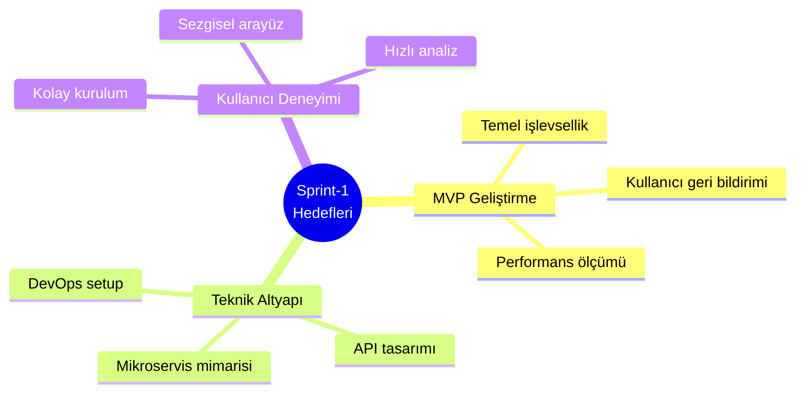
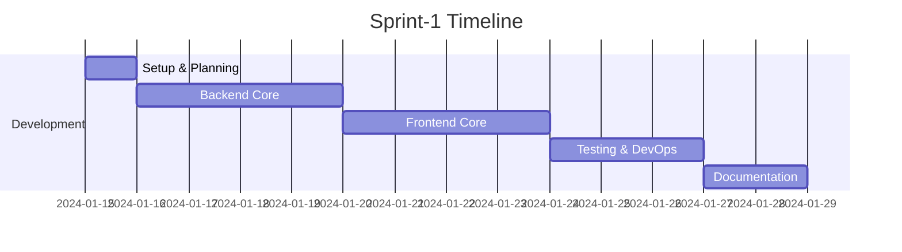

# Dijital Ayak İzi İzleyici - Sprint Dokümantasyonu

## Sprint Bilgileri

| Başlık      | Detay          |
| ----------- | -------------- |
| Sprint No   | Sprint-1       |
| Başlangıç   | 2024-01-15     |
| Bitiş       | 2024-01-29     |
| Durum       | Aktif          |
| Geliştirici | Solo Developer |

## İçindekiler

1. [Sprint Hedefleri](#1-sprint-hedefleri)
2. [Sprint Backlog](#2-sprint-backlog)
3. [Zaman Planlaması](#3-zaman-planlaması)
4. [Günlük Çalışma Planı](#4-günlük-çalışma-planı)
5. [Test Planı](#5-test-planı)
6. [İlerleme Takibi](#6-i̇lerleme-takibi)
7. [Risk Yönetimi](#7-risk-yönetimi)

## 1. Sprint Hedefleri

### 1.1 Ana Hedefler

```yaml
Teknik Hedefler:
  1. Tarayıcı Uzantısı MVP:
    - Temel tracker tespiti
    - Gizlilik skoru hesaplama
    - Basit kullanıcı arayüzü

  2. Backend Servisleri:
    - Auth Service temel yapısı
    - Tracker analiz servisi
    - API endpoint'leri

  3. Frontend Dashboard:
    - Kullanıcı girişi
    - Temel metrikler görünümü
    - Site bazlı raporlar

Bireysel İş Hedefleri:
  - MVP geliştirme tamamlama
  - %90 başarılı tracker tespiti
  - <1s analiz süresi
```

### 1.2 Stratejik Hedeflerle İlişki



## 2. Sprint Backlog

### 2.1 Kullanıcı Hikayeleri

#### US-001: Web Tracker Analizi

```yaml
Başlık: Web sitesi tracker analizi
Öncelik: Yüksek
Effort: 8 SP
Durum: To Do

Kullanıcı Hikayesi:
  Bir kullanıcı olarak,
  Ziyaret ettiğim web sitelerindeki trackerları görmek istiyorum,
  Böylece gizlilik risklerini anlayabilirim.

Kabul Kriterleri:
  1. Tracker Tespiti:
     - JavaScript trackerları tespit edilmeli
     - Çerezler analiz edilmeli
     - 3rd-party requestler izlenmeli

  2. Kullanıcı Arayüzü:
     - Tracker listesi gösterilmeli
     - Risk seviyeleri belirtilmeli
     - Toplam tracker sayısı görünmeli

  3. Performans:
     - Analiz <1s'de tamamlanmalı
     - CPU kullanımı <%1 olmalı
     - Bellek kullanımı <50MB olmalı

Alt Görevler:
  - [ ] Content script geliştirme
  - [ ] Background service worker
  - [ ] Popup UI tasarımı
  - [ ] API entegrasyonu
```

## 3. Zaman Planlaması

### 3.1 Bireysel Çalışma Planı

```yaml
Günlük Çalışma Dağılımı:
  Frontend (%40):
    - UI geliştirme
    - State management
    - Browser extension

  Backend (%40):
    - API geliştirme
    - Database işlemleri
    - Server yönetimi

  DevOps/Test (%20):
    - Test yazımı
    - Deployment
    - Monitoring

Not: Modüler geliştirme yaklaşımı ile her bileşen sırayla ele alınacak
```

### 3.2 Geliştirici Sorumlulukları

```yaml
Bireysel Sorumluluklar:
  Tüm Katmanlar:
    - Tarayıcı uzantısı geliştirme (Frontend)
    - Backend API geliştirme
    - Veritabanı tasarımı ve implementasyonu
    - CI/CD pipeline kurulumu
    - Test yazımı ve otomasyonu

Günlük İş Dağılımı:
  Sabah (09:00-12:00):
    - Backend geliştirme
    - API implementasyonu
    - Database işlemleri

  Öğleden Sonra (13:00-16:00):
    - Frontend geliştirme
    - UI implementasyonu
    - Browser extension

  Son Dilim (16:00-17:00):
    - Test ve dokümantasyon
    - Günlük değerlendirme
    - Sonraki gün planlaması
```

### 3.3 Zaman Planlaması



## 4. Günlük Çalışma Planı

### 4.1 Günlük Rutinler

```yaml
Günlük Plan:
  09:00-09:30:
    - Günlük plan oluşturma
    - Önceki günün değerlendirmesi
    - Engellerin tespiti

  09:30-12:00:
    - Backend geliştirme
    - API implementasyonu

  13:00-15:30:
    - Frontend geliştirme
    - UI implementasyonu

  15:30-16:30:
    - Test yazımı ve çalıştırma

  16:30-17:00:
    - Dokümantasyon
    - İlerleme kaydı
    - Sonraki gün planlaması

Molalar:
  - 10:45-11:00: Kısa mola
  - 12:00-13:00: Öğle molası
  - 14:30-14:45: Kısa mola
```

## 5. Test Planı

```yaml
Günlük Test Rutini:
  Unit Tests:
    - Her yeni özellik için
    - Her bug fix için
    - Hedef kapsam: >80

  Integration Tests:
    - Sprint sonunda
    - Kritik API değişikliklerinde

  Manuel Test:
    - Yeni özellik geliştirmesi sonrası
    - Kritik bug fixleri sonrası
```

## 6. İlerleme Takibi

```yaml
Günlük Metrikler:
  - Tamamlanan görevler
  - Kod kalitesi metrikleri
  - Test coverage
  - Bug sayısı

Sprint Metrikleri:
  - Velocity
  - Tamamlanan user story sayısı
  - Technical debt oranı
  - Dokümantasyon güncelliği
```

## 7. Risk Yönetimi

### 7.1 Risk Matrisi

| Risk             | Olasılık   | Etki   | Önlem                                        |
| ---------------- | ---------- | ------ | -------------------------------------------- |
| İş Yükü Yönetimi | Çok Yüksek | Yüksek | MVP odaklı geliştirme, sıkı önceliklendirme  |
| Bilgi Birikimi   | Yüksek     | Yüksek | Sürekli öğrenme, POC çalışmaları             |
| Teknik Zorluklar | Orta       | Yüksek | Araştırma süreleri, basit çözümlerle başlama |
| Zaman Yönetimi   | Yüksek     | Yüksek | Pomodoro tekniği, sıkı planlama              |
| Motivasyon       | Yüksek     | Yüksek | Küçük hedefler, düzenli molaları             |

### 7.2 Risk Azaltma Stratejileri

```yaml
Bireysel Riskler:
  - Sıkı zaman yönetimi
  - Pomodoro tekniği kullanımı
  - Düzenli mola ve dinlenme
  - İş-yaşam dengesi koruma
  - Sürekli öğrenme ve araştırma

Teknik Riskler:
  - Basit çözümlerle başlama
  - Modüler geliştirme yaklaşımı
  - Sık commit ve yedekleme
  - Test odaklı geliştirme (TDD)
  - Feature toggle kullanımı

Proje Riskleri:
  - MVP hedeflerine odaklanma
  - Küçük iterasyonlarla ilerleme
  - Günlük ilerleme kaydı
  - Esnek planlama
  - Sıkı önceliklendirme
```

---

## Versiyon Geçmişi

| Versiyon | Tarih      | Değişiklikler |
| -------- | ---------- | ------------- |
| 1.0.0    | 2024-01-15 | İlk sürüm     |
