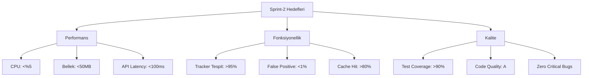
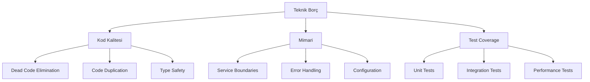

# Dijital Ayak İzi İzleyici - Sprint Dokümantasyonu

## Sprint Bilgileri

| Başlık      | Detay          |
| ----------- | -------------- |
| Sprint No   | Sprint-2       |
| Başlangıç   | 2024-01-30     |
| Bitiş       | 2024-02-13     |
| Durum       | Planlama       |
| Geliştirici | Solo Developer |

## İçindekiler

1. [Sprint Hedefleri](#1-sprint-hedefleri)
2. [Sprint Backlog](#2-sprint-backlog)
3. [Performans Optimizasyonu](#3-performans-optimizasyonu)
4. [Test ve Kalite Güvence](#4-test-ve-kalite-güvence)
5. [Teknik Borç Azaltma](#5-teknik-borç-azaltma)
6. [Risk Yönetimi](#6-risk-yönetimi)
7. [Çıktılar ve Başarı Kriterleri](#7-çıktılar-ve-başarı-kriterleri)

## 1. Sprint Hedefleri

### 1.1 Ana Hedefler

```yaml
Performans İyileştirmeleri:
  1. Tracker Tespit Algoritması:
    - İşlem süresini %40 azaltma
    - Bellek kullanımını optimize etme
    - Pattern eşleştirme verimliliği

  2. API Optimizasyonu:
    - Yanıt sürelerini %50 düşürme
    - Cache mekanizması implementasyonu
    - Rate limiting stratejisi

  3. Sistem Kaynakları:
    - CPU kullanımını %30 azaltma
    - Memory leak tespiti ve düzeltme
    - Disk I/O optimizasyonu

Fonksiyonel İyileştirmeler:
  - Tracker tespit doğruluğu artırma
  - False positive oranını düşürme
  - Yeni tracker pattern'leri ekleme
```

### 1.2 Sprint Metrikleri ve Hedefler



## 2. Sprint Backlog

### 2.1 Teknik Görevler

#### US-007: Tracker Tespit Optimizasyonu

```yaml
Başlık: Tracker tespit algoritması optimizasyonu
Öncelik: Kritik
Effort: 13 SP
Durum: To Do

Teknik Detaylar:
  1. Algoritma İyileştirmeleri:
     - Pattern matching optimizasyonu
     - DOM traversal verimliliği
     - Asenkron işlem yönetimi

  2. Bellek Yönetimi:
     - Gereksiz obje oluşumunu azaltma
     - WeakMap/WeakSet kullanımı
     - Garbage collection stratejisi

  3. Worker Stratejisi:
     - Web Worker implementasyonu
     - İş parçacığı yönetimi
     - Message passing optimizasyonu

Kabul Kriterleri:
  Performance:
    - İşlem süresi: <100ms
    - CPU kullanımı: <%5
    - Bellek kullanımı: <50MB

  Accuracy:
    - Tespit doğruluğu: >95%
    - False positive: <1%
    - False negative: <0.5%

Alt Görevler:
  - [ ] Profiling ve bottleneck analizi
  - [ ] Algoritma refactoring
  - [ ] Worker implementasyonu
  - [ ] Bellek optimizasyonu
  - [ ] Performance testleri
```

#### US-008: API Performans İyileştirmesi

```yaml
Başlık: API endpoint optimizasyonu
Öncelik: Yüksek
Effort: 8 SP
Durum: To Do

Teknik Detaylar:
  1. Caching Stratejisi:
     - Redis implementasyonu
     - Cache invalidation rules
     - Stale-while-revalidate pattern

  2. Query Optimizasyonu:
     - Index stratejisi
     - Bulk operation desteği
     - N+1 query eliminasyonu

  3. Response Optimizasyonu:
     - Payload minimization
     - Compression
     - Connection pooling

Kabul Kriterleri:
  Performance:
    - P95 latency: <100ms
    - Throughput: >1000 req/s
    - Cache hit rate: >80%

  Scalability:
    - Linear scaling
    - No degradation under load
    - Efficient resource usage

Alt Görevler:
  - [ ] Cache layer implementasyonu
  - [ ] Query optimizasyonu
  - [ ] Load testing
  - [ ] Monitoring setup
```

## 3. Performans Optimizasyonu

### 3.1 Tracker Tespit Optimizasyonu

```typescript
interface OptimizationStrategy {
  algorithm: {
    patternMatching: {
      useWorker: boolean;
      batchSize: number;
      priorityQueue: boolean;
    };
    domTraversal: {
      strategy: 'depth-first' | 'breadth-first';
      useVirtualDOM: boolean;
      cacheNodes: boolean;
    };
    memoryManagement: {
      gcTrigger: 'auto' | 'manual';
      poolSize: number;
      weakReferences: boolean;
    };
  };

  metrics: {
    performance: {
      processTime: number;
      memoryUsage: number;
      cpuUtilization: number;
    };
    accuracy: {
      truePositives: number;
      falsePositives: number;
      precision: number;
    };
  };
}

const optimizationConfig: OptimizationStrategy = {
  algorithm: {
    patternMatching: {
      useWorker: true,
      batchSize: 100,
      priorityQueue: true,
    },
    domTraversal: {
      strategy: 'depth-first',
      useVirtualDOM: true,
      cacheNodes: true,
    },
    memoryManagement: {
      gcTrigger: 'auto',
      poolSize: 1000,
      weakReferences: true,
    },
  },
  metrics: {
    performance: {
      processTime: 100, // ms
      memoryUsage: 50, // MB
      cpuUtilization: 5, // %
    },
    accuracy: {
      truePositives: 95, // %
      falsePositives: 1, // %
      precision: 0.95,
    },
  },
};
```

### 3.2 API Optimizasyon Stratejisi

```yaml
Caching Layer:
  Redis Configuration:
    - Connection pooling: 50 connections
    - Key expiration: Sliding window
    - Memory limit: 1GB
    - Eviction policy: allkeys-lru

  Cache Strategies:
    Read-Through:
      - Tracker patterns
      - User preferences
      - Static metadata

    Write-Through:
      - Analytics data
      - Audit logs
      - Score calculations

    Cache-Aside:
      - User sessions
      - Temporary data
      - Real-time metrics

Query Optimization:
  Indexing Strategy:
    - Composite indexes for frequent queries
    - Partial indexes for filtered queries
    - Text indexes for pattern matching

  Query Patterns:
    - Materialized views
    - Denormalization where needed
    - Batch processing
```

## 4. Test ve Kalite Güvence

### 4.1 Performance Test Suite

```typescript
interface PerformanceTestSuite {
  loadTest: {
    concurrent: number;
    duration: number;
    rampUp: number;
    scenarios: TestScenario[];
  };

  stressTest: {
    maxLoad: number;
    sustainedPeriod: number;
    recoveryTime: number;
  };

  enduranceTest: {
    duration: number;
    baseLoad: number;
    memoryProfile: boolean;
  };
}

interface TestScenario {
  name: string;
  weight: number;
  thresholds: {
    p95: number;
    p99: number;
    errorRate: number;
  };
  steps: {
    endpoint: string;
    method: string;
    payload?: unknown;
  }[];
}

const performanceTests: PerformanceTestSuite = {
  loadTest: {
    concurrent: 1000,
    duration: 3600, // 1 hour
    rampUp: 300, // 5 minutes
    scenarios: [
      {
        name: 'Tracker Analysis',
        weight: 70,
        thresholds: {
          p95: 200,
          p99: 500,
          errorRate: 0.01,
        },
        steps: [
          {
            endpoint: '/api/v1/trackers/analyze',
            method: 'POST',
          },
        ],
      },
    ],
  },
  stressTest: {
    maxLoad: 5000,
    sustainedPeriod: 600,
    recoveryTime: 300,
  },
  enduranceTest: {
    duration: 86400, // 24 hours
    baseLoad: 500,
    memoryProfile: true,
  },
};
```

### 4.2 Kalite Metrikleri

```yaml
Code Quality:
  Test Coverage:
    - Unit tests: >90
    - Integration tests: >80
    - E2E tests: >70

  Static Analysis:
    - Complexity: <15
    - Maintainability: A
    - Duplication: <3%

  Performance Metrics:
    - CPU profiling
    - Memory heap snapshots
    - Network waterfall analysis

Error Monitoring:
  - Error tracking
  - Performance monitoring
  - User feedback collection
```

## 5. Teknik Borç Azaltma

### 5.1 Refactoring Hedefleri



### 5.2 İyileştirme Planı

```yaml
Code Quality:
  - Kompleks fonksiyonların bölünmesi
  - Tip sisteminin güçlendirilmesi
  - Error handling standardizasyonu

Architecture:
  - Service boundary'lerinin netleştirilmesi
  - Configuration yönetiminin merkezileştirilmesi
  - Logging/monitoring standardizasyonu

Testing:
  - Test coverage artırımı
  - Test otomasyonu geliştirme
  - Performance test suite oluşturma
```

## 6. Risk Yönetimi

### 6.1 Risk Analizi

| Risk                    | Olasılık | Etki   | Önlem                                    |
| ----------------------- | -------- | ------ | ---------------------------------------- |
| Performans Degradasyonu | Yüksek   | Kritik | Sürekli monitoring, early warning system |
| Memory Leaks            | Orta     | Yüksek | Heap profiling, memory snapshots         |
| API Downtime            | Düşük    | Kritik | Circuit breaker, fallback mechanisms     |
| Data Consistency        | Orta     | Yüksek | Transaction management, data validation  |
| Cache Invalidation      | Yüksek   | Orta   | Cache versioning, graceful degradation   |

### 6.2 Risk Azaltma Stratejileri

```yaml
Performance Risks:
  - Continuous performance monitoring
  - Automated scaling policies
  - Load balancing optimization

Memory Management:
  - Regular memory profiling
  - Automated GC optimization
  - Resource usage alerts

API Stability:
  - Circuit breaker implementation
  - Rate limiting
  - Automated failover
```

## 7. Çıktılar ve Başarı Kriterleri

### 7.1 Performans Hedefleri

```typescript
interface PerformanceTargets {
  tracker: {
    detectionTime: number; // ms
    accuracy: number; // %
    resourceUsage: {
      cpu: number; // %
      memory: number; // MB
      diskIO: number; // MB/s
    };
  };

  api: {
    latency: {
      p50: number; // ms
      p95: number; // ms
      p99: number; // ms
    };
    throughput: number; // req/s
    errorRate: number; // %
  };

  system: {
    uptime: number; // %
    responseTime: number; // ms
    availability: number; // %
  };
}

const targets: PerformanceTargets = {
  tracker: {
    detectionTime: 100,
    accuracy: 95,
    resourceUsage: {
      cpu: 5,
      memory: 50,
      diskIO: 10,
    },
  },
  api: {
    latency: {
      p50: 50,
      p95: 100,
      p99: 200,
    },
    throughput: 1000,
    errorRate: 0.1,
  },
  system: {
    uptime: 99.9,
    responseTime: 200,
    availability: 99.9,
  },
};
```

### 7.2 Sprint Sonu Değerlendirme Kriterleri

```yaml
Success Metrics:
  Performance:
    - Tracker tespit süresi %40 azalma
    - API yanıt süresi %50 azalma
    - Sistem kaynak kullanımı %30 azalma

  Quality:
    - Test coverage >90%
    - Zero critical bugs
    - Improved error handling

  User Experience:
    - Faster analysis results
    - More accurate detections
    - Better error feedback
```

---

## Versiyon Geçmişi

| Versiyon | Tarih      | Değişiklikler |
| -------- | ---------- | ------------- |
| 1.0.0    | 2024-01-30 | İlk sürüm     |

## Sprint Durumu

- [x] Planlama
- [ ] Geliştirme
- [ ] Test
- [ ] Review
- [ ] Tamamlandı
