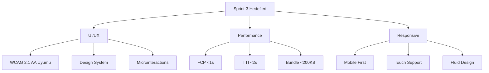

# Dijital Ayak İzi İzleyici - Sprint Dokümantasyonu

## Sprint Bilgileri

| Başlık      | Detay          |
| ----------- | -------------- |
| Sprint No   | Sprint-3       |
| Başlangıç   | 2024-02-14     |
| Bitiş       | 2024-02-28     |
| Durum       | Planlama       |
| Geliştirici | Solo Developer |

## İçindekiler

1. [Sprint Hedefleri](#1-sprint-hedefleri)
2. [Sprint Backlog](#2-sprint-backlog)
3. [UI/UX Geliştirmeleri](#3-uiux-geliştirmeleri)
4. [Dashboard İyileştirmeleri](#4-dashboard-i̇yileştirmeleri)
5. [Responsive Tasarım](#5-responsive-tasarım)
6. [Test ve Kullanıcı Geri Bildirimleri](#6-test-ve-kullanıcı-geri-bildirimleri)
7. [Çıktılar ve Başarı Kriterleri](#7-çıktılar-ve-başarı-kriterleri)

## 1. Sprint Hedefleri

### 1.1 Ana Hedefler

```yaml
UI/UX İyileştirmeleri:
  1. Kullanıcı Arayüzü:
    - Sezgisel navigasyon
    - Görsel tutarlılık
    - Erişilebilirlik standartları

  2. Dashboard Geliştirmeleri:
    - Yeni veri görselleştirmeleri
    - İnteraktif grafikler
    - Real-time güncelleme

  3. Responsive Tasarım:
    - Mobil öncelikli yaklaşım
    - Tablet optimizasyonu
    - Touch-friendly etkileşimler

Performans Hedefleri:
  - First Contentful Paint: <1s
  - Time to Interactive: <2s
  - Lighthouse skoru: >90
  - Kullanıcı memnuniyeti: >85
```

### 1.2 Sprint Metrikleri



## 2. Sprint Backlog

### 2.1 Tasarım Görevleri

#### US-009: Dashboard Yenileme

```yaml
Başlık: Dashboard UI/UX yenileme
Öncelik: Yüksek
Effort: 13 SP
Durum: To Do

Teknik Detaylar:
  1. Yeni Widget'lar:
     - Gizlilik Skoru Gauge
     - Tracker Timeline
     - Risk Heatmap
     - Trend Analytics

  2. İnteraktif Bileşenler:
     - Filtreleme ve sıralama
     - Drill-down analiz
     - Custom raporlama

  3. Görsel İyileştirmeler:
     - Tema sistemi
     - Dark/Light mode
     - Custom animasyonlar

Kabul Kriterleri:
  Performance:
    - FCP: <1s
    - TTI: <2s
    - FPS: 60

  Design:
    - WCAG 2.1 AA uyumlu
    - Responsive breakpoints
    - Design system consistency

Alt Görevler:
  - [ ] Wireframe ve mockup hazırlama
  - [ ] Component library geliştirme
  - [ ] Tema sistemi implementasyonu
  - [ ] Animation framework kurulumu
  - [ ] Performance optimizasyonu
```

#### US-010: Responsive Tasarım

```yaml
Başlık: Responsive tasarım implementasyonu
Öncelik: Yüksek
Effort: 8 SP
Durum: To Do

Teknik Detaylar:
  1. Mobile First Yaklaşım:
     - Fluid grid system
     - Adaptive components
     - Touch interactions

  2. Breakpoint Stratejisi:
     - xs: 0-576px (mobile)
     - sm: 576-768px (tablet)
     - md: 768-992px (laptop)
     - lg: 992-1200px (desktop)
     - xl: 1200px+ (large desktop)

  3. Progressive Enhancement:
     - Core functionality first
     - Enhanced features
     - Fallback stratejisi

Kabul Kriterleri:
  Mobile:
    - Touch target size: 44px
    - No horizontal scroll
    - Fast load time: <2s

  Responsive:
    - Fluid transitions
    - No layout breaks
    - Consistent experience

Alt Görevler:
  - [ ] Grid system implementasyonu
  - [ ] Component adaptasyonu
  - [ ] Touch event handling
  - [ ] Responsive testing
```

## 3. UI/UX Geliştirmeleri

### 3.1 Design System

```typescript
interface DesignSystem {
  colors: {
    primary: ColorPalette;
    secondary: ColorPalette;
    neutral: ColorPalette;
    semantic: {
      success: string;
      warning: string;
      error: string;
      info: string;
    };
  };

  typography: {
    family: {
      heading: string;
      body: string;
      mono: string;
    };
    scale: {
      h1: TextStyle;
      h2: TextStyle;
      body: TextStyle;
      small: TextStyle;
    };
    weights: {
      regular: number;
      medium: number;
      bold: number;
    };
  };

  spacing: {
    unit: number;
    scale: number[];
  };

  motion: {
    duration: {
      fast: string;
      normal: string;
      slow: string;
    };
    easing: {
      easeOut: string;
      easeInOut: string;
      spring: string;
    };
  };
}

const designTokens: DesignSystem = {
  colors: {
    primary: {
      50: '#E3F2FD',
      100: '#BBDEFB',
      500: '#2196F3',
      900: '#0D47A1',
    },
    secondary: {
      // ...color scale
    },
    neutral: {
      // ...grayscale
    },
    semantic: {
      success: '#4CAF50',
      warning: '#FFC107',
      error: '#F44336',
      info: '#2196F3',
    },
  },
  typography: {
    family: {
      heading: 'Inter, sans-serif',
      body: 'Inter, sans-serif',
      mono: 'JetBrains Mono, monospace',
    },
    scale: {
      h1: {
        size: '2.5rem',
        height: 1.2,
        weight: 700,
      },
      // ...other styles
    },
    weights: {
      regular: 400,
      medium: 500,
      bold: 700,
    },
  },
  spacing: {
    unit: 4,
    scale: [0, 4, 8, 16, 24, 32, 48, 64, 96],
  },
  motion: {
    duration: {
      fast: '100ms',
      normal: '200ms',
      slow: '300ms',
    },
    easing: {
      easeOut: 'cubic-bezier(0.4, 0, 0.2, 1)',
      easeInOut: 'cubic-bezier(0.4, 0, 0.2, 1)',
      spring: 'cubic-bezier(0.175, 0.885, 0.32, 1.275)',
    },
  },
};
```

### 3.2 Komponent Kütüphanesi

```typescript
interface ComponentProps {
  variant?: 'primary' | 'secondary' | 'tertiary';
  size?: 'sm' | 'md' | 'lg';
  disabled?: boolean;
  loading?: boolean;
  children?: React.ReactNode;
}

interface FeedbackProps {
  status?: 'success' | 'warning' | 'error' | 'info';
  message: string;
  duration?: number;
}

// Example component implementation
const Button: React.FC<ComponentProps> = styled.button<ComponentProps>`
  padding: ${(props) => props.theme.spacing[props.size === 'sm' ? 2 : 3]};
  font-size: ${(props) => props.theme.typography.scale[props.size || 'md'].size};
  font-weight: ${(props) => props.theme.typography.weights.medium};
  border-radius: ${(props) => props.theme.spacing[1]};
  transition: all ${(props) => props.theme.motion.duration.normal}
    ${(props) => props.theme.motion.easing.easeOut};

  ${(props) =>
    props.disabled &&
    css`
      opacity: 0.5;
      cursor: not-allowed;
    `}

  ${(props) =>
    props.loading &&
    css`
      position: relative;
      color: transparent;
      &::after {
        content: '';
        position: absolute;
        // Loading spinner styles
      }
    `}
`;
```

## 4. Dashboard İyileştirmeleri

### 4.1 Veri Görselleştirme Stratejisi

```typescript
interface ChartLibrary {
  PrivacyScoreGauge: React.FC<{
    score: number;
    trend: number;
    threshold: number;
  }>;

  TrackerTimeline: React.FC<{
    data: TrackerEvent[];
    range: DateRange;
    filter: FilterOptions;
  }>;

  RiskHeatmap: React.FC<{
    risks: RiskMatrix;
    domainGroups: string[];
    timeframe: string;
  }>;

  TrendAnalysis: React.FC<{
    metrics: MetricSeries[];
    comparison: ComparisonType;
    visualization: 'line' | 'bar' | 'area';
  }>;
}

// Chart configuration example
const chartConfig = {
  PrivacyScoreGauge: {
    size: 200,
    thickness: 8,
    colors: {
      low: '#F44336',
      medium: '#FFC107',
      high: '#4CAF50',
    },
    animation: {
      duration: 1000,
      easing: 'cubic-bezier(0.4, 0, 0.2, 1)',
    },
  },

  TrackerTimeline: {
    height: 400,
    margin: { top: 20, right: 30, bottom: 30, left: 40 },
    axis: {
      x: {
        type: 'time',
        tickFormat: '%d %b %Y',
      },
      y: {
        type: 'linear',
        domain: [0, 'auto'],
      },
    },
  },
};
```

### 4.2 Real-time Güncelleme Mekanizması

```typescript
interface RealtimeConfig {
  websocket: {
    url: string;
    reconnect: {
      attempts: number;
      delay: number;
      backoff: number;
    };
  };

  updates: {
    privacyScore: {
      interval: number;
      batchSize: number;
    };
    trackers: {
      throttle: number;
      debounce: number;
    };
  };

  visualization: {
    transition: {
      duration: number;
      easing: string;
    };
    animation: {
      enabled: boolean;
      fps: number;
    };
  };
}

const realtimeHandler = {
  initialize: (config: RealtimeConfig) => {
    // WebSocket connection setup
    // Update handlers
    // Animation frame scheduling
  },

  subscribe: (topic: string, callback: UpdateCallback) => {
    // Subscription logic
  },

  updateView: (data: UpdateData) => {
    // View update with animation
  },
};
```

## 5. Responsive Tasarım

### 5.1 Grid Sistemi

```typescript
interface GridSystem {
  container: {
    maxWidth: Record<Breakpoint, number>;
    padding: Record<Breakpoint, number>;
  };

  columns: Record<Breakpoint, number>;

  gutters: Record<Breakpoint, number>;

  breakpoints: {
    xs: number; // 0
    sm: number; // 576
    md: number; // 768
    lg: number; // 992
    xl: number; // 1200
    xxl: number; // 1400
  };
}

const gridConfig: GridSystem = {
  container: {
    maxWidth: {
      xs: 100,
      sm: 540,
      md: 720,
      lg: 960,
      xl: 1140,
      xxl: 1320,
    },
    padding: {
      xs: 16,
      sm: 16,
      md: 24,
      lg: 24,
      xl: 32,
      xxl: 32,
    },
  },
  columns: {
    xs: 4,
    sm: 8,
    md: 12,
    lg: 12,
    xl: 12,
    xxl: 12,
  },
  gutters: {
    xs: 16,
    sm: 16,
    md: 24,
    lg: 24,
    xl: 32,
    xxl: 32,
  },
  breakpoints: {
    xs: 0,
    sm: 576,
    md: 768,
    lg: 992,
    xl: 1200,
    xxl: 1400,
  },
};
```

### 5.2 Responsive Komponent Adaptasyonu

```typescript
interface ResponsiveProps {
  layout: Record<Breakpoint, LayoutConfig>;
  visibility: Record<Breakpoint, boolean>;
  spacing: Record<Breakpoint, SpacingConfig>;
}

const Dashboard = styled.div<ResponsiveProps>`
  display: grid;
  grid-template-columns: repeat(${(props) => props.layout.columns || 1}, 1fr);
  gap: ${(props) => props.spacing.gap}px;
  padding: ${(props) => props.spacing.padding}px;

  @media (max-width: ${(props) => props.theme.breakpoints.md}px) {
    grid-template-columns: 1fr;
    gap: ${(props) => props.spacing.mobilePadding}px;
  }

  ${(props) =>
    Object.entries(props.visibility).map(
      ([breakpoint, visible]) => css`
        @media (max-width: ${props.theme.breakpoints[breakpoint]}px) {
          display: ${visible ? 'grid' : 'none'};
        }
      `
    )}
`;
```

## 6. Test ve Kullanıcı Geri Bildirimleri

### 6.1 UI Test Stratejisi

```yaml
Test Katmanları:
  Unit Tests:
    - Component rendering
    - State management
    - Event handling
    - Props validation

  Integration Tests:
    - Component interactions
    - Data flow
    - API integration
    - State updates

  E2E Tests:
    - User flows
    - Navigation
    - Form submission
    - Error handling

  Visual Tests:
    - Component snapshots
    - Visual regression
    - Theme consistency
    - Responsive layouts
```

### 6.2 Kullanıcı Geri Bildirim Mekanizması

```typescript
interface UserFeedback {
  type: 'bug' | 'feature' | 'improvement';
  context: {
    page: string;
    component: string;
    action: string;
  };
  details: {
    description: string;
    severity: 'low' | 'medium' | 'high';
    screenshot?: string;
    userAgent: string;
  };
  metadata: {
    timestamp: number;
    sessionId: string;
    userId: string;
  };
}

const feedbackSystem = {
  collect: (feedback: UserFeedback) => {
    // Feedback collection and storage
  },

  analyze: (timeframe: DateRange) => {
    // Feedback analysis and reporting
  },

  prioritize: (feedbacks: UserFeedback[]) => {
    // Prioritization based on impact and frequency
  },
};
```

## 7. Çıktılar ve Başarı Kriterleri

### 7.1 Performans Hedefleri

```typescript
interface PerformanceMetrics {
  loading: {
    fcp: number; // First Contentful Paint
    lcp: number; // Largest Contentful Paint
    tti: number; // Time to Interactive
    tbt: number; // Total Blocking Time
  };

  interaction: {
    fid: number; // First Input Delay
    cls: number; // Cumulative Layout Shift
    inp: number; // Interaction to Next Paint
  };

  resources: {
    bundleSize: number;
    imageSize: number;
    requests: number;
  };
}

const performanceTargets: PerformanceMetrics = {
  loading: {
    fcp: 1000, // 1s
    lcp: 2500, // 2.5s
    tti: 3000, // 3s
    tbt: 300, // 300ms
  },
  interaction: {
    fid: 100, // 100ms
    cls: 0.1, // 0.1
    inp: 200, // 200ms
  },
  resources: {
    bundleSize: 200000, // 200KB
    imageSize: 100000, // 100KB
    requests: 30,
  },
};
```

### 7.2 Sprint Sonu Değerlendirme Kriterleri

```yaml
Success Metrics:
  UI/UX:
    - Design system completion
    - WCAG 2.1 AA compliance
    - Positive user feedback >85%

  Performance:
    - Lighthouse score >90
    - Core Web Vitals pass
    - Bundle size targets met

  Responsive:
    - Mobile-first implementation
    - Cross-browser compatibility
    - Touch interaction support

  User Experience:
    - Improved task completion
    - Reduced error rates
    - Higher engagement
```

---

## Versiyon Geçmişi

| Versiyon | Tarih      | Değişiklikler |
| -------- | ---------- | ------------- |
| 1.0.0    | 2024-02-14 | İlk sürüm     |

## Sprint Durumu

- [x] Planlama
- [ ] Geliştirme
- [ ] Test
- [ ] Review
- [ ] Tamamlandı
