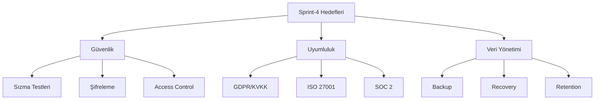
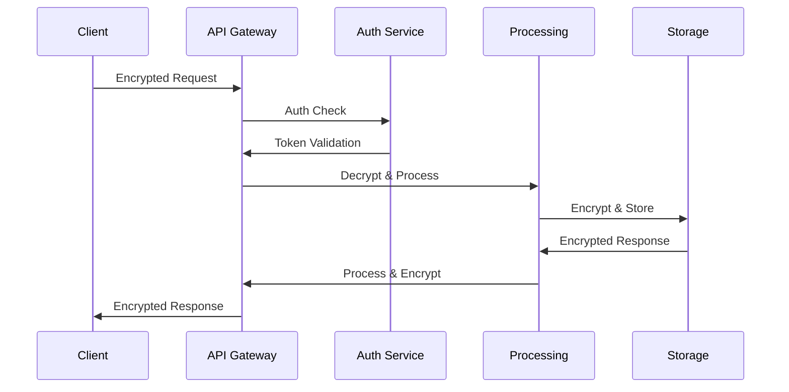

# Dijital Ayak İzi İzleyici - Sprint Dokümantasyonu

## Sprint Bilgileri

| Başlık      | Detay          |
| ----------- | -------------- |
| Sprint No   | Sprint-4       |
| Başlangıç   | 2024-02-29     |
| Bitiş       | 2024-03-14     |
| Durum       | Planlama       |
| Geliştirici | Solo Developer |

## İçindekiler

1. [Sprint Hedefleri](#1-sprint-hedefleri)
2. [Sprint Backlog](#2-sprint-backlog)
3. [Güvenlik İmplementasyonları](#3-güvenlik-i̇mplementasyonları)
4. [Uyumluluk ve Sertifikasyon](#4-uyumluluk-ve-sertifikasyon)
5. [Veri Güvenliği Mimarisi](#5-veri-güvenliği-mimarisi)
6. [Test ve Audit](#6-test-ve-audit)
7. [Çıktılar ve Başarı Kriterleri](#7-çıktılar-ve-başarı-kriterleri)

## 1. Sprint Hedefleri

### 1.1 Ana Hedefler

```yaml
Güvenlik ve Uyumluluk:
  1. Veri Güvenliği:
    - End-to-end şifreleme
    - Anonimleştirme stratejileri
    - Güvenli veri saklama

  2. Yasal Uyumluluk:
    - GDPR/KVKK uyumu
    - Veri koruma politikaları
    - Denetim hazırlığı

  3. Risk Yönetimi:
    - Güvenlik testleri
    - Penetrasyon testleri
    - İhlal müdahale planı

Teknik Hedefler:
  - Güvenlik açıklarının giderilmesi
  - Erişim kontrolü optimizasyonu
  - Logging ve monitoring geliştirmeleri
  - Backup ve recovery stratejileri
```

### 1.2 Sprint Metrikleri



## 2. Sprint Backlog

### 2.1 Güvenlik Görevleri

#### US-011: Güvenlik Altyapısı İyileştirmesi

```yaml
Başlık: Güvenlik altyapısı ve şifreleme implementasyonu
Öncelik: Kritik
Effort: 13 SP
Durum: To Do

Teknik Detaylar:
  1. Şifreleme Katmanı:
     - AES-256-GCM implementasyonu
     - Key management sistemi
     - HSM entegrasyonu

  2. Erişim Kontrolü:
     - RBAC sistemi geliştirme
     - OAuth 2.0 + JWT yapısı
     - 2FA implementasyonu

  3. Audit Logging:
     - Security event logging
     - Audit trail sistemi
     - Log aggregation

Kabul Kriterleri:
  Security:
    - OWASP Top 10 uyumu
    - PCI-DSS standartları
    - SOC 2 gereksinimleri

  Performance:
    - Şifreleme latency <50ms
    - Key rotation süresi <1s
    - Log processing <100ms

Alt Görevler:
  - [ ] Şifreleme modülü geliştirme
  - [ ] Key management sistemi
  - [ ] Access control matrix
  - [ ] Audit logging sistemi
  - [ ] Security monitoring
```

#### US-012: GDPR/KVKK Uyumluluk

```yaml
Başlık: Veri koruma regülasyonları uyumluluğu
Öncelik: Yüksek
Effort: 8 SP
Durum: To Do

Teknik Detaylar:
  1. Veri İşleme:
     - Veri minimizasyonu
     - Anonimleştirme
     - Pseudonymization

  2. Kullanıcı Hakları:
     - Veri taşınabilirliği
     - Silme/unutulma hakkı
     - Veri erişim portali

  3. Dokümantasyon:
     - Veri işleme kayıtları
     - DPA agreements
     - Privacy policy

Kabul Kriterleri:
  Compliance:
    - GDPR Article 25 uyumu
    - KVKK madde 12 uyumu
    - ISO 27701 hazırlığı

  Implementation:
    - Kullanıcı hakları portalı
    - Veri işleme kayıt sistemi
    - Otomatik raporlama

Alt Görevler:
  - [ ] Veri haritalama
  - [ ] Kullanıcı portalı
  - [ ] Raporlama sistemi
  - [ ] Politika güncelleme
```

## 3. Güvenlik İmplementasyonları

### 3.1 Şifreleme Stratejisi

```typescript
interface EncryptionConfig {
  algorithm: {
    type: 'AES-GCM' | 'ChaCha20-Poly1305';
    keySize: 256 | 512;
    mode: 'GCM' | 'CBC';
  };

  keyManagement: {
    rotation: {
      interval: number; // milliseconds
      strategy: 'time-based' | 'usage-based';
    };
    storage: {
      type: 'HSM' | 'KMS' | 'software';
      location: string;
      backup: boolean;
    };
  };

  options: {
    padding: boolean;
    ivSize: number;
    tagLength: number;
  };
}

const encryptionConfig: EncryptionConfig = {
  algorithm: {
    type: 'AES-GCM',
    keySize: 256,
    mode: 'GCM',
  },
  keyManagement: {
    rotation: {
      interval: 7 * 24 * 60 * 60 * 1000, // 7 days
      strategy: 'time-based',
    },
    storage: {
      type: 'HSM',
      location: 'primary-hsm',
      backup: true,
    },
  },
  options: {
    padding: true,
    ivSize: 96,
    tagLength: 128,
  },
};
```

### 3.2 Erişim Kontrolü Sistemi

```typescript
interface AccessControl {
  authentication: {
    type: 'OAuth2' | 'OIDC';
    provider: string;
    config: AuthConfig;
  };

  authorization: {
    type: 'RBAC' | 'ABAC';
    roles: Role[];
    permissions: Permission[];
  };

  mfa: {
    enabled: boolean;
    methods: MFAMethod[];
    fallback: string[];
  };
}

interface Role {
  name: string;
  level: number;
  permissions: string[];
  constraints: {
    timeRestriction?: TimeWindow;
    locationRestriction?: string[];
    deviceRestriction?: string[];
  };
}

const accessControlConfig: AccessControl = {
  authentication: {
    type: 'OAuth2',
    provider: 'internal',
    config: {
      issuer: 'https://auth.digitalfootprint.com',
      algorithms: ['RS256'],
      expiresIn: '1h',
    },
  },
  authorization: {
    type: 'RBAC',
    roles: [
      {
        name: 'admin',
        level: 100,
        permissions: ['*'],
        constraints: {
          timeRestriction: {
            start: '09:00',
            end: '18:00',
            timezone: 'UTC',
          },
        },
      },
    ],
    permissions: [
      // Permission definitions
    ],
  },
  mfa: {
    enabled: true,
    methods: ['TOTP', 'SMS', 'Email'],
    fallback: ['security-questions'],
  },
};
```

## 4. Uyumluluk ve Sertifikasyon

### 4.1 GDPR/KVKK Uyumluluk Matrisi

```yaml
Veri Koruma Gereksinimleri:
  Veri Minimizasyonu:
    - Gerekli minimum veri toplama
    - Saklama süresi sınırlaması
    - Otomatik veri temizleme

  Şeffaf İşleme:
    - Açık rıza mekanizması
    - İşleme amaçları bildirimi
    - Veri işleme kaydı

  Kullanıcı Hakları:
    - Veri erişim hakkı
    - Düzeltme/silme hakkı
    - Taşınabilirlik hakkı

Teknik Önlemler:
  - Şifreleme (at-rest & in-transit)
  - Erişim kontrolü
  - Düzenli denetim
```

### 4.2 Veri İşleme Kaydı

```typescript
interface DataProcessingRecord {
  purpose: {
    id: string;
    description: string;
    legalBasis: LegalBasis;
  };

  dataCategories: {
    personal: string[];
    sensitive: string[];
    derived: string[];
  };

  processing: {
    operations: ProcessingOperation[];
    location: string[];
    duration: RetentionPeriod;
  };

  security: {
    measures: SecurityMeasure[];
    access: AccessLevel[];
    monitoring: MonitoringConfig;
  };
}

const processingRegistry: DataProcessingRecord[] = [
  {
    purpose: {
      id: 'PRO-001',
      description: 'Tracker analizi ve gizlilik skoru hesaplama',
      legalBasis: 'legitimate-interest',
    },
    dataCategories: {
      personal: ['device-id', 'browser-config'],
      sensitive: [],
      derived: ['privacy-score', 'risk-level'],
    },
    processing: {
      operations: ['collection', 'analysis', 'storage'],
      location: ['EU-central'],
      duration: {
        active: '90d',
        archive: '365d',
      },
    },
    security: {
      measures: ['encryption', 'access-control', 'logging'],
      access: ['system', 'privacy-analyst'],
      monitoring: {
        enabled: true,
        alerting: true,
      },
    },
  },
];
```

## 5. Veri Güvenliği Mimarisi

### 5.1 Veri Akışı Güvenliği



### 5.2 Güvenlik Katmanları

```typescript
interface SecurityArchitecture {
  network: {
    firewall: FirewallConfig;
    ddos: DDoSProtection;
    waf: WAFConfig;
  };

  application: {
    authentication: AuthConfig;
    encryption: EncryptionConfig;
    headers: SecurityHeaders;
  };

  data: {
    encryption: DataEncryption;
    backup: BackupStrategy;
    masking: DataMasking;
  };

  monitoring: {
    ids: IDSConfig;
    siem: SIEMConfig;
    audit: AuditConfig;
  };
}

const securityConfig: SecurityArchitecture = {
  network: {
    firewall: {
      mode: 'stateful',
      rules: [
        // Firewall rules
      ],
    },
    ddos: {
      provider: 'cloudflare',
      threshold: {
        requests: 1000,
        timeWindow: 60,
      },
    },
    waf: {
      rules: ['OWASP-CRS'],
      customRules: [
        // Custom WAF rules
      ],
    },
  },
  application: {
    // ... application security config
  },
  data: {
    // ... data security config
  },
  monitoring: {
    // ... security monitoring config
  },
};
```

## 6. Test ve Audit

### 6.1 Güvenlik Test Planı

```yaml
Test Kategorileri:
  Penetrasyon Testi:
    - Network penetration
    - Application security
    - API security
    - Social engineering

  Güvenlik Taraması:
    - Vulnerability scanning
    - Configuration audit
    - Code security review
    - Dependency check

  Compliance Testing:
    - GDPR requirements
    - KVKK requirements
    - Industry standards
```

### 6.2 Audit Logging

```typescript
interface AuditLog {
  event: {
    id: string;
    type: AuditEventType;
    severity: 'low' | 'medium' | 'high';
    timestamp: number;
  };

  context: {
    user: string;
    resource: string;
    action: string;
    result: 'success' | 'failure';
  };

  data: {
    before?: unknown;
    after?: unknown;
    diff?: string;
  };

  metadata: {
    ip: string;
    userAgent: string;
    sessionId: string;
  };
}

const auditLogger = {
  log: (event: AuditLog) => {
    // Secure audit logging implementation
  },

  query: (filter: AuditFilter) => {
    // Audit log query with access control
  },

  export: (format: 'json' | 'csv') => {
    // Audit log export for compliance
  },
};
```

## 7. Çıktılar ve Başarı Kriterleri

### 7.1 Güvenlik Metrikleri

```typescript
interface SecurityMetrics {
  vulnerabilities: {
    critical: number;
    high: number;
    medium: number;
    low: number;
  };

  compliance: {
    gdpr: ComplianceScore;
    kvkk: ComplianceScore;
    iso27001: ComplianceScore;
  };

  incidents: {
    total: number;
    resolved: number;
    meanTimeToDetect: number;
    meanTimeToResolve: number;
  };

  access: {
    failedAttempts: number;
    unusualPatterns: number;
    privilegeViolations: number;
  };
}

const securityTargets: SecurityMetrics = {
  vulnerabilities: {
    critical: 0,
    high: 0,
    medium: <5,
    low: <10
  },
  compliance: {
    gdpr: {
      score: >0.95,
      gaps: 0,
      actions: []
    },
    kvkk: {
      score: >0.95,
      gaps: 0,
      actions: []
    },
    iso27001: {
      score: >0.90,
      gaps: <5,
      actions: []
    }
  },
  incidents: {
    total: <10,
    resolved: >95%,
    meanTimeToDetect: <1h,
    meanTimeToResolve: <4h
  },
  access: {
    failedAttempts: <100,
    unusualPatterns: <10,
    privilegeViolations: 0
  }
};
```

### 7.2 Sprint Sonu Değerlendirme Kriterleri

```yaml
Success Metrics:
  Security:
    - Zero critical vulnerabilities
    - Penetration test clearance
    - Security monitoring active

  Compliance:
    - GDPR/KVKK documentation complete
    - Technical measures implemented
    - Audit readiness achieved

  Data Protection:
    - Encryption implemented
    - Access controls verified
    - Backup system tested

  Incident Response:
    - Team trained
    - Procedures documented
    - Drills completed
```

---

## Versiyon Geçmişi

| Versiyon | Tarih      | Değişiklikler |
| -------- | ---------- | ------------- |
| 1.0.0    | 2024-02-29 | İlk sürüm     |

## Sprint Durumu

- [x] Planlama
- [ ] Geliştirme
- [ ] Test
- [ ] Review
- [ ] Tamamlandı
