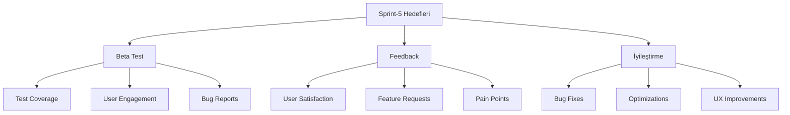

# Dijital Ayak İzi İzleyici - Sprint Dokümantasyonu

## Sprint Bilgileri

| Başlık      | Detay          |
| ----------- | -------------- |
| Sprint No   | Sprint-5       |
| Başlangıç   | 2024-03-15     |
| Bitiş       | 2024-03-29     |
| Durum       | Planlama       |
| Geliştirici | Solo Developer |

## İçindekiler

1. [Sprint Hedefleri](#1-sprint-hedefleri)
2. [Sprint Backlog](#2-sprint-backlog)
3. [Beta Test Süreci](#3-beta-test-süreci)
4. [Kullanıcı Geri Bildirimi](#4-kullanıcı-geri-bildirimi)
5. [Hata Düzeltme ve İyileştirme](#5-hata-düzeltme-ve-i̇yileştirme)
6. [Test Metrikleri ve Analiz](#6-test-metrikleri-ve-analiz)
7. [Çıktılar ve Başarı Kriterleri](#7-çıktılar-ve-başarı-kriterleri)

## 1. Sprint Hedefleri

### 1.1 Ana Hedefler

```yaml
Beta Test ve Geri Bildirim:
  1. Test Süreci:
    - Beta kullanıcı grubu oluşturma
    - Test senaryoları hazırlama
    - Kullanıcı deneyimi izleme

  2. Geri Bildirim Yönetimi:
    - Feedback sistemi kurulumu
    - Analiz metodolojisi
    - İyileştirme planlaması

  3. Kalite Güvence:
    - Hata tespiti ve düzeltme
    - Performans optimizasyonu
    - Kullanıcı deneyimi artırımı

Teknik Hedefler:
  - Hata raporlama sistemi
  - Analytics entegrasyonu
  - A/B test altyapısı
  - Kullanıcı davranış analizi
```

### 1.2 Sprint Metrikleri



## 2. Sprint Backlog

### 2.1 Test ve Feedback Görevleri

#### US-013: Beta Test Yönetimi

```yaml
Başlık: Beta test süreci ve kullanıcı katılımı
Öncelik: Kritik
Effort: 13 SP
Durum: To Do

Teknik Detaylar:
  1. Test Ortamı:
     - Staging environment setup
     - Test data generation
     - Monitoring araçları

  2. Test Senaryoları:
     - Kritik yol testleri
     - Edge case testleri
     - Performans testleri

  3. Kullanıcı Yönetimi:
     - Beta kullanıcı onboarding
     - Test grupları oluşturma
     - İletişim kanalları

Kabul Kriterleri:
  Coverage:
    - Kritik fonksiyonlar: %100
    - Genel fonksiyonlar: >80%
    - UI komponentleri: >90%

  Engagement:
    - Aktif kullanıcı oranı: >70%
    - Senaryo tamamlama: >80%
    - Geri bildirim oranı: >50%

Alt Görevler:
  - [ ] Test planı hazırlama
  - [ ] Beta kullanıcı seçimi
  - [ ] Test ortamı kurulumu
  - [ ] Monitoring setup
  - [ ] Raporlama sistemi
```

#### US-014: Feedback Sistemi

```yaml
Başlık: Kullanıcı geri bildirim sistemi implementasyonu
Öncelik: Yüksek
Effort: 8 SP
Durum: To Do

Teknik Detaylar:
  1. Feedback Mekanizmaları:
     - In-app feedback formu
     - Kullanıcı anketleri
     - Session recording

  2. Analiz Araçları:
     - Sentiment analizi
     - Usage analytics
     - Heatmap tracking

  3. Raporlama:
     - Otomatik raporlar
     - Trend analizi
     - Önceliklendirme

Kabul Kriterleri:
  Usage:
    - Form completion rate: >30%
    - Survey response rate: >40%
    - Feedback kalitesi: >4/5

  Analysis:
    - Real-time dashboard
    - Automated categorization
    - Actionable insights

Alt Görevler:
  - [ ] Feedback form tasarımı
  - [ ] Analytics entegrasyonu
  - [ ] Raporlama sistemi
  - [ ] Trend analizi
```

## 3. Beta Test Süreci

### 3.1 Test Metodolojisi

```typescript
interface TestStrategy {
  phases: {
    alpha: TestPhase;
    beta: TestPhase;
    gradualRollout: TestPhase;
  };

  userGroups: {
    size: number;
    demographics: UserDemographic[];
    technicalLevel: TechnicalLevel[];
  };

  scenarios: {
    critical: TestScenario[];
    functional: TestScenario[];
    usability: TestScenario[];
  };

  monitoring: {
    metrics: MetricConfig[];
    alerts: AlertConfig[];
    reporting: ReportConfig[];
  };
}

const betaTestConfig: TestStrategy = {
  phases: {
    alpha: {
      duration: '2 weeks',
      participants: 50,
      features: ['core', 'security'],
    },
    beta: {
      duration: '4 weeks',
      participants: 500,
      features: ['all'],
    },
    gradualRollout: {
      duration: '2 weeks',
      userPercentage: 10,
      incrementStep: 5,
    },
  },
  userGroups: {
    size: 500,
    demographics: ['tech-savvy', 'privacy-conscious', 'general-users'],
    technicalLevel: ['beginner', 'intermediate', 'advanced'],
  },
  scenarios: {
    critical: [
      {
        name: 'Privacy Score Calculation',
        steps: ['setup', 'scan', 'analyze'],
        successCriteria: ['accuracy', 'speed'],
      },
    ],
    functional: [
      // Functional test scenarios
    ],
    usability: [
      // Usability test scenarios
    ],
  },
  monitoring: {
    metrics: [
      {
        name: 'User Engagement',
        type: 'behavioral',
        threshold: 0.7,
      },
    ],
    alerts: [
      {
        type: 'error-rate',
        threshold: 0.01,
        notification: 'immediate',
      },
    ],
    reporting: [
      {
        frequency: 'daily',
        metrics: ['errors', 'usage', 'feedback'],
      },
    ],
  },
};
```

### 3.2 Test Senaryoları

```yaml
Test Kategorileri:
  Fonksiyonel Testler:
    - Tracker tespiti ve analizi
    - Gizlilik skoru hesaplama
    - Raporlama ve öneriler

  Kullanılabilirlik Testleri:
    - Yeni kullanıcı onboarding
    - Temel işlem akışları
    - Hata mesajları ve yönlendirmeler

  Performans Testleri:
    - Yükleme süreleri
    - Sistem tepki süresi
    - Kaynak kullanımı

  Güvenlik Testleri:
    - Veri şifreleme
    - Erişim kontrolü
    - Güvenlik duvarı
```

## 4. Kullanıcı Geri Bildirimi

### 4.1 Feedback Toplama Metodolojisi

```typescript
interface FeedbackSystem {
  channels: {
    inApp: FeedbackChannel;
    email: FeedbackChannel;
    survey: FeedbackChannel;
  };

  collection: {
    automated: AutomatedCollection;
    manual: ManualCollection;
  };

  analysis: {
    sentiment: SentimentAnalysis;
    categorization: CategoryAnalysis;
    prioritization: PriorityAnalysis;
  };

  reporting: {
    realTime: ReportingConfig;
    scheduled: ReportingConfig;
    automated: ReportingConfig;
  };
}

interface FeedbackChannel {
  type: string;
  format: 'structured' | 'unstructured';
  frequency: 'continuous' | 'scheduled';
  targeting: {
    userGroups: string[];
    triggers: string[];
    conditions: Condition[];
  };
}

const feedbackConfig: FeedbackSystem = {
  channels: {
    inApp: {
      type: 'widget',
      format: 'structured',
      frequency: 'continuous',
      targeting: {
        userGroups: ['all'],
        triggers: ['feature-use', 'error'],
        conditions: [
          {
            type: 'session-duration',
            value: '>5min',
          },
        ],
      },
    },
    email: {
      // Email feedback config
    },
    survey: {
      // Survey config
    },
  },
  collection: {
    automated: {
      metrics: ['usage', 'errors', 'performance'],
      frequency: 'real-time',
      storage: {
        type: 'time-series',
        retention: '90d',
      },
    },
    manual: {
      tools: ['forms', 'interviews'],
      scheduling: {
        frequency: 'weekly',
        duration: '30min',
      },
    },
  },
  analysis: {
    sentiment: {
      engine: 'natural',
      languages: ['tr', 'en'],
      metrics: ['polarity', 'subjectivity'],
    },
    categorization: {
      categories: ['bug', 'feature-request', 'usability', 'performance'],
      autoTagging: true,
    },
    prioritization: {
      factors: ['severity', 'frequency', 'impact'],
      weights: {
        severity: 0.4,
        frequency: 0.3,
        impact: 0.3,
      },
    },
  },
  reporting: {
    realTime: {
      dashboard: true,
      alerts: true,
      metrics: ['critical-issues'],
    },
    scheduled: {
      frequency: 'daily',
      format: 'pdf',
      distribution: ['team', 'stakeholders'],
    },
    automated: {
      triggers: {
        thresholds: {
          errorRate: 0.05,
          satisfactionDrop: 0.1,
        },
      },
    },
  },
};
```

### 4.2 Geri Bildirim Analizi

```typescript
interface FeedbackAnalytics {
  metrics: {
    satisfaction: SatisfactionMetrics;
    usability: UsabilityMetrics;
    performance: PerformanceMetrics;
  };

  trends: {
    daily: TrendAnalysis;
    weekly: TrendAnalysis;
    monthly: TrendAnalysis;
  };

  insights: {
    categories: string[];
    severity: SeverityLevel[];
    impact: ImpactAssessment[];
  };
}

const analyticsConfig: FeedbackAnalytics = {
  metrics: {
    satisfaction: {
      nps: {
        current: 45,
        target: 60,
        trend: 'increasing',
      },
      csat: {
        current: 4.2,
        target: 4.5,
        responses: 500,
      },
    },
    usability: {
      taskSuccess: 0.85,
      errorRate: 0.03,
      timeOnTask: {
        average: 45,
        p90: 120,
      },
    },
    performance: {
      loadTime: {
        average: 1.2,
        p95: 2.5,
      },
      responseTime: {
        average: 0.3,
        p95: 0.8,
      },
    },
  },
  trends: {
    daily: {
      metrics: ['errors', 'usage'],
      aggregation: 'sum',
      visualization: 'line-chart',
    },
    weekly: {
      metrics: ['satisfaction', 'engagement'],
      aggregation: 'average',
      visualization: 'bar-chart',
    },
    monthly: {
      metrics: ['retention', 'growth'],
      aggregation: 'cumulative',
      visualization: 'area-chart',
    },
  },
  insights: {
    categories: ['UI/UX', 'Performance', 'Features', 'Bugs'],
    severity: [
      {
        level: 'critical',
        count: 2,
        trend: 'decreasing',
      },
    ],
    impact: [
      {
        area: 'user-retention',
        score: 8,
        recommendation: 'high-priority',
      },
    ],
  },
};
```

## 5. Hata Düzeltme ve İyileştirme

### 5.1 Hata Takip Sistemi

```typescript
interface BugTrackingSystem {
  categorization: {
    severity: SeverityLevel[];
    priority: PriorityLevel[];
    type: BugType[];
  };

  workflow: {
    states: WorkflowState[];
    transitions: StateTransition[];
    automation: AutomationRule[];
  };

  resolution: {
    sla: SLAConfig;
    assignment: AssignmentRule[];
    verification: VerificationStep[];
  };
}

const bugTrackingConfig: BugTrackingSystem = {
  categorization: {
    severity: [
      {
        level: 'critical',
        description: 'Core functionality broken',
        responseTime: '1h',
      },
      {
        level: 'high',
        description: 'Major feature affected',
        responseTime: '4h',
      },
      {
        level: 'medium',
        description: 'Non-critical issue',
        responseTime: '24h',
      },
      {
        level: 'low',
        description: 'Minor improvement',
        responseTime: '72h',
      },
    ],
    priority: [
      // Priority levels
    ],
    type: [
      // Bug types
    ],
  },
  workflow: {
    states: ['new', 'triaged', 'in-progress', 'testing', 'resolved'],
    transitions: [
      {
        from: 'new',
        to: 'triaged',
        conditions: ['severity-set', 'assigned'],
      },
    ],
    automation: [
      {
        trigger: 'new-critical-bug',
        action: 'notify-team',
        priority: 'immediate',
      },
    ],
  },
  resolution: {
    sla: {
      critical: '24h',
      high: '48h',
      medium: '72h',
      low: '1w',
    },
    assignment: [
      {
        type: 'security',
        team: 'security-team',
        priority: 'high',
      },
    ],
    verification: [
      {
        step: 'code-review',
        required: true,
        approvers: 1,
      },
      {
        step: 'testing',
        required: true,
        coverage: 0.9,
      },
    ],
  },
};
```

## 6. Test Metrikleri ve Analiz

### 6.1 Test Metrikleri

```yaml
Metrik Kategorileri:
  Kullanıcı Etkileşimi:
    - Aktif kullanıcı sayısı
    - Oturum süresi
    - Özellik kullanım oranları

  Performans:
    - Sayfa yüklenme süreleri
    - API yanıt süreleri
    - Kaynak kullanımı

  Hata Oranları:
    - Crash rate
    - Error rate
    - Bug reports

  Kullanıcı Memnuniyeti:
    - NPS skoru
    - CSAT değeri
    - Kullanıcı yorumları
```

### 6.2 Analiz ve Raporlama

```typescript
interface AnalyticsSystem {
  metrics: {
    user: UserMetrics;
    performance: PerformanceMetrics;
    quality: QualityMetrics;
  };

  reporting: {
    realTime: RealtimeReports;
    daily: DailyReports;
    weekly: WeeklyReports;
  };

  visualization: {
    dashboards: Dashboard[];
    charts: ChartConfig[];
    exports: ExportConfig[];
  };
}

const analyticsConfig: AnalyticsSystem = {
  metrics: {
    user: {
      engagement: {
        dau: number;    // Daily Active Users
        sessionLength: number;
        retention: number;
      },
      satisfaction: {
        nps: number;
        csat: number;
        churn: number;
      }
    },
    performance: {
      timing: {
        ttfb: number;    // Time to First Byte
        fcp: number;     // First Contentful Paint
        tti: number;     // Time to Interactive
      },
      resources: {
        cpu: number;
        memory: number;
        network: number;
      }
    },
    quality: {
      bugs: {
        open: number;
        resolved: number;
        meanTimeToResolve: number;
      },
      coverage: {
        unit: number;
        integration: number;
        e2e: number;
      }
    }
  },
  reporting: {
    realTime: {
      metrics: ['errors', 'performance'],
      alerts: {
        conditions: ['error-spike', 'performance-drop'],
        channels: ['slack', 'email']
      }
    },
    daily: {
      metrics: ['usage', 'satisfaction'],
      distribution: ['team', 'stakeholders'],
      format: ['pdf', 'dashboard']
    },
    weekly: {
      metrics: ['trends', 'insights'],
      presentation: 'executive-summary',
      recommendations: true
    }
  },
  visualization: {
    dashboards: [
      {
        name: 'Beta Overview',
        metrics: ['core-kpis', 'user-feedback'],
        refresh: '5min'
      }
    ],
    charts: [
      {
        type: 'time-series',
        metrics: ['usage', 'errors'],
        options: {
          aggregation: '1h',
          comparison: 'week-over-week'
        }
      }
    ],
    exports: [
      {
        format: 'csv',
        schedule: 'daily',
        data: ['raw-metrics', 'aggregations']
      }
    ]
  }
};
```

## 7. Çıktılar ve Başarı Kriterleri

### 7.1 Beta Test Metrikleri

```typescript
interface BetaMetrics {
  participation: {
    activeUsers: number;
    completionRate: number;
    feedbackRate: number;
  };

  quality: {
    bugCount: {
      critical: number;
      high: number;
      medium: number;
      low: number;
    };
    testCoverage: number;
    successRate: number;
  };

  satisfaction: {
    nps: number;
    usability: number;
    reliability: number;
  };

  performance: {
    responseTime: number;
    errorRate: number;
    availability: number;
  };
}

const betaTargets: BetaMetrics = {
  participation: {
    activeUsers: >400,
    completionRate: >80%,
    feedbackRate: >50%
  },
  quality: {
    bugCount: {
      critical: 0,
      high: <5,
      medium: <15,
      low: <30
    },
    testCoverage: >90%,
    successRate: >95%
  },
  satisfaction: {
    nps: >40,
    usability: >4.0,
    reliability: >4.5
  },
  performance: {
    responseTime: <500,  // ms
    errorRate: <1%,
    availability: >99.9%
  }
};
```

### 7.2 Sprint Sonu Değerlendirme Kriterleri

```yaml
Success Metrics:
  Beta Test:
    - Completed test scenarios >90%
    - Active beta user count >400
    - Feature adoption rate >70%

  Feedback:
    - Response rate >50%
    - Actionable feedback >200
    - Issue resolution rate >80%

  Quality:
    - Critical bugs: 0
    - Test coverage >90%
    - System stability >99.9%

  User Experience:
    - NPS score >40
    - Task completion >85%
    - User satisfaction >4/5
```

---

## Versiyon Geçmişi

| Versiyon | Tarih      | Değişiklikler |
| -------- | ---------- | ------------- |
| 1.0.0    | 2024-03-15 | İlk sürüm     |

## Sprint Durumu

- [x] Planlama
- [ ] Geliştirme
- [ ] Test
- [ ] Review
- [ ] Tamamlandı
