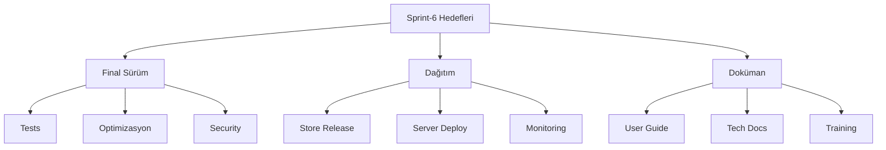

# Dijital Ayak İzi İzleyici - Sprint Dokümantasyonu

## Sprint Bilgileri

| Başlık      | Detay          |
| ----------- | -------------- |
| Sprint No   | Sprint-6       |
| Başlangıç   | 2024-03-30     |
| Bitiş       | 2024-04-13     |
| Durum       | Planlama       |
| Geliştirici | Solo Developer |

## İçindekiler

1. [Sprint Hedefleri](#1-sprint-hedefleri)
2. [Sprint Backlog](#2-sprint-backlog)
3. [Son Testler ve Kalite Güvencesi](#3-son-testler-ve-kalite-güvencesi)
4. [Dağıtım Süreci](#4-dağıtım-süreci)
5. [Dokümantasyon ve Eğitim](#5-dokümantasyon-ve-eğitim)
6. [Lansman Stratejisi](#6-lansman-stratejisi)
7. [Çıktılar ve Başarı Kriterleri](#7-çıktılar-ve-başarı-kriterleri)

## 1. Sprint Hedefleri

### 1.1 Ana Hedefler

```yaml
Final Sürüm ve Dağıtım:
  1. Ürün Tamamlama:
    - Son hata düzeltmeleri
    - Performans optimizasyonu
    - Güvenlik doğrulaması

  2. Dağıtım Hazırlığı:
    - Store yayın hazırlığı
    - Sunucu dağıtımı
    - CI/CD pipeline

  3. Dokümantasyon:
    - Kullanıcı kılavuzu
    - Teknik dokümanlar
    - Eğitim materyalleri

Teknik Hedefler:
  - Final sürüm testleri
  - Dağıtım otomasyonu
  - Monitoring setup
  - Backup stratejisi
```

### 1.2 Sprint Metrikleri



## 2. Sprint Backlog

### 2.1 Final Sürüm Görevleri

#### US-015: Final Sürüm Hazırlığı

```yaml
Başlık: Final sürüm hazırlığı ve kalite kontrol
Öncelik: Kritik
Effort: 13 SP
Durum: To Do

Teknik Detaylar:
  1. Kod Temizliği:
     - Tech debt çözümü
     - Code review
     - Optimizasyonlar

  2. Test Suite:
     - E2E testleri
     - Performans testleri
     - Güvenlik testleri

  3. Final Build:
     - Versiyon kontrolü
     - Build otomasyonu
     - Artifact yönetimi

Kabul Kriterleri:
  Quality:
    - Test coverage: >95%
    - Zero critical bugs
    - Performance targets met

  Release:
    - Signed artifacts
    - Store compliance
    - Documentation complete

Alt Görevler:
  - [ ] Kod review ve cleanup
  - [ ] Test suite çalıştırma
  - [ ] Build ve imzalama
  - [ ] Store submission prep
```

#### US-016: Dağıtım Otomasyonu

```yaml
Başlık: Dağıtım süreçleri ve otomasyon
Öncelik: Yüksek
Effort: 8 SP
Durum: To Do

Teknik Detaylar:
  1. CI/CD Pipeline:
     - Build automation
     - Test automation
     - Deploy automation

  2. Infrastructure:
     - Server provisioning
     - Monitoring setup
     - Backup system

  3. Store Release:
     - Store listings
     - Review process
     - Launch schedule

Kabul Kriterleri:
  Automation:
    - Automated builds
    - Test integration
    - Deploy scripts

  Infrastructure:
    - High availability
    - Scalability
    - Monitoring

Alt Görevler:
  - [ ] CI/CD setup
  - [ ] Server config
  - [ ] Store submission
  - [ ] Launch prep
```

## 3. Son Testler ve Kalite Güvencesi

### 3.1 Test Stratejisi

```typescript
interface TestPlan {
  functional: {
    e2e: E2ETests;
    integration: IntegrationTests;
    ui: UITests;
  };

  performance: {
    load: LoadTests;
    stress: StressTests;
    scalability: ScalabilityTests;
  };

  security: {
    penetration: PenTests;
    compliance: ComplianceTests;
    audit: SecurityAudit;
  };
}

const finalTestPlan: TestPlan = {
  functional: {
    e2e: {
      scenarios: ['user-journey', 'tracker-detection', 'privacy-score'],
      coverage: {
        target: 0.95,
        critical: 1.0,
      },
    },
    integration: {
      apis: ['core', 'analytics', 'storage'],
      dataflow: ['real-time', 'batch'],
      persistence: ['cache', 'storage'],
    },
    ui: {
      responsive: true,
      accessibility: 'WCAG2.1',
      browsers: ['chrome', 'firefox', 'safari'],
    },
  },
  performance: {
    load: {
      users: 1000,
      rampUp: '5m',
      duration: '1h',
    },
    stress: {
      maxUsers: 5000,
      spikeUsers: 1000,
      recoveryTime: '1m',
    },
    scalability: {
      metrics: ['cpu', 'memory', 'network'],
      thresholds: {
        responseTime: '200ms',
        errorRate: 0.001,
      },
    },
  },
  security: {
    penetration: {
      scope: ['api', 'web', 'extension'],
      tools: ['OWASP ZAP', 'Burp Suite'],
      duration: '5d',
    },
    compliance: {
      standards: ['GDPR', 'CCPA', 'KVKK'],
      requirements: ['encryption', 'consent', 'rights'],
    },
    audit: {
      code: true,
      infrastructure: true,
      thirdParty: true,
    },
  },
};
```

### 3.2 Kalite Metrikleri

```yaml
Kalite Kategorileri:
  Kod Kalitesi:
    - Test coverage
    - Code complexity
    - Documentation coverage

  Performans:
    - Response time
    - Resource usage
    - Scalability metrics

  Güvenlik:
    - Vulnerability count
    - Compliance score
    - Encryption strength

  Kullanılabilirlik:
    - Error rate
    - Task completion
    - User satisfaction
```

## 4. Dağıtım Süreci

### 4.1 Dağıtım Planı

```typescript
interface DeploymentPlan {
  infrastructure: {
    servers: ServerConfig[];
    networking: NetworkConfig;
    storage: StorageConfig;
  };

  automation: {
    ci: CIConfig;
    cd: CDConfig;
    monitoring: MonitoringConfig;
  };

  release: {
    stages: ReleaseStage[];
    rollback: RollbackPlan;
    verification: VerificationStep[];
  };
}

const deploymentConfig: DeploymentPlan = {
  infrastructure: {
    servers: [
      {
        role: 'web',
        count: 3,
        spec: {
          cpu: 4,
          memory: '16GB',
          storage: '100GB',
        },
      },
      {
        role: 'api',
        count: 2,
        spec: {
          cpu: 8,
          memory: '32GB',
          storage: '200GB',
        },
      },
    ],
    networking: {
      loadBalancer: true,
      ssl: {
        provider: 'LetsEncrypt',
        auto: true,
      },
      cdn: {
        enabled: true,
        provider: 'Cloudflare',
      },
    },
    storage: {
      type: 'distributed',
      backup: {
        frequency: '6h',
        retention: '30d',
      },
    },
  },
  automation: {
    ci: {
      provider: 'GitHub Actions',
      triggers: ['push', 'pull_request'],
      stages: ['build', 'test', 'package'],
    },
    cd: {
      provider: 'ArgoCD',
      strategy: 'blue-green',
      automation: true,
    },
    monitoring: {
      metrics: ['prometheus'],
      logs: ['elasticsearch'],
      alerts: ['grafana'],
    },
  },
  release: {
    stages: [
      {
        name: 'staging',
        duration: '24h',
        validation: ['smoke', 'e2e'],
      },
      {
        name: 'production',
        strategy: 'gradual',
        rollout: '10%/hour',
      },
    ],
    rollback: {
      triggers: ['error-rate > 1%', 'latency > 500ms'],
      automation: true,
    },
    verification: [
      {
        type: 'automated',
        tests: ['health', 'critical-path'],
      },
      {
        type: 'manual',
        checklist: ['security', 'compliance'],
      },
    ],
  },
};
```

## 5. Dokümantasyon ve Eğitim

### 5.1 Dokümantasyon Planı

```typescript
interface Documentation {
  user: {
    guides: UserGuide[];
    tutorials: Tutorial[];
    faq: FAQSection[];
  };

  technical: {
    architecture: ArchDoc;
    api: APIDoc;
    deployment: DeployDoc;
  };

  training: {
    materials: TrainingMaterial[];
    videos: VideoContent[];
    workshops: Workshop[];
  };
}

const documentationPlan: Documentation = {
  user: {
    guides: [
      {
        title: 'Getting Started',
        sections: [
          'installation',
          'configuration',
          'first-scan'
        ],
        format: ['web', 'pdf']
      },
      {
        title: 'Advanced Features',
        sections: [
          'custom-rules',
          'reporting',
          'integration'
        ],
        format: ['web']
      }
    ],
    tutorials: [
      {
        title: 'Privacy Score Improvement',
        duration: '10min',
        difficulty: 'beginner'
      }
    ],
    faq: [
      {
        category: 'General',
        questions: 10,
        autoGenerated: false
      }
    ]
  },
  technical: {
    architecture: {
      sections: [
        'overview',
        'components',
        'data-flow'
      ],
      diagrams: true,
      code: true
    },
    api: {
      format: 'OpenAPI',
      version: '3.0',
      interactive: true
    },
    deployment: {
      environments: ['dev', 'stage', 'prod'],
      automation: true,
      monitoring: true
    }
  },
  training: {
    materials: [
      {
        type: 'presentation',
        audience: 'end-user',
        duration: '1h'
      }
    ],
    videos: [
      {
        type: 'tutorial',
        length: '5min',
        topics: ['setup', 'usage']
      }
    ],
    workshops: [
      {
        title: 'Privacy Master',
        duration: '2h',
        hands-on: true
      }
    ]
  }
};
```

## 6. Lansman Stratejisi

### 6.1 Lansman Planı

```typescript
interface LaunchStrategy {
  phases: {
    prelaunch: PrelaunchPhase;
    launch: LaunchPhase;
    postlaunch: PostlaunchPhase;
  };

  communication: {
    channels: Channel[];
    content: ContentPlan[];
    schedule: Schedule[];
  };

  monitoring: {
    metrics: MetricConfig[];
    alerts: AlertConfig[];
    response: ResponsePlan[];
  };
}

const launchPlan: LaunchStrategy = {
  phases: {
    prelaunch: {
      duration: '2w',
      tasks: ['final-testing', 'documentation', 'store-submission'],
      milestones: ['ready-for-launch', 'marketing-prepared'],
    },
    launch: {
      strategy: 'gradual',
      steps: [
        {
          audience: 'beta-users',
          percentage: 100,
          duration: '24h',
        },
        {
          audience: 'new-users',
          percentage: 10,
          increments: '10%/day',
        },
      ],
    },
    postlaunch: {
      duration: '2w',
      monitoring: true,
      feedback: true,
      iterations: true,
    },
  },
  communication: {
    channels: [
      {
        type: 'email',
        audience: 'beta-users',
        frequency: 'launch-day',
      },
      {
        type: 'blog',
        content: 'launch-announcement',
        timing: 'launch-day',
      },
      {
        type: 'social',
        platforms: ['twitter', 'linkedin'],
        schedule: 'continuous',
      },
    ],
    content: [
      {
        type: 'announcement',
        variants: ['email', 'blog', 'social'],
        scheduling: true,
      },
    ],
    schedule: [
      {
        phase: 'pre-launch',
        activities: ['teasers', 'previews'],
        duration: '1w',
      },
    ],
  },
  monitoring: {
    metrics: [
      {
        category: 'user-acquisition',
        metrics: ['downloads', 'activations'],
        frequency: 'hourly',
      },
      {
        category: 'performance',
        metrics: ['latency', 'errors'],
        frequency: 'real-time',
      },
    ],
    alerts: [
      {
        trigger: 'error-rate',
        threshold: 0.01,
        action: 'notify-team',
      },
    ],
    response: [
      {
        scenario: 'high-load',
        action: 'scale-up',
        automation: true,
      },
    ],
  },
};
```

## 7. Çıktılar ve Başarı Kriterleri

### 7.1 Lansman Metrikleri

```typescript
interface LaunchMetrics {
  adoption: {
    downloads: number;
    activations: number;
    retention: number;
  };

  performance: {
    availability: number;
    responseTime: number;
    errorRate: number;
  };

  satisfaction: {
    rating: number;
    feedback: number;
    supportTickets: number;
  };

  business: {
    cac: number;
    conversion: number;
    revenue: number;
  };
}

const launchTargets: LaunchMetrics = {
  adoption: {
    downloads: >1000,
    activations: >70%,
    retention: >60%
  },
  performance: {
    availability: >99.9%,
    responseTime: <200,  // ms
    errorRate: <0.1%
  },
  satisfaction: {
    rating: >4.5,
    feedback: >100,
    supportTickets: <50
  },
  business: {
    cac: <5,          // USD
    conversion: >10%,
    revenue: >1000    // USD/month
  }
};
```

### 7.2 Sprint Sonu Değerlendirme Kriterleri

```yaml
Success Metrics:
  Final Release:
    - All tests passed
    - Zero critical bugs
    - Documentation complete

  Deployment:
    - Successful store submission
    - Server infrastructure ready
    - Monitoring active

  Launch:
    - Gradual rollout complete
    - Positive user feedback
    - Performance targets met

  Documentation:
    - User guide complete
    - API docs updated
    - Training materials ready
```

---

## Versiyon Geçmişi

| Versiyon | Tarih      | Değişiklikler |
| -------- | ---------- | ------------- |
| 1.0.0    | 2024-03-30 | İlk sürüm     |

## Sprint Durumu

- [x] Planlama
- [ ] Geliştirme
- [ ] Test
- [ ] Review
- [ ] Tamamlandı
