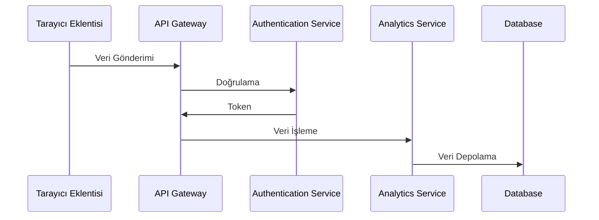
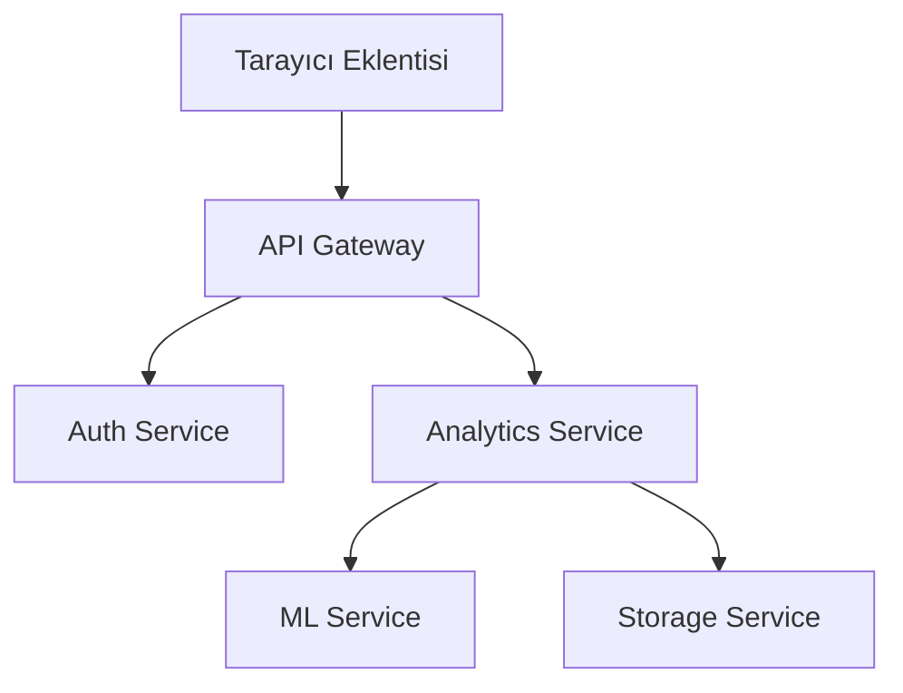

# Dijital Ayak İzi İzleyici ve Kişisel Veri Gizliliği Koruma Platformu

## Yazılım Gereksinimleri Spesifikasyonu (SRS)

## 1. Proje Tanımı ve Kapsamı

### 1.1 Projenin Amacı

Bu proje, kullanıcıların çevrimiçi aktivitelerini şeffaf bir şekilde izleyerek dijital ayak izlerini yönetmelerine ve kişisel veri gizliliklerini korumalarına yardımcı olan kapsamlı bir platform sunmayı amaçlamaktadır.

### 1.2 Temel İşlevler

- Çevrimiçi aktivite izleme ve analizi
- Gizlilik risk değerlendirmesi ve skorlaması
- Kişisel veri koruma önerileri
- Otomatik veri temizleme araçları
- Gerçek zamanlı gizlilik tehdidi uyarıları

### 1.3 Çözüm Sağlanan Problemler

- Kullanıcı verilerinin kontrolsüz takibi
- Dijital ayak izi yönetimi zorluğu
- Veri gizliliği konusundaki bilinç eksikliği
- Kişisel verilerin üçüncü taraflarca kötüye kullanımı

## 2. Hedef Kullanıcı Kitlesi ve Kullanım Senaryoları

### 2.1 Hedef Kullanıcılar

1. Bireysel Kullanıcılar

   - İnternet kullanıcıları
   - Gizlilik konusunda endişeli bireyler
   - Dijital güvenlik farkındalığı olan kullanıcılar

2. Kurumsal Kullanıcılar
   - Siber güvenlik uzmanları
   - Veri koruma görevlileri
   - IT yöneticileri

### 2.2 Kullanım Senaryoları

#### Senaryo 1: Bireysel Kullanıcı

```
Kullanıcı Profili: John, 35, yazılım geliştirici
Amaç: Çevrimiçi gizliliğini korumak
Akış:
1. Tarayıcı eklentisini yükler
2. Web sitelerindeki takipçileri görüntüler
3. Gizlilik risk skorunu kontrol eder
4. Önerilen temizleme işlemlerini uygular
```

#### Senaryo 2: Siber Güvenlik Uzmanı

```
Kullanıcı Profili: Sarah, 42, CISO
Amaç: Şirket çalışanlarının gizlilik yönetimi
Akış:
1. Toplu kullanıcı analizi yapar
2. Risk raporlarını inceler
3. Gizlilik politikalarını günceller
4. Çalışanlara önerilerde bulunur
```

## 3. İşlevsel Gereksinimler

### 3.1 Tarayıcı Eklentisi

- **Çerez Analizi**
  - Üçüncü taraf çerezlerin tespiti
  - Çerez kategorilendirmesi
  - Çerez yaşam süresi takibi
- **Tracker Tespiti**

  - JavaScript tracker'ların belirlenmesi
  - Piksel takipçilerinin tespiti
  - Fingerprinting girişimlerinin tespiti

- **Gerçek Zamanlı İzleme**
  - Anlık tracker bildirimleri
  - Risk seviyesi göstergeleri
  - Otomatik engelleme seçenekleri

### 3.2 Web Platformu

- **Kullanıcı Yönetimi**

  - Hesap oluşturma ve yönetimi
  - Tercih ayarları
  - Profil özelleştirme

- **Analiz ve Raporlama**

  - Detaylı gizlilik skorları
  - Trend analizleri
  - Özelleştirilmiş raporlar

- **Veri Temizleme**
  - Otomatik temizleme önerileri
  - Planlı temizleme görevleri
  - Temizleme geçmişi

## 4. Performans, Güvenlik ve Uyumluluk Gereksinimleri

### 4.1 Performans Gereksinimleri

- Sayfa yüklenme süresi: < 2 saniye
- API yanıt süresi: < 500ms
- Eşzamanlı kullanıcı desteği: > 10,000
- Tarayıcı eklentisi RAM kullanımı: < 100MB

### 4.2 Güvenlik Gereksinimleri

- End-to-end encryption (AES-256)
- İki faktörlü kimlik doğrulama
- Rate limiting
- SQL injection koruması
- XSS koruması

### 4.3 Uyumluluk Gereksinimleri

- GDPR uyumluluğu
- CCPA uyumluluğu
- KVKK uyumluluğu
- ISO 27001 standartları

## 5. Sistem Entegrasyon Gereksinimleri

### 5.1 API Entegrasyonu



### 5.2 Veri Akışı

- **Giriş Noktaları**

  - Tarayıcı eklentisi
  - Web platformu
  - Mobile API

- **Veri İşleme**
  - Real-time processing
  - Batch processing
  - ML model integration

### 5.3 Sistem Mimarisi



## 6. Risk Analizi ve Kısıtlamalar

### 6.1 Teknik Riskler

1. Tarayıcı Uyumluluğu

   - Chrome politika değişiklikleri
   - Firefox manifest v3 geçişi
   - Safari eklenti kısıtlamaları

2. Performans Riskleri
   - Yüksek CPU kullanımı
   - Memory leaks
   - Network bottlenecks

### 6.2 Operasyonel Riskler

1. Veri Toplama

   - Web sitesi yapısı değişiklikleri
   - Anti-scraping önlemleri
   - API rate limits

2. Kullanıcı Deneyimi
   - Karmaşık arayüz
   - Yanlış pozitif uyarılar
   - Manual müdahale gerekliliği

### 6.3 Kısıtlamalar

1. Teknik Kısıtlamalar

   - Tarayıcı API limitleri
   - Cross-origin restrictions
   - Storage quotas

2. Yasal Kısıtlamalar
   - Veri toplama sınırlamaları
   - Bölgesel yasal gereksinimler
   - Lisanslama gereksinimleri

## 7. Proje Zaman Çizelgesi

### 7.1 Geliştirme Fazları

1. Faz 1 - MVP (3 ay)

   - Temel tarayıcı eklentisi
   - Basit web platformu
   - Temel analitik

2. Faz 2 - Genişletme (3 ay)

   - ML entegrasyonu
   - Gelişmiş raporlama
   - API geliştirmeleri

3. Faz 3 - Optimizasyon (2 ay)
   - Performans iyileştirmeleri
   - UI/UX geliştirmeleri
   - Otomasyon araçları

## 8. Teknik Gereksinimler

### 8.1 Backend

- NestJS framework
- TypeScript
- PostgreSQL
- Redis
- Docker

### 8.2 Frontend

- React
- TypeScript
- Material-UI
- Redux

### 8.3 Tarayıcı Eklentisi

- Chrome Extension API
- JavaScript/TypeScript
- WebAssembly (performans kritik modüller için)

### 8.4 ML/AI

- Python
- TensorFlow/PyTorch
- scikit-learn
- Natural Language Processing

## 9. Kalite Gereksinimleri

### 9.1 Test Gereksinimleri

- Unit test coverage > 80%
- E2E test suite
- Load testing
- Security testing

### 9.2 Dökümantasyon

- API documentation
- User guides
- Developer documentation
- Deployment guides

---

## Onay

| Rol              | İsim | Tarih | İmza |
| ---------------- | ---- | ----- | ---- |
| Proje Yöneticisi |      |       |      |
| Teknik Lider     |      |       |      |
| Güvenlik Uzmanı  |      |       |      |
