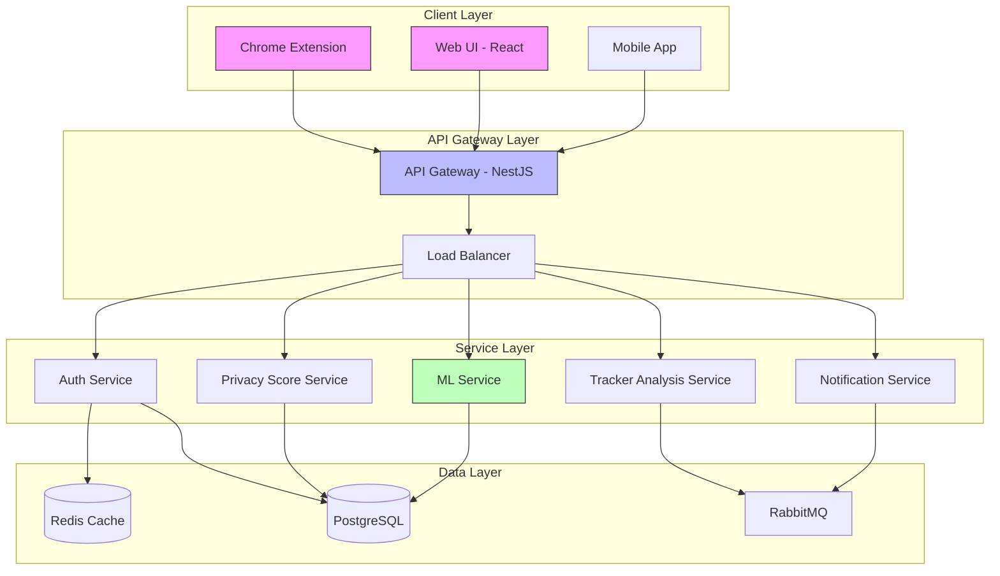
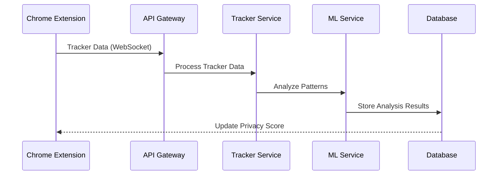
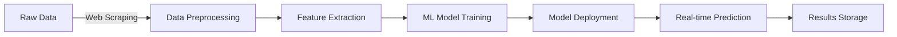

# Dijital Ayak İzi İzleyici ve Kişisel Veri Gizliliği Koruma Platformu

## Teknik Mimari Dokümanı (TAD)

## 1. Genel Mimari Şema ve Modüller

### 1.1 Yüksek Seviyeli Mimari Diyagram



### 1.2 Ana Bileşenler

#### 1.2.1 Frontend Bileşenleri

- **Web Arayüzü (React)**

  - Dashboard Modülü
  - Analiz Görselleştirme Modülü
  - Kullanıcı Profil Yönetimi
  - Raporlama Arayüzü

- **Tarayıcı Uzantısı**
  - Tracker Tespit Modülü
  - Gerçek Zamanlı İzleme Modülü
  - Lokal Veri Önbelleği
  - Bildirim Yöneticisi

#### 1.2.2 Backend Bileşenleri

- **API Gateway**

  - İstek Yönlendirme
  - Rate Limiting
  - Yük Dengeleme
  - API Versiyonlama

- **Mikroservisler**
  - Kimlik Doğrulama Servisi
  - Tracker Analiz Servisi
  - Gizlilik Skor Servisi
  - ML Servisi
  - Bildirim Servisi

## 2. Kullanılacak Teknolojiler

### 2.1 Backend Stack

```yaml
Ana Framework: NestJS
Programlama Dili: TypeScript
Veritabanı:
  - PostgreSQL: Ana veritabanı
  - Redis: Önbellekleme
Message Broker: RabbitMQ
Containerization: Docker & Kubernetes
API Documentation: Swagger/OpenAPI
```

### 2.2 Frontend Stack

```yaml
Framework: React
State Management: Redux Toolkit
UI Library: Material-UI
API Client: Axios
Grafik Kütüphanesi: D3.js/Chart.js
Build Tool: Vite
```

### 2.3 Tarayıcı Uzantısı

```yaml
API: Chrome Extension API v3
Core: TypeScript
State Management: Redux
Storage: Chrome Storage API
Network: Fetch API/Axios
```

### 2.4 ML/AI Stack

```yaml
Core: Python 3.9+
Frameworks:
  - TensorFlow 2.x
  - scikit-learn
NLP:
  - spaCy
  - NLTK
Web Scraping:
  - BeautifulSoup4
  - Scrapy
```

## 3. Veri Akışı ve Entegrasyon

### 3.1 Tarayıcı Uzantısı - Backend Entegrasyonu



### 3.2 ML Pipeline Entegrasyonu



## 4. API Tanımları

### 4.1 RESTful Endpoints

#### Authentication API

```yaml
POST /api/v1/auth/login:
  description: Kullanıcı girişi
  request:
    body:
      email: string
      password: string
  response:
    token: JWT token

POST /api/v1/auth/register:
  description: Yeni kullanıcı kaydı
  request:
    body:
      email: string
      password: string
      name: string
```

#### Tracker API

```yaml
POST /api/v1/trackers/analyze:
  description: Tracker analizi
  request:
    body:
      url: string
      pageContent: string
      cookies: Cookie[]
  response:
    trackers: Tracker[]
    riskScore: number
```

### 4.2 WebSocket Endpoints

```yaml
/ws/v1/tracking:
  description: Gerçek zamanlı tracker izleme
  events:
    tracker.detected:
      data: TrackerInfo
    privacy.score.updated:
      data: PrivacyScore
```

## 5. Veri Modelleri

### 5.1 PostgreSQL Şemaları

```sql
-- Kullanıcılar
CREATE TABLE users (
    id UUID PRIMARY KEY,
    email VARCHAR(255) UNIQUE NOT NULL,
    password_hash VARCHAR(255) NOT NULL,
    created_at TIMESTAMP DEFAULT NOW()
);

-- Tracker Verileri
CREATE TABLE trackers (
    id UUID PRIMARY KEY,
    user_id UUID REFERENCES users(id),
    domain VARCHAR(255) NOT NULL,
    tracker_type VARCHAR(50) NOT NULL,
    risk_score DECIMAL(3,2),
    detected_at TIMESTAMP DEFAULT NOW()
);
```

## 6. Güvenlik ve Performans

### 6.1 Güvenlik Önlemleri

#### 6.1.1 Kimlik Doğrulama ve Yetkilendirme

```yaml
Authentication:
  - JWT tabanlı token sistemi
  - Refresh token mekanizması
  - 2FA desteği

Authorization:
  - Role-based access control (RBAC)
  - Resource-based permissions
  - API key yönetimi
```

#### 6.1.2 Veri Güvenliği

```yaml
Encryption:
  - AES-256 for data at rest
  - TLS 1.3 for data in transit
  - End-to-end encryption for sensitive data

Data Protection:
  - PII anonymization
  - Data masking
  - Secure key management
```

### 6.2 Performans Optimizasyonu

#### 6.2.1 Caching Stratejisi

```yaml
Redis Cache Layers:
  - API response caching
  - Session caching
  - Frequently accessed user data
  - ML model predictions

Cache Invalidation:
  - Time-based expiration
  - Event-driven invalidation
  - Selective cache updates
```

#### 6.2.2 Ölçeklendirme Stratejisi

```yaml
Horizontal Scaling:
  - Kubernetes auto-scaling
  - Load balancer configuration
  - Database replication

Vertical Scaling:
  - Resource optimization
  - Query optimization
  - Background job processing
```

## 7. Deployment ve DevOps

### 7.1 Container Orchestration

```yaml
Kubernetes Components:
  - API Gateway Deployment
  - Microservices Deployments
  - StatefulSets for Databases
  - ConfigMaps & Secrets

Monitoring:
  - Prometheus
  - Grafana
  - ELK Stack
```

### 7.2 CI/CD Pipeline

```yaml
Pipeline Stages:
  - Code Quality Check
  - Unit Tests
  - Integration Tests
  - Security Scan
  - Build & Package
  - Deploy to Staging
  - Integration Tests
  - Deploy to Production
```

## 8. Hata Yönetimi ve Logging

### 8.1 Error Handling

```yaml
Error Categories:
  - Validation Errors
  - Business Logic Errors
  - System Errors
  - Network Errors

Response Format:
  status: number
  message: string
  errors: Error[]
  timestamp: string
```

### 8.2 Logging Strategy

```yaml
Log Levels:
  - ERROR: Sistem hataları
  - WARN: Potansiyel problemler
  - INFO: Önemli işlem bilgileri
  - DEBUG: Geliştirici detayları

Log Storage:
  - Elasticsearch
  - Logstash
  - Kibana dashboards
```

## 9. Bakım ve Güncellemeler

### 9.1 Versiyon Yönetimi

```yaml
Semantic Versioning:
  - Major: Uyumsuz API değişiklikleri
  - Minor: Geriye dönük uyumlu özellikler
  - Patch: Hata düzeltmeleri

Update Strategy:
  - Rolling updates
  - Blue-green deployments
  - Canary releases
```

### 9.2 Backup Stratejisi

```yaml
Backup Types:
  - Full daily backups
  - Incremental hourly backups
  - Transaction logs

Retention Policy:
  - Daily backups: 30 days
  - Weekly backups: 3 months
  - Monthly backups: 1 year
```

---

## Onay

| Rol             | İsim | Tarih | İmza |
| --------------- | ---- | ----- | ---- |
| Baş Mimar       |      |       |      |
| DevOps Lideri   |      |       |      |
| Güvenlik Mimarı |      |       |      |
