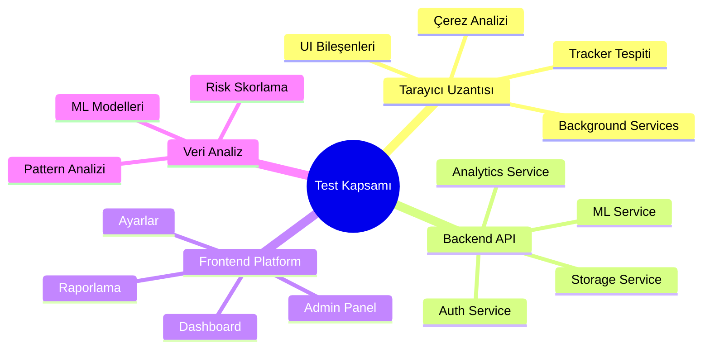
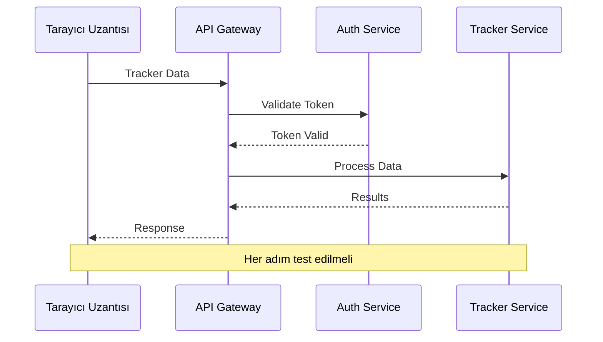
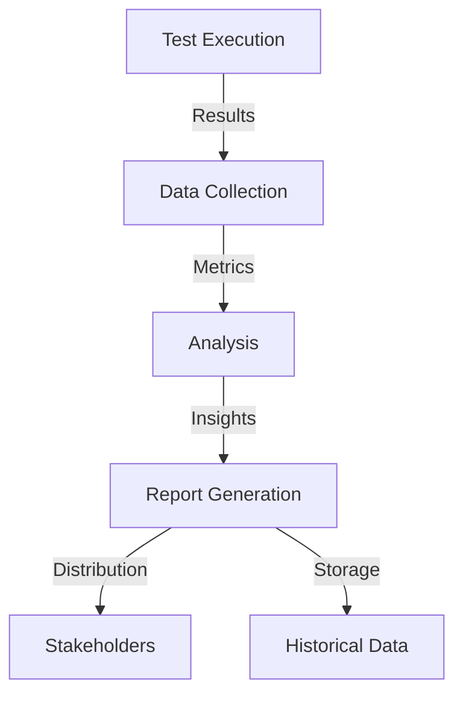

# Dijital Ayak İzi İzleyici - Test ve Kalite Güvence Dokümanı (TQAD)

## 1. Test Planı ve Kapsamı

### 1.1 Test Edilecek Bileşenler



### 1.2 Test Seviyeleri

| Seviye           | Kapsam                | Sorumlu Ekip     | Süre             |
| ---------------- | --------------------- | ---------------- | ---------------- |
| L1 - Birim       | Bağımsız modüller     | Geliştiriciler   | Sürekli          |
| L2 - Entegrasyon | Bileşenler arası      | QA Ekibi         | Sprint başı/sonu |
| L3 - Sistem      | Uçtan uca             | QA Ekibi         | Sprint sonu      |
| L4 - UAT         | Kullanıcı senaryoları | Son kullanıcılar | Release öncesi   |

### 1.3 Test Metrikleri

```yaml
Kod Kapsama Hedefleri:
  Birim Testleri: >80
  Entegrasyon Testleri: >70
  UI Testleri: >60

Kalite Hedefleri:
  Kritik Hata: 0
  Major Hata: <5
  Minor Hata: <10

Performans Hedefleri:
  Sayfa Yüklenme: <2s
  API Yanıt: <500ms
  CPU Kullanımı: <%1
```

## 2. Test Senaryoları

### 2.1 Birim Test Senaryoları

#### 2.1.1 Tarayıcı Uzantısı

```typescript
describe('CookieAnalyzer', () => {
  test('should correctly identify third-party cookies', () => {
    const cookies = [
      { domain: 'example.com', name: 'session' },
      { domain: 'tracker.com', name: 'analytics' },
    ];
    expect(analyzer.identifyThirdPartyCookies('example.com', cookies)).toEqual(['tracker.com']);
  });

  test('should calculate correct risk score', () => {
    const cookieData = {
      thirdPartyCount: 5,
      trackerCount: 3,
      sensitiveData: true,
    };
    expect(analyzer.calculateRiskScore(cookieData)).toBeGreaterThan(7);
  });
});
```

#### 2.1.2 Backend Servisleri

```typescript
describe('PrivacyScoreService', () => {
  test('should aggregate multiple risk factors', async () => {
    const userData = {
      cookies: { risk: 0.7 },
      trackers: { risk: 0.8 },
      fingerprinting: { risk: 0.3 },
    };
    const score = await privacyScorer.calculateOverallScore(userData);
    expect(score).toBeBetween(0, 1);
  });
});
```

### 2.2 Entegrasyon Test Senaryoları

#### 2.2.1 API Entegrasyon Testleri

```yaml
Test Senaryosu: API-INT-001
Başlık: Tarayıcı Uzantısı - Backend Entegrasyonu
Adımlar: 1. Uzantı tarafından tracker verisi toplanır
  2. Veri API'ye gönderilir
  3. API veriyi işler ve risk skoru hesaplar
  4. Sonuç uzantıya döner
Beklenen Sonuç:
  - Başarılı API yanıtı (200 OK)
  - Doğru formatta risk skoru
  - <500ms yanıt süresi
```

#### 2.2.2 Servisler Arası Entegrasyon



### 2.3 Sistem Test Senaryoları

#### 2.3.1 Uçtan Uca Test Akışı

```yaml
Test Senaryosu: SYS-001
Başlık: Tam Kullanıcı Yolculuğu
Adımlar: 1. Kullanıcı kaydı
  2. Uzantı kurulumu
  3. Web sitesi ziyareti
  4. Tracker tespiti
  5. Risk analizi
  6. Rapor görüntüleme
  7. Önlem alma
  8. Sonuç doğrulama

Kontrol Noktaları:
  - Kullanıcı verilerinin doğru saklanması
  - Gerçek zamanlı izleme
  - Doğru risk skorlaması
  - Raporların tutarlılığı
```

### 2.4 Kullanıcı Kabul Testleri (UAT)

#### 2.4.1 UAT Test Senaryoları

```yaml
Senaryo Grupları:
  Bireysel Kullanıcılar:
    - Kolay kurulum ve aktivasyon
    - Anlaşılır gizlilik skorları
    - Etkili tracker engelleme
    - Sezgisel ayarlar

  Kurumsal Kullanıcılar:
    - Toplu kullanıcı yönetimi
    - Detaylı raporlama
    - Politika yapılandırması
    - Audit log izleme
```

## 3. Performans ve Güvenlik Testleri

### 3.1 Performans Test Planı

#### 3.1.1 Yük Testi Senaryoları

```yaml
Senaryo 1 - Normal Yük:
  Kullanıcı Sayısı: 1000
  Süre: 1 saat
  Beklenen Metrikler:
    - Ortalama Yanıt Süresi: <200ms
    - Hata Oranı: <%1
    - CPU Kullanımı: <%50

Senaryo 2 - Yüksek Yük:
  Kullanıcı Sayısı: 10000
  Süre: 30 dakika
  Beklenen Metrikler:
    - Ortalama Yanıt Süresi: <500ms
    - Hata Oranı: <%2
    - CPU Kullanımı: <%80
```

#### 3.1.2 Stress Testi Konfigürasyonu

```javascript
// k6 test script örneği
export let options = {
  stages: [
    { duration: '5m', target: 100 }, // Ramp-up
    { duration: '10m', target: 100 }, // Steady state
    { duration: '5m', target: 200 }, // Ramp-up 2
    { duration: '10m', target: 200 }, // Steady state 2
    { duration: '5m', target: 0 }, // Ramp-down
  ],
  thresholds: {
    http_req_duration: ['p(95)<500'],
    http_req_failed: ['rate<0.01'],
  },
};
```

### 3.2 Güvenlik Test Planı

#### 3.2.1 Güvenlik Test Matrisi

| Test Türü       | Araç      | Sıklık     | Hedef         |
| --------------- | --------- | ---------- | ------------- |
| SAST            | SonarQube | Her commit | Kod güvenliği |
| DAST            | OWASP ZAP | Haftalık   | API güvenliği |
| Pentest         | Manual    | Aylık      | Tüm sistem    |
| Dependency Scan | Snyk      | Günlük     | Bağımlılıklar |

#### 3.2.2 Güvenlik Test Senaryoları

```yaml
API Güvenlik Testleri:
  - SQL Injection
  - XSS Attacks
  - CSRF Attacks
  - Authentication Bypass
  - Rate Limiting

Veri Güvenliği Testleri:
  - Encryption at Rest
  - Encryption in Transit
  - Key Management
  - Access Controls
  - Data Leakage
```

## 4. Hata Yönetimi ve Raporlama

### 4.1 Hata Sınıflandırma

```yaml
Hata Seviyeleri:
  Kritik (P0):
    - Veri sızıntısı
    - Sistem çökmesi
    - Yanlış risk skoru
    Response: Anında müdahale

  Yüksek (P1):
    - UI hataları
    - Performance sorunları
    - API timeout
    Response: 24 saat içinde

  Orta (P2):
    - Minor UI sorunları
    - Gecikmeli bildirimler
    Response: 3 gün içinde

  Düşük (P3):
    - Kozmetik hatalar
    - İyileştirme önerileri
    Response: Sonraki sprint
```

### 4.2 Hata Raporlama Şablonu

```yaml
Bug Report Template:
  ID: BUG-{number}
  Başlık: Kısa açıklama
  Öncelik: P0-P3
  Ortam: Dev/Stage/Prod
  Adımlar: 1. Adım adım repro
    2. Beklenen davranış
    3. Gerçekleşen davranış
  Ekler:
    - Screenshot
    - Logs
    - Video
```

## 5. Test Ortamı ve Otomasyon

### 5.1 Test Ortamları

```yaml
Development:
  - LocalHost
  - Mock Services
  - Test Database

Staging:
  - Cloud Environment
  - Test Data
  - Monitoring

Production:
  - Live Environment
  - Real Data
  - Full Monitoring
```

### 5.2 Otomasyon Framework'ü

```typescript
// Test Otomasyon Mimarisi
class TestFramework {
  config: TestConfig;
  reporters: Reporter[];
  runners: TestRunner[];

  async runTests(suite: TestSuite): Promise<TestResult> {
    // Test execution logic
  }

  async generateReport(results: TestResult[]): Promise<Report> {
    // Reporting logic
  }
}

interface TestConfig {
  environment: string;
  parallel: boolean;
  retries: number;
  timeout: number;
}
```

### 5.3 CI/CD Pipeline Entegrasyonu

```yaml
Test Pipeline Stages:
  1. Code Validation:
    - Lint
    - SAST
    - Unit Tests

  2. Build & Package:
    - Build
    - Asset Compilation
    - Docker Image

  3. Integration Tests:
    - API Tests
    - UI Tests
    - Security Scans

  4. Deployment:
    - Staging Deploy
    - Smoke Tests
    - Performance Tests

  5. Production:
    - Canary Deploy
    - Health Checks
    - Monitoring
```

## 6. Test Takip ve Raporlama

### 6.1 Test Metrikleri Dashboard

```yaml
Günlük Metrikler:
  - Test Coverage
  - Pass/Fail Oranı
  - Hata Sayısı
  - Çözüm Süreleri

Haftalık Metrikler:
  - Trend Analizi
  - Regresyon Oranı
  - Performance Trending
  - Risk Analizi
```

### 6.2 Raporlama Otomasyonu



---

## Versiyon Geçmişi

| Versiyon | Tarih | Değişiklikler |
| -------- | ----- | ------------- |
| 1.0.0    | -     | İlk sürüm     |

## Onay

| Rol               | İsim | Tarih | İmza |
| ----------------- | ---- | ----- | ---- |
| QA Lead           |      |       |      |
| Test Mimarı       |      |       |      |
| Güvenlik Testçisi |      |       |      |
