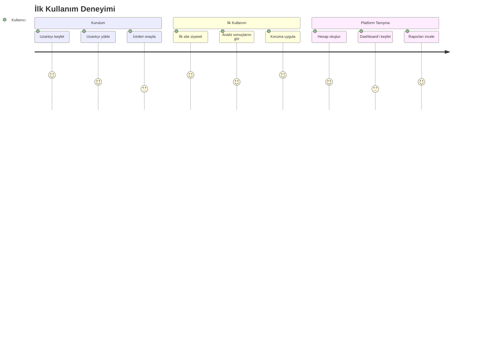

# Dijital Ayak İzi İzleyici - User Stories ve Acceptance Criteria Document (USACD)

## Doküman Bilgileri

| Başlık         | Detay                               |
| -------------- | ----------------------------------- |
| Proje          | Dijital Ayak İzi İzleyici           |
| Doküman Tipi   | User Stories ve Acceptance Criteria |
| Versiyon       | 1.0.0                               |
| Son Güncelleme | [Tarih]                             |
| Durum          | Taslak                              |

## İçindekiler

1. [Kullanıcı Hikayeleri](#1-kullanıcı-hikayeleri)
2. [Kabul Kriterleri](#2-kabul-kriterleri)
3. [Kullanıcı Yolculukları](#3-kullanıcı-yolculukları)
4. [Test Senaryoları](#4-test-senaryoları)

## 1. Kullanıcı Hikayeleri

### 1.1 Temel Kullanıcı Hikayeleri

#### US-001: Web Sitesi Analizi

```yaml
Kullanıcı Tipi: Web Kullanıcısı
İstek: Ziyaret ettiğim web sitelerinin beni nasıl takip ettiğini görmek
Amaç: Gizlilik ayarlarımı daha iyi yönetebilmek

Öncelik: Yüksek
Effort: Orta
Sprint: 1
```

#### US-002: Tracker Engelleme

```yaml
Kullanıcı Tipi: Web Kullanıcısı
İstek: Çerezleri ve izleyicileri (trackers) engelleyebilmek
Amaç: Daha güvenli bir şekilde internette gezinebilmek

Öncelik: Yüksek
Effort: Yüksek
Sprint: 1
```

#### US-003: Gizlilik Raporları

```yaml
Kullanıcı Tipi: Web Kullanıcısı
İstek: Gizlilik raporlarımı görüntüleyerek geçmiş aktivitelerimi analiz etmek
Amaç: Hangi sitelerin daha güvenli olduğunu belirleyebilmek

Öncelik: Orta
Effort: Orta
Sprint: 2
```

### 1.2 Gelişmiş Kullanıcı Hikayeleri

#### US-004: Özelleştirilmiş Koruma Kuralları

```yaml
Kullanıcı Tipi: Premium Kullanıcı
İstek: Kendi koruma kurallarımı oluşturabilmek
Amaç: Özel ihtiyaçlarıma göre gizlilik ayarlarını yapılandırabilmek

Öncelik: Düşük
Effort: Yüksek
Sprint: 3
```

#### US-005: Trend Analizi

```yaml
Kullanıcı Tipi: Premium Kullanıcı
İstek: Gizlilik skorlarımın zaman içindeki değişimini görmek
Amaç: Gizlilik önlemlerimin etkinliğini ölçebilmek

Öncelik: Düşük
Effort: Orta
Sprint: 3
```

### 1.3 Kurumsal Kullanıcı Hikayeleri

#### US-006: Toplu Kullanıcı Yönetimi

```yaml
Kullanıcı Tipi: IT Yöneticisi
İstek: Şirket çalışanlarının gizlilik ayarlarını merkezi olarak yönetebilmek
Amaç: Kurumsal gizlilik politikalarını uygulayabilmek

Öncelik: Orta
Effort: Yüksek
Sprint: 4
```

## 2. Kabul Kriterleri

### 2.1 Web Sitesi Analizi (US-001)

```yaml
Fonksiyonel Kriterler:
  1. Tracker Tespiti:
    - Tüm yaygın tracker türleri tespit edilmeli
    - Her tracker'ın kategorisi gösterilmeli
    - Risk seviyesi belirtilmeli

  2. Gerçek Zamanlı Analiz:
    - Sayfa yüklendiğinde analiz başlamalı
    - Sonuçlar 2 saniye içinde gösterilmeli
    - Dinamik içerik değişiklikleri izlenmeli

  3. Kullanıcı Arayüzü:
    - Tracker sayısı görünür olmalı
    - Detaylı liste görüntülenebilmeli
    - Risk seviyesi renk koduyla gösterilmeli

Teknik Kriterler:
  - Doğruluk oranı: >95
  - Yanıt süresi: <2s
  - CPU kullanımı: <%1
```

### 2.2 Tracker Engelleme (US-002)

```yaml
Fonksiyonel Kriterler:
  1. Engelleme Kontrolü:
    - Tek tıkla tüm trackerları engelleme
    - Kategori bazlı engelleme seçeneği
    - Whitelist/blacklist yönetimi

  2. Engelleme Bildirimleri:
    - Engellenen tracker sayısı gösterimi
    - Engelleme başarı/başarısızlık bildirimi
    - Site fonksiyonalite uyarıları

  3. Özelleştirme:
    - Koruma seviyesi ayarı
    - Site bazlı istisnalar
    - Otomatik engelleme kuralları

Teknik Kriterler:
  - Engelleme başarı oranı: >98
  - Yanlış pozitif oranı: <%1
  - Performans etkisi: <100ms
```

### 2.3 Gizlilik Raporları (US-003)

```yaml
Fonksiyonel Kriterler:
  1. Rapor İçeriği:
    - Site bazlı gizlilik skorları
    - Tracker istatistikleri
    - Trend analizi grafikleri

  2. Filtreleme ve Arama:
    - Tarih aralığı seçimi
    - Site bazlı filtreleme
    - Kategori filtreleme

  3. Dışa Aktarma:
    - PDF rapor oluşturma
    - CSV veri export
    - API entegrasyonu

Teknik Kriterler:
  - Rapor yükleme süresi: <3s
  - Veri doğruluğu: %100
  - Tarihsel veri saklama: 12 ay
```

## 3. Kullanıcı Yolculukları

### 3.1 İlk Kullanım Yolculuğu



### 3.2 Günlük Kullanım Yolculuğu

```yaml
1. Web Gezintisi:
  - Site ziyareti başlatma
  - Otomatik tracker analizi
  - Risk bildirimi alma
  - Koruma uygulama

2. Rapor İnceleme:
  - Platform girişi
  - Dashboard kontrolü
  - Detaylı rapor görüntüleme
  - Trend analizi

3. Ayar Optimizasyonu:
  - Koruma seviyesi kontrolü
  - İstisna yönetimi
  - Kural güncelleme
```

### 3.3 Premium Kullanıcı Yolculuğu

```yaml
1. Premium Aktivasyon:
  - Plan seçimi
  - Ödeme
  - Özellik aktivasyonu

2. Gelişmiş Özellikler:
  - Özel kural oluşturma
  - Detaylı analitik
  - API erişimi

3. Raporlama:
  - Özelleştirilmiş raporlar
  - Trend analizi
  - Benchmark karşılaştırması
```

## 4. Test Senaryoları

### 4.1 Fonksiyonel Test Senaryoları

#### 4.1.1 Web Sitesi Analizi Testleri

```yaml
Senaryo 1 - Temel Analiz:
  Adımlar: 1. Popüler bir web sitesini ziyaret et
    2. Uzantının analizi tamamlamasını bekle
    3. Sonuçları kontrol et

  Beklenen Sonuçlar:
    - Tracker listesi gösterilmeli
    - Risk skoru hesaplanmalı
    - Koruma önerileri sunulmalı

Senaryo 2 - Dinamik İçerik:
  Adımlar: 1. AJAX kullanan bir siteyi ziyaret et
    2. Dinamik içerik yüklemesini bekle
    3. Yeni trackerları kontrol et

  Beklenen Sonuçlar:
    - Yeni trackerlar tespit edilmeli
    - Risk skoru güncellenmeli
```

#### 4.1.2 Engelleme Testleri

```yaml
Senaryo 1 - Toplu Engelleme:
  Adımlar: 1. "Tümünü Engelle" butonuna tıkla
    2. Sayfa yenilenmesini bekle
    3. Tracker durumunu kontrol et

  Beklenen Sonuçlar:
    - Tüm trackerlar engellenmeli
    - Site fonksiyonları çalışmalı
    - Bildirim gösterilmeli

Senaryo 2 - Seçici Engelleme:
  Adımlar: 1. Belirli kategorileri seç
    2. Engelleme uygula
    3. İstisnaları kontrol et

  Beklenen Sonuçlar:
    - Seçili trackerlar engellenmeli
    - İstisnalar korunmalı
    - Kategori bazlı rapor güncellenmeli
```

### 4.2 Performans Test Senaryoları

```yaml
Senaryo 1 - Yükleme Performansı:
  Metrikler:
    - Sayfa yükleme etkisi: <200ms
    - CPU kullanımı: <%1
    - Bellek kullanımı: <50MB

Senaryo 2 - Analiz Performansı:
  Metrikler:
    - Analiz süresi: <2s
    - API yanıt süresi: <500ms
    - Veri işleme: <100ms
```

### 4.3 Kullanılabilirlik Test Senaryoları

```yaml
Senaryo 1 - Kolay Kullanım:
  Kriterler:
    - İlk kullanımda yardım gereksinimi olmamalı
    - Tüm butonlar görünür olmalı
    - Hata mesajları anlaşılır olmalı

Senaryo 2 - Erişilebilirlik:
  Kriterler:
    - Klavye navigasyonu desteklenmeli
    - Renk kontrastı yeterli olmalı
    - Ekran okuyucu uyumlu olmalı
```

## 5. Başarı Metrikleri

### 5.1 Kullanıcı Memnuniyeti

```yaml
Temel Metrikler:
  - App Store puanı: >4.5/5
  - Kullanıcı yorumları: >80% pozitif
  - Aktif kullanıcı oranı: >70%

İleri Metrikler:
  - Net Promoter Score: >50
  - Kullanıcı kaybı: <%5/ay
  - Premium dönüşüm: >5%
```

### 5.2 Teknik Başarı

```yaml
Doğruluk:
  - Tracker tespiti: >95
  - Risk skorlama: >90
  - Engelleme başarısı: >98

Performans:
  - Sayfa etki süresi: <200ms
  - Analiz süresi: <2s
  - Hata oranı: <%0.1
```

---

## Versiyon Geçmişi

| Versiyon | Tarih | Değişiklikler |
| -------- | ----- | ------------- |
| 1.0.0    | -     | İlk sürüm     |

## Onay

| Rol              | İsim | Tarih | İmza |
| ---------------- | ---- | ----- | ---- |
| Product Owner    |      |       |      |
| User Story Owner |      |       |      |
| QA Lead          |      |       |      |
| UX Designer      |      |       |      |
